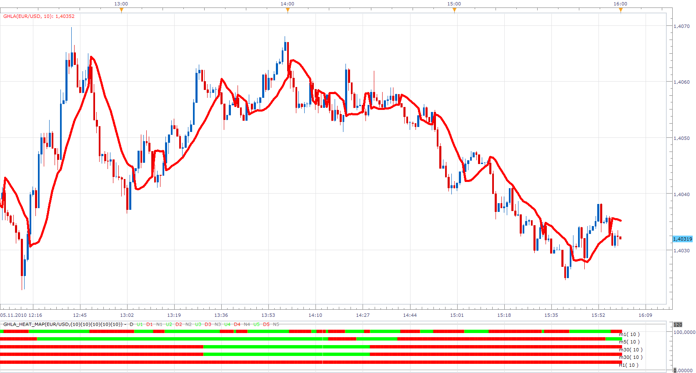
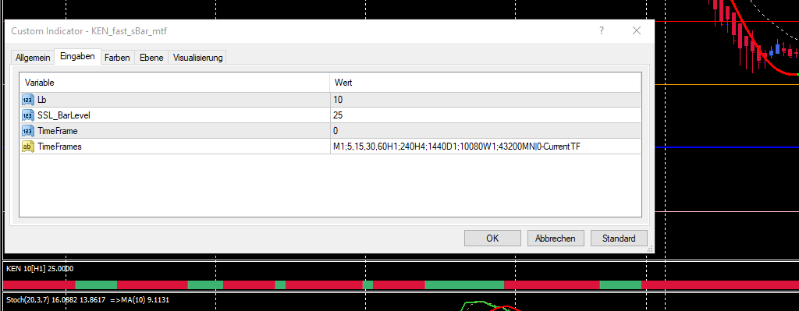

# Gann Hi-Lo Activator (GHLA) MTF Heat Map

> Source: https://fxcodebase.com/code/viewtopic.php?f=17&t=2610  
> Forum: 17 · Topic 2610 · 14 post(s)

---

## Gann Hi-Lo Activator (GHLA) MTF Heat Map

**Apprentice** · Sat Nov 06, 2010 9:56 am

 [GHLA_Heat_Map.lua](files/5865/GHLA_Heat_Map.lua)

 [STF Gann Hi-Lo Activator Heat Map.lua](files/5865/STF%20Gann%20Hi-Lo%20Activator%20Heat%20Map.lua)

For this to work, you need to have Gann Hi-Lo Activator (GHLA) indicator.
[viewtopic.php?f=17&t=227&p=320&hilit=ghla#p320](https://fxcodebase.com/code/viewtopic.php?f=17&t=227&p=320&hilit=ghla#p320)

MT4/MQ4 version.
[viewtopic.php?f=38&t=65121](https://fxcodebase.com/code/viewtopic.php?f=38&t=65121)

---

## Re: Gann Hi-Lo Activator (GHLA) MTF Heat Map

**coldrecs** · Thu Nov 18, 2010 5:07 pm

Very nice, and very useful. Thank you!
Do you think it is possible to create a indicator for plotting on the tick chart the GHLA from a bigger time frame (for example from 15 minutes let's say) ?

Thanks again!

---

## Re: Gann Hi-Lo Activator (GHLA) MTF Heat Map

**Coondawg71** · Thu Oct 25, 2012 6:54 pm

Can we please request a MTF MCP Gann HI LO Activator heat map.

Thanks,

sjc

---

## Re: Gann Hi-Lo Activator (GHLA) MTF Heat Map

**Dimitri** · Sun Apr 13, 2014 11:38 am

is there a gan hilo heatmap for just the chart that it is on? not MTF

---

## Re: Gann Hi-Lo Activator (GHLA) MTF Heat Map

**Apprentice** · Mon Apr 14, 2014 10:35 am

Sure, GHLA_Heat_Map.lua See first, top post of this topic.

---

## Re: Gann Hi-Lo Activator (GHLA) MTF Heat Map

**Dimitri** · Mon Apr 14, 2014 4:08 pm

Thanks Apprentice, is it possible to have it on just the timeframe of the chart? and also if possible to remove the labels as the "m15" (or whatever timeframe it is set to) overlaps the last bar

Thanks

---

## Re: Gann Hi-Lo Activator (GHLA) MTF Heat Map

**Apprentice** · Tue Apr 15, 2014 11:41 am

Try STF Gann Hi-Lo Activator Heat Map (top most post).
Will only work for Chart Time Frame.

---

## Re: Gann Hi-Lo Activator (GHLA) MTF Heat Map

**Dimitri** · Wed Apr 16, 2014 5:49 am

my mistake, sorry about that thanks alot for both indicators

---

## Re: Gann Hi-Lo Activator (GHLA) MTF Heat Map

**ChrisM** · Fri Oct 06, 2017 1:53 pm

Hello Apprentice,

thank you for your excellent work.

It is possible to make the Heat Map something different?
As a narrow band, compressed with a clear view.

Best thanks in advance

Example from MT4 below (MTF–current=0)

 

*exampleMT4*

---

## Re: Gann Hi-Lo Activator (GHLA) MTF Heat Map

**Apprentice** · Mon Oct 09, 2017 3:53 am

Like STF Gann Hi-Lo Activator Heat Map?

Your request is added to the development list under Id Number 3917

---

## Re: Gann Hi-Lo Activator (GHLA) MTF Heat Map

**ChrisM** · Mon Oct 09, 2017 10:50 am

Hello Apprentice,

Thank you for your fast reaction
Yes, I mean that.

Here is another example
[https://www.mql5.com/en/code/8276](https://www.mql5.com/en/code/8276)

---

## Re: Gann Hi-Lo Activator (GHLA) MTF Heat Map

**Alexander.Gettinger** · Mon Oct 09, 2017 1:51 pm

> **ChrisM wrote:**
> Hello Apprentice,
>
> thank you for your excellent work.
>
> It is possible to make the Heat Map something different?
> As a narrow band, compressed with a clear view.
>
> Best thanks in advance
>
> Example from MT4 below (MTF–current=0)
>
>
>
> The attachment **exampleMT4.png** is no longer available

Please, try this indicator:

 [STF Gann Hi-Lo Activator Heat Map2.lua](files/115350/STF%20Gann%20Hi-Lo%20Activator%20Heat%20Map2.lua)

---

## Re: Gann Hi-Lo Activator (GHLA) MTF Heat Map

**ChrisM** · Tue Oct 10, 2017 5:14 pm

thank you very much!

---

## Re: Gann Hi-Lo Activator (GHLA) MTF Heat Map

**Apprentice** · Sun Feb 04, 2018 8:12 am

The Indicator was revised and updated.
