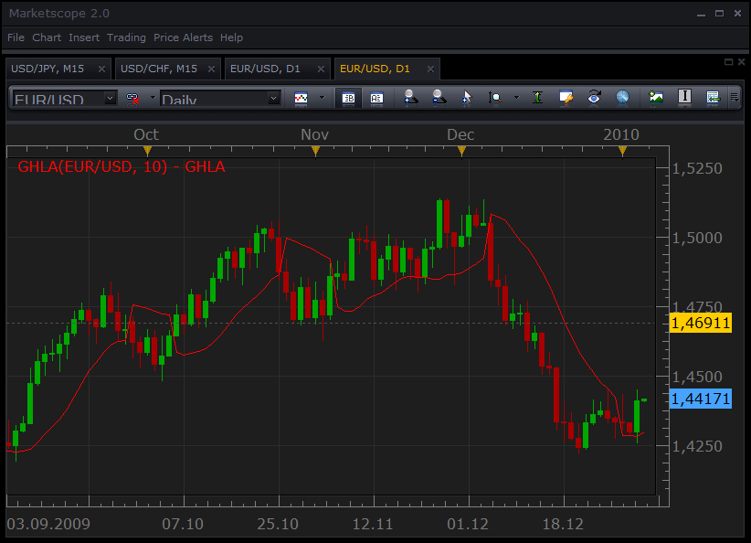
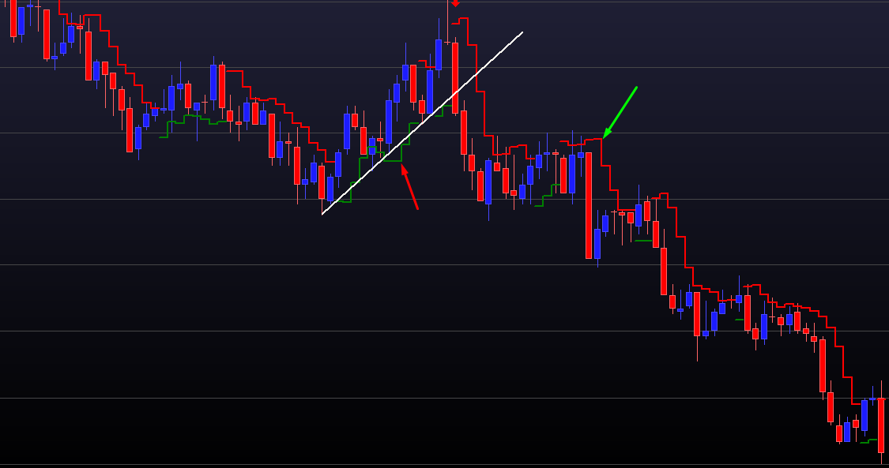

# Gann HiLo Activator

> Source: https://fxcodebase.com/code/viewtopic.php?f=17&t=227  
> Forum: 17 · Topic 227 · 18 post(s)

---

## Gann HiLo Activator

**TonyMod** · Wed Jan 06, 2010 1:41 pm

Hello,

Here is a indicator called "Gann Hi-Lo Activator".

**Description** on how to use this indicator you can find here: [http://forex-strategies-revealed.com/mt4/gann-hilo-activator](http://forex-strategies-revealed.com/mt4/gann-hilo-activator)

Screenshot of Gann Hi-Lo Activator in MarketScope:

 

*Screenshot of indicator in MarketScope charts.*

Download:
MVA (Original) Version

 [GHLA.lua](files/320/GHLA.lua)

The version that has a selection of several types of moving averages.

 [GHLA Touchline.lua](files/320/GHLA%20Touchline.lua)

 [GHLA Averages.lua](files/320/GHLA%20Averages.lua)

Averages.lua
[viewtopic.php?f=17&t=2430](https://fxcodebase.com/code/viewtopic.php?f=17&t=2430)

MT4/MQ4 version.
[viewtopic.php?f=38&t=65122](https://fxcodebase.com/code/viewtopic.php?f=38&t=65122)

---

## Re: Gann HiLo Activator

**Apprentice** · Sat Nov 06, 2010 8:45 am

Style Update.

---

## Re: Gann HiLo Activator

**deltayod** · Wed Dec 15, 2010 11:26 am

Could you please code this indi in MTF? I realize that recently the MTF Heatmap was published but it would be nice to see MTF GHLA on the price chart to gauge distance from MTF Support/Resistance levels. Foe example, on the M5 chart, I use H1 & H4 GHLA and they clearly show how far before breakout or reversal. Thanks.

---

## Re: Gann HiLo Activator

**Apprentice** · Wed Dec 15, 2010 12:40 pm

Added to developmental cue.

---

## Re: Gann HiLo Activator

**Apprentice** · Fri Dec 17, 2010 4:35 am

Bigger timeframe Gann High Low Activator can be found here.
[viewtopic.php?f=17&t=2978](https://fxcodebase.com/code/viewtopic.php?f=17&t=2978)

---

## Re: Gann HiLo Activator

**HNAES44** · Mon Feb 28, 2011 4:44 pm

Hello,

I’d like to backtest on FXCM Marketsope 2.0 a strategy only based on Gann HiLo indicator. Could you tell me if this strategy does already exist and where can I found it? If not, could you please develop it, i would really be intersted in trying it as soon as possible ?

Thanks a lot

Sincerly

hnaes44

---

## Re: Gann HiLo Activator

**Apprentice** · Tue Mar 01, 2011 6:02 am

Requested can be found here.
[viewtopic.php?f=31&t=3562](https://fxcodebase.com/code/viewtopic.php?f=31&t=3562)

---

## Re: Gann HiLo Activator

**Apprentice** · Thu Nov 17, 2011 3:34 am

Version that has a selection of several types of moving averages added.

---

## Re: Gann HiLo Activator

**turkuaz** · Fri Nov 18, 2011 1:38 am

Dear Apprentice

Can we use the strategy with hillo Gan super trend indicator. Take for example the case of super-trend sales strategy or open position. Or position of the spool. Super-position of the turn also supports the trend.

 Can we edit such a strategy.

 respects

---

## Re: Gann HiLo Activator

**Apprentice** · Fri Nov 18, 2011 4:47 am

Unfortunately I'm not sure I understand your request.
Can you define the conditions.

Like this.
Buy
If GHLA CrossUnder .....
and GHLA <....
or ....

Sell
...

---

## Re: Gann HiLo Activator

**turkuaz** · Fri Nov 18, 2011 9:49 am

Dear Apprentice

 Has not looked back my theory correct. For this reason, do not take my request into consideration.
 respects

---

## Re: Gann HiLo Activator

**Apprentice** · Sun Mar 08, 2015 3:21 am

Updated.

---

## Re: Gann HiLo Activator

**wakitrader** · Fri Feb 05, 2016 5:39 am

*hello I would like to know if you have this hilo?*

---

## Re: Gann HiLo Activator

**Apprentice** · Fri Feb 05, 2016 7:45 am

You will have to provide more information.
Indicator name, formula, description or better yet, indicator code.

Post your request here.
[viewforum.php?f=27](https://fxcodebase.com/code/viewforum.php?f=27)

---

## Re: Gann HiLo Activator

**Apprentice** · Sat Feb 06, 2016 11:51 am

Try GHLA Touchline.lua

---

## Re: Gann HiLo Activator

**Apprentice** · Tue Oct 23, 2018 6:34 am

The indicator was revised and updated.

---

## Re: Gann HiLo Activator

**Apprentice** · Fri Nov 26, 2021 7:38 am

GHLA Averages.lua added.

---

## Re: Gann HiLo Activator

**fortcentral** · Sun Feb 01, 2026 12:04 am

Hi,
Can the plot for the Gann HiLo Activator be slightly modified please, to reflect the original author's (Robert Krausz) directions?

The GHLA.lua indicator posted here has the correct calculation/performance. However, Krausz's plot of the "calculated point" was a horizontal line spanning the half-way distance between bars, from half of the gap before a bar, to half-gap after a bar, instead of plotting the "calculated point" on the bar itself. This gave a clearer visual separation with price movement on a live bar, as he used this indicator both for "stop loss" and as a "trend" indicator in live trading in his time (~1980s).

The switch from using bar "low (or high)" prices for calculation of the moving-average line, to using bar "high (or low)" prices for the line, only happened when the price closed "below (or above)" the moving average "calculated point/line".

In Krausz's original HiLo Activator, if price penetrated the "Activator" line by a "user determined" amount, for example 5 pips (or 2 ticks in his case), then a second plot of the calculation using the "switch" in high (or low) value, would appear on the same bar; but this second "Activator" plot line would disappear, if price did not end up closing above (or below) the "Activator line".

Some photos are attached from Krausz's work for greater clarity.

Thank you.
