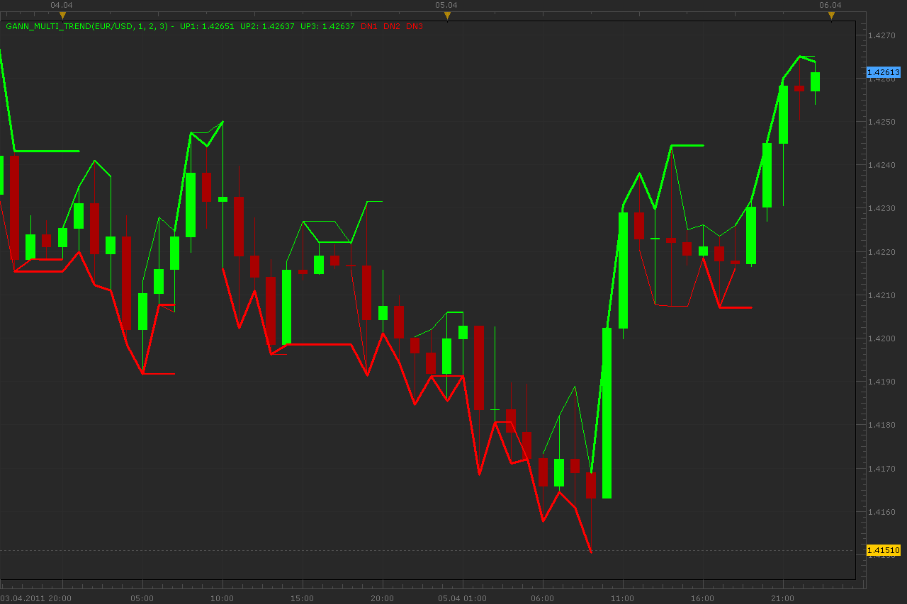

# Gann multi trend (indicator of small, medium and main trend)

> Source: https://fxcodebase.com/code/viewtopic.php?f=17&t=3845  
> Forum: 17 · Topic 3845 · 2 post(s)

---

## Gann multi trend (indicator of small, medium and main trend)

**Alexander.Gettinger** · Tue Apr 05, 2011 10:57 pm

Download:

 [Gann_Multi_Trend.lua](files/9400/Gann_Multi_Trend.lua)

The indicator was revised and updated

---

## Re: Gann multi trend (indicator of small, medium and main tr

**Apprentice** · Mon Mar 06, 2017 7:30 am

Indicator was revised and updated.
