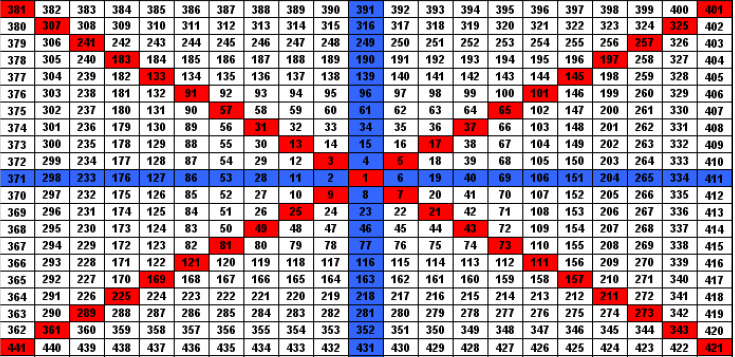

# Gann's Square Of Nine (Support / Resistance Lines)

> Source: https://fxcodebase.com/code/viewtopic.php?f=17&t=2754  
> Forum: 17 · Topic 2754 · 16 post(s)

---

## Gann's Square Of Nine (Support / Resistance Lines)

**Apprentice** · Sun Nov 21, 2010 8:40 am

Prime Numbers Mode
A prime number (or a prime) is a natural number that has exactly two distinct natural number divisors: 1 and itself.
Prime Numbers {2, 3, 5, 7, 11, 13, 17, 19, 23, 29, 31, 37, 41, 43, 47, 53, 59, 61, 67, 71, 73, 79, 83, 89, 97...}

This indicator, generating a line of support, resistance,based on prime numbers.

The basis is the minimum, for period, from first to last.
The lines of resistance, support, we get if we multiplie the prime numbers by a defined step.

Gann's Square Of Nine Mode

Price respect Gann's Square Of Nine Support / Resistance Lines.

 

0={6,19, 40, 69, 106, 151, 204, 265, 334};
45={5, 17, 37, 65, 101, 145, 197, 256, 325};
90={316, 249, 190, 139, 96, 61, 34, 15, 4};
135={3, 13, 31, 57, 91, 133, 183, 241, 307};
180={298, 233, 176, 127, 86, 53, 28, 11, 2};
230={9, 25, 49, 81, 121, 169, 225, 289, 361};
270={8, 23, 46, 77, 116, 163, 218, 281, 352};
315={7, 21, 43, 73, 111, 157, 211, 273, 343};

Support and Resistance line calculation.
To local minum add the product between the index and user defined step.

 [Gann's Square Of Nine.lua](files/6257/Ganns%20Square%20Of%20Nine.lua)

MT4/MQ4 version
[viewtopic.php?f=38&t=69157](https://fxcodebase.com/code/viewtopic.php?f=38&t=69157)

---

## Re: Gann's Square Of Nine

**sabrumea** · Sun Nov 21, 2010 9:31 am

) thank you Apprentice, niiiiiiiice.. i have just put it on my chart and if you adjust the step to cater for each currency pair it does look great it to use it in conjunction with other Gann's tools i think it has a potential to produce a good result!!!

---

## Re: Gann's Square Of Nine (Support / Resistance Lines)

**Apprentice** · Sun Nov 21, 2010 2:15 pm

Update.

---

## Re: Gann's Square Of Nine (Support / Resistance Lines)

**sabrumea** · Sun Nov 21, 2010 10:51 pm

yahoo thank you! thank you!

---

## Re: Gann's Square Of Nine (Support / Resistance Lines)

**Jigit Jigit** · Thu Mar 31, 2011 7:22 pm

Hi,
Can someone, please, explain how to determine the "step"?

Cheers,

---

## Re: Gann's Square Of Nine (Support / Resistance Lines)

**Apprentice** · Fri Apr 01, 2011 12:07 am

Basic Formula of Gann's Square Of Nine lines is
Period Low + Axis Prime Number *Step (in Pips)

Adjustment of Step parameter the user can adjust the indicators to the actual price action.

---

## Re: Gann's Square Of Nine (Support / Resistance Lines)

**Jigit Jigit** · Fri Apr 01, 2011 1:02 pm

Thank you Apprentice.
But could you, please, explain what this "step" actually is?
Is it an average pip range in a given period?
Do I have to manually modify it when the price doesn't seem to respect S/R lines?

I know it must be pretty basic stuff, but I would appreciate if you explained that.
Cheers

---

## Re: Gann's Square Of Nine (Support / Resistance Lines)

**Trader1** · Thu Sep 01, 2011 8:05 pm

very interesting indicator,
Im glad someone can think a little out of the box:)
thanks for your great work

---

## Re: Gann's Square Of Nine (Support / Resistance Lines)

**Apprentice** · Tue Mar 14, 2017 9:04 am

Indicator was revised and updated.

---

## Re: Gann's Square Of Nine (Support / Resistance Lines)

**jaricarr** · Thu Nov 09, 2017 11:30 pm

Hi Apprentice,

This method also requires that we divide 360 by 3. Can you please add these angles...
120 and 240

---

## Re: Gann's Square Of Nine (Support / Resistance Lines)

**Apprentice** · Fri Nov 10, 2017 5:19 am

Can you provide a reference?
Your request is added to the development list under Id Number 3947

---

## Re: Gann's Square Of Nine (Support / Resistance Lines)

**High&Low** · Fri Nov 10, 2017 5:12 pm

Hi,

It would be nice if you add the angles 30 and 60 too, as 60 was one of his important angles and he had also an overly for 60 degree.

Thanks

---

## Re: Gann's Square Of Nine (Support / Resistance Lines)

**jaricarr** · Sun Nov 12, 2017 8:13 pm

> **Apprentice wrote:**
> Can you provide a reference?
> Your request is added to the development list under Id Number 3947

see pgs 2 and 3. hope this helps.
Also please make a correction. the indicator should have a 225 degree angle (not 230).

---

## Re: Gann's Square Of Nine (Support / Resistance Lines)

**Apprentice** · Mon Nov 13, 2017 4:37 am

Your request is added to the development list under Id Number 3950

---

## Re: Gann's Square Of Nine (Support / Resistance Lines)

**Apprentice** · Sun Nov 26, 2017 9:04 am

Try this version.

 [Gann's Square Of Nine.lua](files/116220/Ganns%20Square%20Of%20Nine.lua)

---

## Re: Gann's Square Of Nine (Support / Resistance Lines)

**Apprentice** · Sat Apr 21, 2018 9:23 am

The Indicator was revised and updated.
