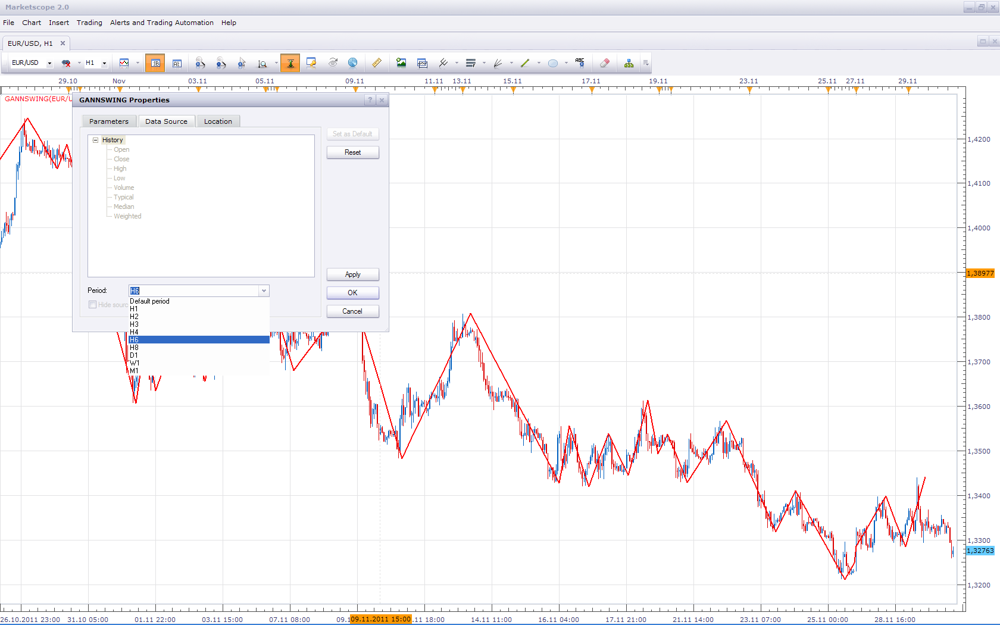

# Gann Swing

> Source: https://fxcodebase.com/code/viewtopic.php?f=17&t=294  
> Forum: 17 · Topic 294 · 14 post(s)

---

## Gann Swing

**Nikolay.Gekht** · Tue Feb 09, 2010 2:53 pm

Gann swing is an analogue of the [ZigZag](https://fxcodebase.com/code/viewtopic.php?f=17&t=275) indicator can be used to detect market's figures.

The rules are the following:

> **Apprentice wrote:**
> Gann Swing indicators
>
> 1.Two consecutive Higher High candles indicate Upswing.
>
> 2.Two consecutive Lower Low candles indicate Downswing.
>
>
> 3.Swing lines connect either Highs or Lows of individual bars - never Open or Close.
> 4.If the next bar has a higher high and a higher low (or the same low) when compared to the previous bar, then the swing line goes up connecting the high of the next bar.
> 5. If the next bar has a lower high (or same high) and a lower low when compared to the previous bar, then the swing line goes down connecting the low of the next bar.
> 6.If the next bar is an inside bar (lower high and higher low), ignore it and don’t plot a line on it at all – wait for the next bar.
> 7.If the next br is an outside bar (higher high and lower low), plot a swing line on the high of an outside bar if the following bar (one after the outside bar) is lower, OR plot a swing line on the low of an outside bar if the following bar (one after the outside bar) is higher.
> 8. Market growth over the previous peak marks the beginning of Uptrenda (Solid line).
>
> 9. Markets fall below the previous valley marks the beginning of Downtrenda (Dash line).

Code: [Select all](https://fxcodebase.com/code/)
`-- initializes the indicator
function Init()
    indicator:name("Gann Swing");
    indicator:description("");
    indicator:requiredSource(core.Bar);
    indicator:type(core.Indicator);

    indicator.parameters:addColor("clr", "Color of the line", "", core.rgb(255, 0, 0));
end

local first = 0;
local source = nil;
local high = nil;
local low = nil;
local out = nil;

-- initializes the instance of the indicator
function Prepare()
    source = instance.source;
    high = source.high;
    low = source.low;
    first = source:first();
    local name = profile:id() .. "(" .. source:name() .. ")";
    instance:name(name);
    out = instance:addStream("GSW", core.Line, name, "GSW", instance.parameters.clr,  first);
end

local swingNone = 0;
local swingUp = 1;
local swingDown = -1;
local swingDir = nil;
local _previousPeak = nil;
local _previousDrawn = nil;

-- calculate the value
function Update(period)
    local i, us, ds;

    if (period <= 3) then
        swingDir = swingNone;
        _previousPeak = nil;
        _previousDrawn = nil;
    end

    local previousPeak = nil;
    local previousDrawn = nil;

    if _previousPeak ~= nil then
        for i = period, 0, -1 do
            if (source:date(i) == _previousDrawn) then
                previousDrawn = i;
            end
            if (source:date(i) == _previousPeak) then
                previousPeak = i;
                break;
            end
        end
    end

    if (previousPeak == nil) then
        swingDir = swingNone;
        previousDrawn = nil;
    end

    period = period - 1;        -- calculate for the previous period
    if previousPeak ~= nil and previousPeak == period then
        return ;
    end

    if (period > 3) then
        -- check for swing high and swing low conditions
        us = false;
        ds = false;

        -- 1.Two consecutive Higher High candles indicate Upswing.
        if high[period] > high[period - 1] and high[period - 1] > high[period - 2] then
            us = true;
        end

        -- 2.Two consecutive Lower Low candles indicate Downswing.
        if low[period] < low[period - 1] and low[period - 1] < low[period - 2] then
            ds = true;
        end

        -- 4.If the next bar has a higher high and a higher low (or the same low) when
        -- compared to the previous bar, then the swing line goes up connecting the high of the next bar.
        if not(us) and high[period] > high[period - 1] and low[period] >= low[period -1] then
            us = true;
        end
       
        -- 5. If the next bar has a lower high (or same high) and a
        -- lower low when compared to the previous bar, then the swing line goes down connecting the low of the next bar.
        if not(ds) and high[period] <= high[period - 1] and low[period] < low[period -1] then
            ds = true;
        end

        if us then
            if swingDir == swingUp then
                core.drawLine(out, core.range(previousPeak, period), out[previousPeak], previousPeak, high[period], period);
                previousDrawn = period;
            elseif swingDir == swingDown then
                -- direction was changed
                core.drawLine(out, core.range(previousDrawn, period), out[previousDrawn], previousDrawn, high[period], period);
                swingDir = swingUp;
                previousPeak = previousDrawn;
                previousDrawn = period;
            else
                -- no direction yet
                swingDir = swingUp;
                previousPeak = period;
                previousDrawn = period;
                out[period] = high[period];
            end
        elseif ds then
            if swingDir == swingDown then
                -- continue the gann line from the last peak
                core.drawLine(out, core.range(previousPeak, period), out[previousPeak], previousPeak, low[period], period);
                previousDrawn = period;
            elseif swingDir == swingUp then
                -- direction was changed
                core.drawLine(out, core.range(previousDrawn, period), out[previousDrawn], previousDrawn, low[period], period);
                swingDir = swingDown;
                previousPeak = previousDrawn;
                previousDrawn = period;
            else
                -- no direction yet
                swingDir = swingDown;
                previousPeak = period;
                previousDrawn = period;
                out[period] = low[period];
            end
        else
            -- 7.If the next br is an outside bar (higher high and
            -- lower low), plot a swing line on the high of an outside bar if the
            -- following bar (one after the outside bar) is lower, OR plot a swing
            -- line on the low of an outside bar if the following bar (one after the
            -- outside bar) is higher.
            if (high[period - 1] > high[period - 2] and low[period - 1] < low[period - 2]) then
                -- outside bar was before the current bar
                if (high[period] > high[period - 1] and low[period] >= low[period - 1]) then
                    -- plot to low
                    if swingDir == swingDown then
                        -- continue the gann line from the last peak
                        core.drawLine(out, core.range(previousPeak, period), out[previousPeak], previousPeak, low[period], period);
                        previousDrawn = period;
                    elseif swingDir == swingUp then
                        -- direction was changed
                        core.drawLine(out, core.range(previousDrawn, period), out[previousDrawn], previousDrawn, low[period], period);
                        swingDir = swingDown;
                        previousPeak = previousDrawn;
                        previousDrawn = period;
                    end
                elseif (high[period] <= high[period - 1] and low[period] < low[period - 1]) then
                    -- plot to high
                    if swingDir == swingUp then
                        core.drawLine(out, core.range(previousPeak, period), out[previousPeak], previousPeak, high[period], period);
                        previousDrawn = period;
                    elseif swingDir == swingDown then
                        -- direction was changed
                        core.drawLine(out, core.range(previousDrawn, period), out[previousDrawn], previousDrawn, high[period], period);
                        swingDir = swingUp;
                        previousPeak = previousDrawn;
                        previousDrawn = period;
                    end
                end
            end
        end
        if (previousPeak ~= nil) then
            _previousPeak = source:date(previousPeak);
        end
        if (previousDrawn ~= nil) then
            _previousDrawn = source:date(previousDrawn);
        end
    end
end`

Download:

 [gannswing.lua](files/513/gannswing.lua)

Many thanks to user Apprentice who prepared the excellent specification and walked an extra mile with us in testing of this indicator.

Mq4 version can be found here.
[viewtopic.php?f=38&t=63884&p=108195#p108195](https://fxcodebase.com/code/viewtopic.php?f=38&t=63884&p=108195#p108195)

The indicator was revised and updated

---

## Re: Gann Swing

**sedraude** · Thu Nov 04, 2010 8:29 am

Hi Nikolay,

Can you make it in bigger time frame, too?

Thank you in advance

---

## Re: Gann Swing

**Apprentice** · Thu Nov 04, 2010 8:35 am

Added to developmental cue.

---

## Re: Gann Swing

**Apprentice** · Fri Nov 26, 2010 10:42 am

Style Update

---

## Re: Gann Swing

**deltayod** · Thu Jan 06, 2011 12:23 am

As it is illustrated on bullet points 8 and 9 of the original post, it would be very beneficial to have the indicator either change from solid to dashed/dotted or better yet to change color when changing from uptrend to downtrend (and vice a versa) as per the conditions already explained in detail. For example, blue for uptrend and red for downtrend, with the color selected by the user. Could this enhancement be added to the indicator

Thanks in advance

---

## Re: Gann Swing

**Apprentice** · Thu Jan 06, 2011 5:00 am

Adding this capability is now quite complicated, gives me a headache.
Just wait a few days to release a new version of the platform.

---

## Re: Gann Swing

**Apprentice** · Wed Nov 30, 2011 3:46 am

Bigger time frame version is now unnecessary.
It is possible to have this, by changing the time frame of the data source.

---

## Re: Gann Swing

**Rachid** · Tue Sep 24, 2013 12:25 pm

Hi Nikolay,

Thank you for all great work you did.

Is it possible to combine the 2 here attached indicators in order to have a Gann Retracement based on the last zig or zag instead of the last N candels?

Thank you in advance

---

## Re: Gann Swing

**Apprentice** · Wed Sep 25, 2013 4:25 am

Your request is added to the development list.

---

## Re: Gann Swing

**Apprentice** · Wed Sep 25, 2013 6:16 am

Try This version.
[viewtopic.php?f=17&t=59571](https://fxcodebase.com/code/viewtopic.php?f=17&t=59571)

---

## Re: Gann Swing

**volnmar** · Tue Dec 02, 2014 4:52 am

can you please update it with option for **3** consecutive bars? Not only 2.

---

## Re: Gann Swing

**volnmar** · Tue Dec 02, 2014 6:04 am

Or like it is described here: [http://www.ino.com/blog/2009/07/using-gann-swing-charts-in-futures-trading/#.VH2OPzGG-9E](http://www.ino.com/blog/2009/07/using-gann-swing-charts-in-futures-trading/#.VH2OPzGG-9E)

> However, in the real world, it is very rare that you will see “3 consecutive” down candles without one, or sometimes even two up candles in between, which would mean normally, even if price moved a significant distance, one wouldn’t be able to class it as a Gann price swing. For example:
>
>
>
>
> Observe diagrams A & B. (Assume trend is up). The “standard” Gann 3 candle pullback is shown in diagram A. A swing low is established at point X. According to W.D. Gann, point Y in diagram B would not qualify as a swing low, because down days are not consecutive. In reality I suggest there is little difference between diagram A and B, so little in fact, one can suggest they are substantially the same. Consequently, I have chosen to modify a traditional Gann 3 period swing chart by relaxing the requirement for there to be 3 “consecutive” days in order for a Gann swing to be formed. I use the definition of 3 lower lows (without there being a new higher high – i.e. higher than “Z” in-between).

---

## Re: Gann Swing

**Apprentice** · Tue Dec 02, 2014 6:44 pm

Your request is added to the development list.

---

## Re: Gann Swing

**Apprentice** · Sat Jul 01, 2017 5:26 am

The indicator was revised and updated.
