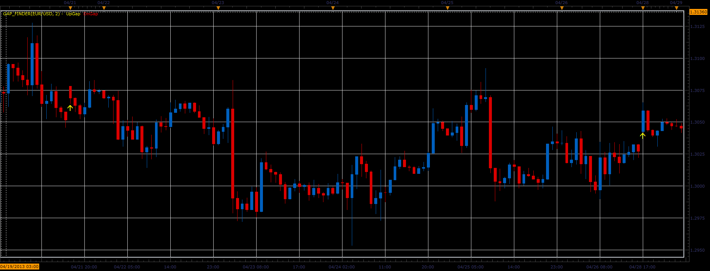

# Gap finder

> Source: https://fxcodebase.com/code/viewtopic.php?f=17&t=36113  
> Forum: 17 · Topic 36113 · 21 post(s)

---

## Gap finder

**Alexander.Gettinger** · Tue Apr 30, 2013 4:50 pm

The indicator shows gaps on the price chart.

 

Download:

 [Gap_Finder.lua](files/60729/Gap_Finder.lua)

 [Gap_Finder_With_Alert.lua](files/60729/Gap_Finder_With_Alert.lua)

---

## Re: Gap finder

**Apprentice** · Thu May 11, 2017 1:39 pm

Indicator was revised and updated.

---

## Re: Gap finder

**mistertrade** · Mon May 25, 2020 11:22 pm

Hello,

I use the indicator gap_finder and it works very well.

I would like to know if it is possible to add a new functionnality which would be :
 "Delete the arrow for all the gaps that have been closed"

Thank you for your help.
Philippe

---

## Re: Gap finder

**Apprentice** · Tue May 26, 2020 8:06 am

Your request is added to the development list.
Development reference 1357.

---

## Re: Gap finder

**mistertrade** · Mon Jun 01, 2020 10:24 pm

Hello, I saw that yesterday you developed development reference 1389.
Mine is 1357.
What is the rule you apply to take in charge new developments ? I thought the number (1357) was a sequential number which indicated the next developments to come, but it seems no.
Thank you...

---

## Re: Gap finder

**Apprentice** · Tue Jun 02, 2020 5:36 am

Developers have the freedom to choose the tasks, according to their preferences and abilities.

---

## Re: Gap finder

**Apprentice** · Tue Jun 09, 2020 7:21 am

[Gap Finder Redraw.lua](files/134725/Gap%20Finder%20Redraw.lua)

Something like this?

---

## Re: Gap finder

**mistertrade** · Tue Jun 09, 2020 11:57 pm

Hello Apprentice,

Thank you very much for your work.

I just wanted to know how to best use the 'Lookback' parameter.

For example, suppose that the indicator detects a gap in period 'P'. This gap is closed during the 'P + 15' period.

What value should I put in 'Lookback' so that the signal is automatically erased on the graph at P + 15?

Thank you

---

## Re: Gap finder

**Apprentice** · Wed Jun 10, 2020 5:00 am

Your request is added to the development list.
Development reference 1452.

---

## Re: Gap finder

**Apprentice** · Wed Jun 10, 2020 5:39 am

15

---

## Re: Gap finder

**mistertrade** · Wed Jun 10, 2020 7:04 am

Ok I understand
It works very well
Thank you

---

## Re: Gap finder

**mistertrade** · Fri Jun 19, 2020 2:19 am

Hi,

Is it possible to add a sound alarm when a gap is detected ? It would be a great help...

Thanks

---

## Re: Gap finder

**Apprentice** · Fri Jun 19, 2020 4:17 am

Your request is added to the development list.
Development reference 1517.

---

## Re: Gap finder

**Apprentice** · Sun Jun 21, 2020 5:17 am

Gap_Finder_With_Alert.lua added.

---

## Re: Gap finder

**mistertrade** · Sun Jun 21, 2020 9:48 pm

Thank you very much...

---

## Re: Gap finder

**papynou34** · Fri Jan 15, 2021 11:17 am

Hello,
First of all receive my best wishes for 2021.
Is it possible to have un option to draw lines (rectangle) on graph determinig the gap and remove it when the gap is filled?.

Thanks a lot in advance.

---

## Re: Gap finder

**Apprentice** · Mon Jan 18, 2021 7:39 am

Your request is added to the development list.
Development reference 89.

---

## Re: Gap finder

**Apprentice** · Mon Apr 12, 2021 12:49 pm

[Gap_finder.lua](files/141465/Gap_finder.lua)

Try this version.

---

## Re: Gap finder

**stavloiz** · Tue Apr 19, 2022 9:37 am

i was hoping for something like the attached: -

---

## Re: Gap finder

**stavloiz** · Thu Apr 21, 2022 7:23 am

hanks guys, could it be written in pine script for Trading View?

---

## Re: Gap finder

**Apprentice** · Fri Apr 22, 2022 4:05 am

We do not provide support for the Trading View.
