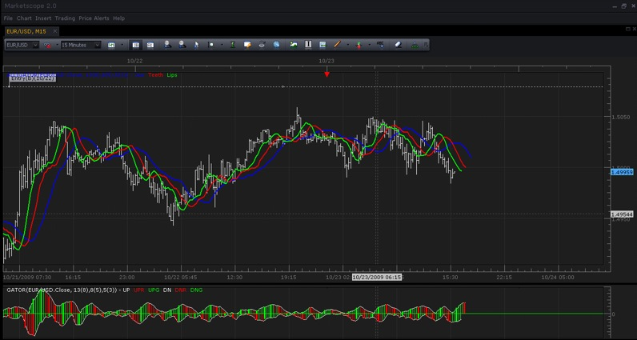

# "Gator" Oscillator (closed topic)

> Source: https://fxcodebase.com/code/viewtopic.php?f=17&t=27  
> Forum: 17 · Topic 27 · 4 post(s)

---

## "Gator" Oscillator (closed topic)

**admin** · Fri Oct 23, 2009 4:25 pm

**Note: This version is OLD version of the indicator. To get the new version please follow this link:
[viewtopic.php?f=17&t=1975](https://fxcodebase.com/code/viewtopic.php?f=17&t=1975).**

Gator Oscillator is based on the Alligator Indicator and shows the degree of convergence/divergence of the Smoothed Moving Averages. Gator oscillator is usually used in combination with “Alligator” indicator. (As you can see on the screenshot)

Gator displays 2 history graphs:

- **Top Graph:** Shows the distance between Blue and Red lines of the “Alligator”. (Jaws <-> Teeth)
- **Bottom Graph:** Shows the distance between Red and Green lines of the “Alligator”. (Teeth <-> Lips)

“Gator” shows convergence and intertwining of the Lines when “Alligator” indicator is “asleep” or “awake” and can help you identify a trend.

**Calculation:**
Top Graph = | Alligator Jaw – Alligator Teeth |
Bottom Graph = - | Alligator Teeth – Alligator Lips |
(*|| means the absolute value.)

 

*Gator Screenshot. (Note that "Gator" is the oscillator below. Over the chart lines is the Alligator Indicator, with which "Gator" is usually used.)*

 [gator.lua](files/28/gator.lua)

Tags: Gator, indicator, Marketscope, oscillator, Trading Station, FXCM, dbFX

The indicator was revised and updated

---

## "Gator" Oscillator based on SMMA and Median price

**Nikolay.Gekht** · Tue Dec 22, 2009 3:43 pm

As for the [alligator](https://fxcodebase.com/code/viewtopic.php?f=17&t=15#p263) indicator, the gator oscillator can be also calculated using [smma](https://fxcodebase.com/code/viewtopic.php?f=17&t=195) average and median price.

Here is the modified version of the gator oscillator:

 [gator1.lua](files/264/gator1.lua)

Source code:

Code: [Select all](https://fxcodebase.com/code/)
`-- initializes the indicator
function Init()
    indicator:name("Gator1");
    indicator:description("Median and SMMA-based version of the gator")
    indicator:requiredSource(core.Bar);
    indicator:type(core.Oscillator);

    indicator.parameters:addInteger("JawN", "Number of periods for smoothing the alligator jaw", "", 13, 2, 1000);
    indicator.parameters:addInteger("JawS", "Number of periods for shifting the alligator jaw", "", 8, 1, 100);
    indicator.parameters:addInteger("TeethN", "Number of periods for smoothing the alligator teeth", "", 8, 2, 1000);
    indicator.parameters:addInteger("TeethS", "Number of periods for shifting the alligator teeth", "", 5, 1, 100);
    indicator.parameters:addInteger("LipsN", "Number of periods for smoothing the alligator lips", "", 5, 2, 1000);
    indicator.parameters:addInteger("LipsS", "Number of periods for shifting the alligator lips", "", 3, 1, 100);
    indicator.parameters:addString("MTH", "Smoothing method", "", "SMMA");
    indicator.parameters:addStringAlternative("MTH", "MVA", "", "MVA");
    indicator.parameters:addStringAlternative("MTH", "EMA", "", "EMA");
    indicator.parameters:addStringAlternative("MTH", "LWMA", "", "LWMA");
    indicator.parameters:addStringAlternative("MTH", "SMMA", "", "SMMA");
    indicator.parameters:addColor("CL_color", "Color for covering line", "Color for covering line", core.rgb(255, 255, 255));
    indicator.parameters:addColor("GO_color", "Color for higher bars", "Color for higher bars", core.rgb(0, 255, 0));
    indicator.parameters:addColor("RO_color", "Color for lower bars", "Color for lower bars", core.rgb(255, 0, 0));

end

-- lines parameters
local JawN, JawS;
local TeethN, TeethS;
local LipsN, LipsC;

-- indicator source
local source;
local median;

-- alligator lines
local Jaw, Teeth, Lips;
-- alligator lines sources
local JawSrc, TeethSrc, LipsSrc;
-- gator bars
local Up, Down, UpRed, UpGreen, DownRed, DownGreen;
-- bar's parameters
local UpExtent, DownExtent;
local UpFirst, DownFirst;

-- process parameters and prepare for calculations
function Prepare()
    JawN = instance.parameters.JawN;
    JawS = instance.parameters.JawS;
    TeethN = instance.parameters.TeethN;
    TeethS = instance.parameters.TeethS;
    LipsN = instance.parameters.LipsN;
    LipsS = instance.parameters.LipsS;

    source = instance.source;
    median = instance:addInternalStream(source:first(), 0);

    JawSrc = core.indicators:create(instance.parameters.MTH, median, JawN, core.rgb(0, 0, 0));
    TeethSrc = core.indicators:create(instance.parameters.MTH, median, TeethN, core.rgb(0, 0, 0));
    LipsSrc = core.indicators:create(instance.parameters.MTH, median, LipsN, core.rgb(0, 0, 0));

    local name = profile:id() .. "(" .. source:name() .. ", " .. JawN .. "(" .. JawS .. ")," .. TeethN .. "(" .. TeethS .. ")," .. LipsN .. "(" .. LipsS .. "))";
    instance:name(name);

    Jaw = instance:addInternalStream(JawSrc.DATA:first() + JawS, JawS);
    Teeth = instance:addInternalStream(TeethSrc.DATA:first() + TeethS, TeethS);
    Lips = instance:addInternalStream(LipsSrc.DATA:first() + LipsS, LipsS);

    UpExtent = math.min(JawS, TeethS);
    UpFirst = math.max(Jaw:first(), Teeth:first());
    Up = instance:addStream("UP", core.Line, name .. ".UP", "UP", instance.parameters.CL_color, UpFirst, UpExtent);
    Up:addLevel(0);
    UpRed = instance:addStream("UPR", core.Bar, name .. ".UPR", "UPR", instance.parameters.RO_color, UpFirst, UpExtent);
    UpGreen = instance:addStream("UPG", core.Bar, name .. ".UPG", "UPG", instance.parameters.GO_color, UpFirst, UpExtent);

    DownExtent = math.min(TeethS, LipsS);
    DownFirst = math.max(Teeth:first(), Lips:first());
    Down = instance:addStream("DOWN", core.Line, name .. ".DN", "DN", instance.parameters.CL_color, DownFirst, DownExtent);
    DownRed = instance:addStream("DNR", core.Bar, name .. ".DNR", "DNR", instance.parameters.RO_color, DownFirst, DownExtent);
    DownGreen = instance:addStream("DNG", core.Bar, name .. ".DNG", "DNG", instance.parameters.GO_color, DownFirst, DownExtent);

end

-- Indicator calculation routine
function Update(period, mode)
    -- calculate alligator
    median[period] = (source.high[period] + source.low[period]) / 2;
    JawSrc:update(mode);
    TeethSrc:update(mode);
    LipsSrc:update(mode);

    if (period + JawS >= 0 and period >= JawSrc.DATA:first()) then
        Jaw[period + JawS] = JawSrc.DATA[period];
    end

    if (period + TeethS >= 0 and period >= TeethSrc.DATA:first()) then
        Teeth[period + TeethS] = TeethSrc.DATA[period];
    end

    if (period + LipsS >= 0 and period >= LipsSrc.DATA:first()) then
        Lips[period + LipsS] = LipsSrc.DATA[period];
    end
    -- calculate gator
    if period >= UpFirst then
        Up[period + UpExtent] = math.abs(Jaw[period + UpExtent] - Teeth[period + UpExtent]);
        if period >= UpFirst + 1 then
            if Up[period + UpExtent] >= Up[period + UpExtent - 1] then
                UpGreen[period + UpExtent] = Up[period + UpExtent];
            else
                UpRed[period + UpExtent] = Up[period + UpExtent];
            end
        end
    end
    if period >= DownFirst then
        Down[period + DownExtent] = -math.abs(Teeth[period + DownExtent] - Lips[period + DownExtent]);
        if period >= DownFirst + 1 then
            if Down[period + DownExtent] >= Down[period + DownExtent - 1] then
                DownGreen[period + DownExtent] = Down[period + DownExtent];
            else
                DownRed[period + DownExtent] = Down[period + DownExtent];
            end
        end
    end
end`

---

## Re: "Gator" Oscillator

**boursicoton** · Tue Aug 10, 2010 3:20 pm

color on gator..... not simply !

but if on gator histo < 0, down = green et up = red....waouh...! because mouvement is synchro with histo gator >0
gator explain the difference between alligator lines
if divergence : green for two histos
if convergence : red...
do you understand my bad english and poor french !

---

## Re: "Gator" Oscillator (closed topic)

**Apprentice** · Mon Jan 16, 2017 6:45 am

Indicator was revised and updated.
