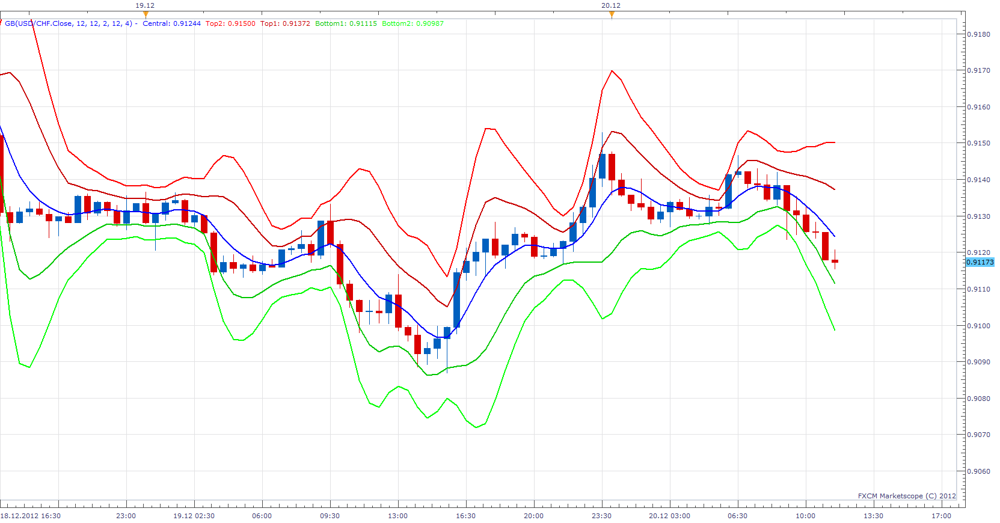

# Gaussian Bands

> Source: https://fxcodebase.com/code/viewtopic.php?f=17&t=27847  
> Forum: 17 · Topic 27847 · 3 post(s)

---

## Gaussian Bands

**Apprentice** · Thu Dec 20, 2012 5:50 am

Works nearly the same as the original bollinger band, but with following features:
Gaussian Filtration for centerline;
Gaussian Filtration for stDev;

 [GB.lua](files/48828/GB.lua)

The indicator was revised and updated

---

## Re: Gaussian Bands

**Alexander.Gettinger** · Tue Sep 23, 2014 10:30 am

MQL4 version of Gaussian Bands indicator: [viewtopic.php?f=38&t=61231](https://fxcodebase.com/code/viewtopic.php?f=38&t=61231).

---

## Re: Gaussian Bands

**Apprentice** · Fri Jun 23, 2017 7:15 am

The indicator was revised and updated.
