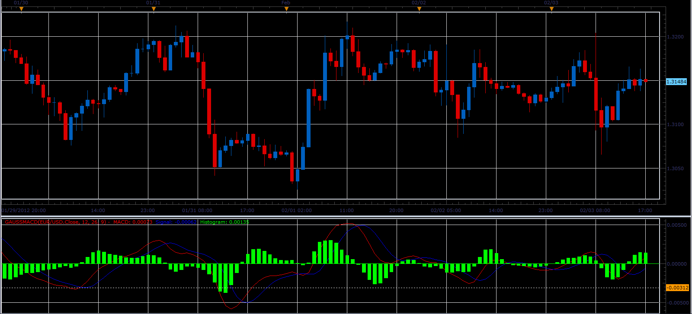

# Gaussian MACD

> Source: https://fxcodebase.com/code/viewtopic.php?f=17&t=12839  
> Forum: 17 · Topic 12839 · 4 post(s)

---

## Gaussian MACD

**Alexander.Gettinger** · Sat Feb 04, 2012 9:07 pm

MACD with Gaussian MA ([viewtopic.php?f=17&t=12230](https://fxcodebase.com/code/viewtopic.php?f=17&t=12230)) instead of EMA.

 

Download:

 [GaussMACD.lua](files/25182/GaussMACD.lua)

The indicator was revised and updated

---

## Re: Gaussian MACD

**kekonline** · Tue Mar 13, 2012 3:18 am

hello very nice macd i wanted to ask you if it is possible to have this same macs but with volume as source to the macs.

thank you

---

## Re: Gaussian MACD

**Alexander.Gettinger** · Tue Mar 13, 2012 2:48 pm

> **kekonline wrote:**
> hello very nice macd i wanted to ask you if it is possible to have this same macs but with volume as source to the macs.
>
> thank you

You may use this MACD with volume as source.

---

## Re: Gaussian MACD

**Apprentice** · Mon Mar 27, 2017 3:49 pm

Indicator was revised and updated.
