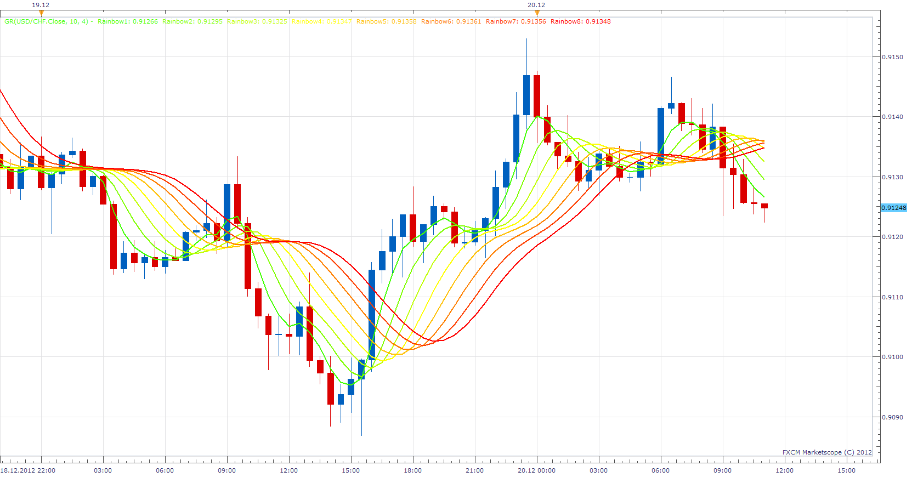

# Gaussian Rainbow

> Source: https://fxcodebase.com/code/viewtopic.php?f=17&t=27846  
> Forum: 17 · Topic 27846 · 3 post(s)

---

## Gaussian Rainbow

**Apprentice** · Thu Dec 20, 2012 5:02 am

This indiactor uses gaussian filtration to get the first filter line,
 the additional lines are calculated by refiltration of the last filter line.
Use it for spotting trends, sideway markets and retracement zones

 [GR.lua](files/48825/GR.lua)

The indicator was revised and updated

---

## Re: Gaussian Rainbow

**Alexander.Gettinger** · Tue Sep 23, 2014 10:33 am

MQL4 version of Gaussian Rainbow indicator: [viewtopic.php?f=38&t=61232](https://fxcodebase.com/code/viewtopic.php?f=38&t=61232).

---

## Re: Gaussian Rainbow

**Apprentice** · Fri Jun 23, 2017 7:13 am

The indicator was revised and updated.
