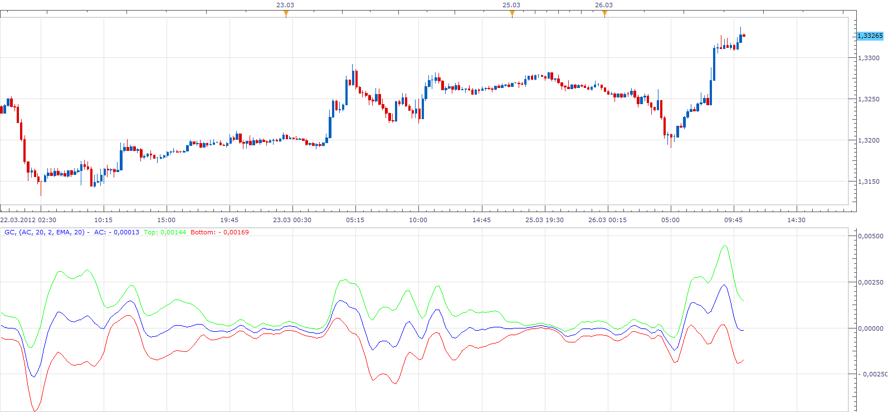

# Generic Channel

> Source: https://fxcodebase.com/code/viewtopic.php?f=17&t=15195  
> Forum: 17 · Topic 15195 · 2 post(s)

---

## Generic Channel

**Apprentice** · Mon Mar 26, 2012 10:25 am

This indicator allows you to add a channel, to any indicator.
Use the standard deviation as a measure of volatility.
The initial smoothing is supported.

 [GC.lua](files/28723/GC.lua)

The indicator was revised and updated

---

## Re: Generic Channel

**Apprentice** · Tue Apr 04, 2017 3:49 am

Indicator was revised and updated.
