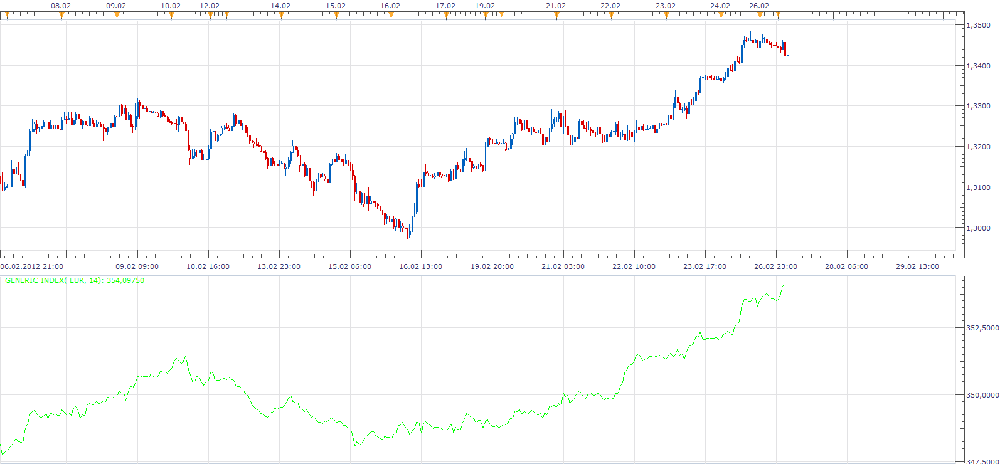

# Generic Index

> Source: https://fxcodebase.com/code/viewtopic.php?f=17&t=14219  
> Forum: 17 · Topic 14219 · 2 post(s)

---

## Generic Index

**Apprentice** · Mon Feb 27, 2012 7:16 am

This indicator is generated index for the selected pair.
Based on all available currency pairs, where the currency is component.

 [Generic Index.lua](files/27104/Generic%20Index.lua)

The indicator was revised and updated

---

## Re: Generic Index

**Apprentice** · Mon Apr 03, 2017 4:41 am

Indicator was revised and updated.
