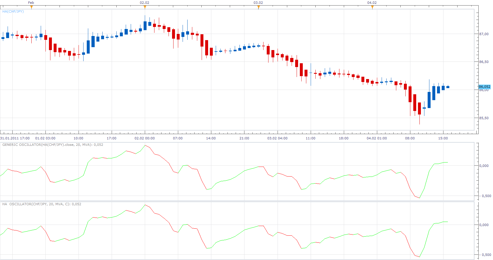

# Generic Oscillator

> Source: https://fxcodebase.com/code/viewtopic.php?f=17&t=3337  
> Forum: 17 · Topic 3337 · 2 post(s)

---

## Generic Oscillator

**Apprentice** · Sun Feb 06, 2011 6:18 am

This oscillator uses tick data, as the source.
What allows you to use it with any source,
regardless of whether it is a Price, Indicator or Oscillator

The formula is.
Tick Source - Moving Average of Tick Source

 [Generic Oscillator.lua](files/7970/Generic%20Oscillator.lua)

MT4/MQ4 version.
[viewtopic.php?f=38&t=65482&p](https://fxcodebase.com/code/viewtopic.php?f=38&t=65482&p)

To work install 20 in 1 Moving Average Indicator a.k.a. Averages
[viewtopic.php?f=17&t=2430](https://fxcodebase.com/code/viewtopic.php?f=17&t=2430)

HA oscillator

 

For comparison I put HA oscillator.
Each design has its advantages and disadvantages.
So I put both.

 [HA Oscillator.lua](files/7970/HA%20Oscillator.lua)

Likewise To work install 20 in 1 Moving Average Indicator a.k.a. Averages
[viewtopic.php?f=17&t=2430](https://fxcodebase.com/code/viewtopic.php?f=17&t=2430)

The indicator was revised and updated

---

## Re: Generic Oscillator

**Apprentice** · Sat Feb 18, 2017 4:36 am

Indicator was revised and updated.
