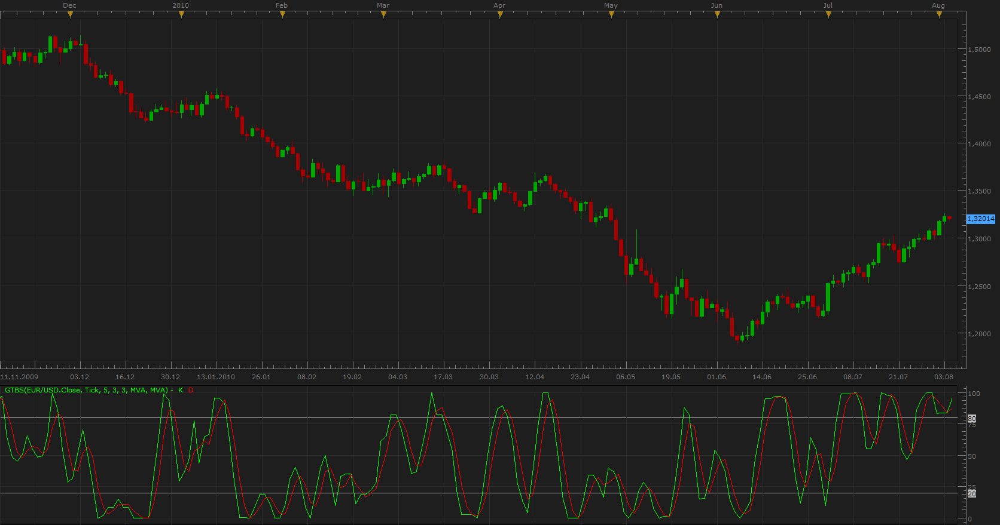

# Generic Tick Based Stochastic

> Source: https://fxcodebase.com/code/viewtopic.php?f=17&t=1667  
> Forum: 17 · Topic 1667 · 13 post(s)

---

## Generic Tick Based Stochastic

**Apprentice** · Wed Aug 04, 2010 5:07 am

This generic stochastic use ticks not bars stream for calculation.

Have Tick, MACD, RSI and ROC, as possible sources.

 [GTBS.lua](files/3313/GTBS.lua)

---

## Re: Generic Tick Based Stochastic

**philipphilip** · Wed Dec 24, 2014 10:08 am

Hello,
This indicator, what are the default settings for the Smoothing that gets applied to the Stochastic?

Thank you in advance,

---

## Re: Generic Tick Based Stochastic

**philipphilip** · Wed Dec 24, 2014 10:20 am

The indicator has "Smoothing type for %K". What is the period that %K is being smoothed? As I think it is by what ever the period of %K is specified above but that would create a Stochastic that is to smoothed than what it is.
Please could some one maybe explain the Smoothing type for %K" a bit?

Thanking you in advance,
Regards,

---

## Re: Generic Tick Based Stochastic

**Apprentice** · Wed Dec 24, 2014 11:12 am

Please Re-Download.
I hope that the new parameter description will be understandable.

---

## Re: Generic Tick Based Stochastic

**philipphilip** · Mon Dec 29, 2014 2:13 am

Thank you apprentice,

But the k% doesn't usually get smoothed, it is the D% that is the smoothing of the K% line in a stochastic, that is why I am confused with the smoothing "value" of K% that it doesn't specify what the value is.

Hope that helps my question?

Kind regards

---

## Re: Generic Tick Based Stochastic

**Apprentice** · Mon Dec 29, 2014 2:42 am

That may be true.
I have just translated and adapted it.
Please re-download, set smoothing period to one.

---

## Re: Generic Tick Based Stochastic

**lancelune** · Thu Sep 24, 2015 4:58 am

I have change the code to have customize style, french language, oversold overbough level classification in oscilator group.

---

## Re: Generic Tick Based Stochastic

**Apprentice** · Fri May 20, 2016 2:44 am

Minor Update.

---

## Re: Generic Tick Based Stochastic

**Apprentice** · Mon Aug 28, 2017 9:57 am

The indicator was revised and updated.

---

## Re: Generic Tick Based Stochastic

**ForexGuy** · Fri Oct 20, 2017 6:28 am

Appreciate all the work you guys are making here with all the useful indicators.
Is it possible to have the above indicator (tick stochastic) accept values larger than 1000 (for the stochastic value) when applied to tick charts?
Thank you in advance for the interest in this request.

P.S. I have searched the forum for a stochastic (other than the fisher transform one) to accept values larger than 1000 for tick charts without any luck.

---

## Re: Generic Tick Based Stochastic

**Apprentice** · Mon Oct 23, 2017 4:58 am

Try it now.
Have set it to 100000 now.

---

## Re: Generic Tick Based Stochastic

**ForexGuy** · Mon Oct 23, 2017 5:51 am

Thank you very much, working great now.

---

## Re: Generic Tick Based Stochastic

**Apprentice** · Thu May 03, 2018 4:02 pm

The Indicator was revised and updated.
