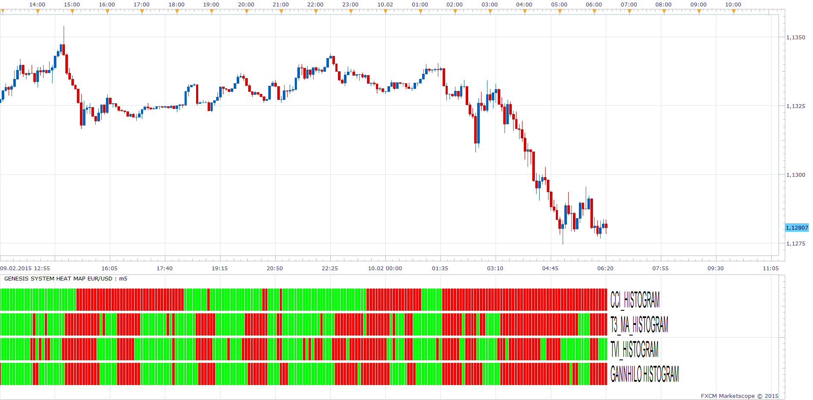

# Genesis System Heat Map

> Source: https://fxcodebase.com/code/viewtopic.php?f=17&t=60294  
> Forum: 17 · Topic 60294 · 16 post(s)

---

## Genesis System Heat Map

**Apprentice** · Wed Feb 12, 2014 7:22 am

Posted by request.
[viewtopic.php?f=27&t=59641](https://fxcodebase.com/code/viewtopic.php?f=27&t=59641)

 [Genesis System Heat Map.lua](files/92623/Genesis%20System%20Heat%20Map.lua)

 [CCI_Histogram.lua](files/92623/CCI_Histogram.lua)

 [GannHiLo Histogram.lua](files/92623/GannHiLo%20Histogram.lua)

 [T3_MA_Histogram.lua](files/92623/T3_MA_Histogram.lua)

 [T3_MA.lua](files/92623/T3_MA.lua)

 [TVI.lua](files/92623/TVI.lua)

 [TVI_Histogram.lua](files/92623/TVI_Histogram.lua)

---

## Re: Genesis System Heat Map

**cash4u** · Fri Feb 14, 2014 10:05 pm

hi to all,

thank you for this nice indicator.

can you create a strategy based on genesis system heat map with following specifications

for each bar if green color +1 score, if red color -1 score.
entry score: 4

buy: source.close[period ]has score 4 and source.close[period-1] has score 3
sell:source.close[period ]has score -4 and source.close[period-1] has score -3

---

## Re: Genesis System Heat Map

**Apprentice** · Sat Feb 15, 2014 5:57 am

Your request is added to the development list.

---

## Re: Genesis System Heat Map

**Apprentice** · Mon Feb 02, 2015 4:48 am

Genesis System Heat Map Update.

---

## Re: Genesis System Heat Map

**Apprentice** · Mon Feb 02, 2015 6:13 am

Requested strategy can be found here.
[viewtopic.php?f=31&t=61770&p=98424#p98424](https://fxcodebase.com/code/viewtopic.php?f=31&t=61770&p=98424#p98424)

---

## Re: Genesis System Heat Map

**fran_erni** · Mon Feb 09, 2015 4:23 am

I downloaded all the indicators for this strategy but still asking for GannHiLo Histogram.lua even though it is included in the package. Any idea guys why this is happening? Do i havethe wrong GannHiLo indicator? thanks!

---

## Re: Genesis System Heat Map

**Apprentice** · Tue Feb 10, 2015 2:20 am

Please re-download / re-install Genesis System Heat Map.lua.
Indicator will now provide accurate information, about missing indicators.

---

## Re: Genesis System Heat Map

**fran_erni** · Tue Feb 10, 2015 4:32 am

I redownloaded and reinstalled all the indicators and still getting the problem. Also with the Genesis System strategy it's asking for GannHilo Histogram.lua. I will attach a screenshot to make sure I am describing the right issue. Thanks for helping by the way.

---

## Re: Genesis System Heat Map

**Apprentice** · Tue Feb 10, 2015 6:17 am

As you can see, for me indicator works without any problems.

---

## Re: Genesis System Heat Map

**Apprentice** · Wed Mar 09, 2016 3:45 pm

Genesis System Heat Map.lua
CCI_Histogram.lua
Update

---

## Re: Genesis System Heat Map

**Apprentice** · Thu Sep 21, 2017 6:03 am

The indicator was revised and updated.

---

## Re: Genesis System Heat Map

**Apprentice** · Fri Jan 05, 2018 6:27 am

Try it now.
Use strategy from top/first topic post.
Re-Download CCI_Histogram.lua

---

## Re: Genesis System Heat Map

**ChrisM** · Mon Jan 08, 2018 10:46 am

Hi Apprentice,

Thanks for your update.
The TVI.lua calculation is 12/12/5 - in the histogram parameters the "5" is missing.
Therefore in my opinion the description is not quite correct in the histogram.

(by the way, the title in Heat Map should be T3_MA = GANNHILO and GANNHILO = T3_MA?)

Can you please check that.
Thanks in advance!

---

## Re: Genesis System Heat Map

**Apprentice** · Tue Jan 09, 2018 6:05 am

The signal is based on the TVI line slope,
not on TVI / Signal cross.
We use 3. parameter to define the signal,
Therefore, it is unnecessary for calculation.

---

## Re: Genesis System Heat Map

**ChrisM** · Tue Jan 09, 2018 6:26 am

thanks for your quick reply
okay, I understand.
I've only compared it to the original MT4 version and there I noticed the small difference.

---

## Re: Genesis System Heat Map

**Apprentice** · Sun Feb 04, 2018 8:27 am

The Indicator was revised and updated.
