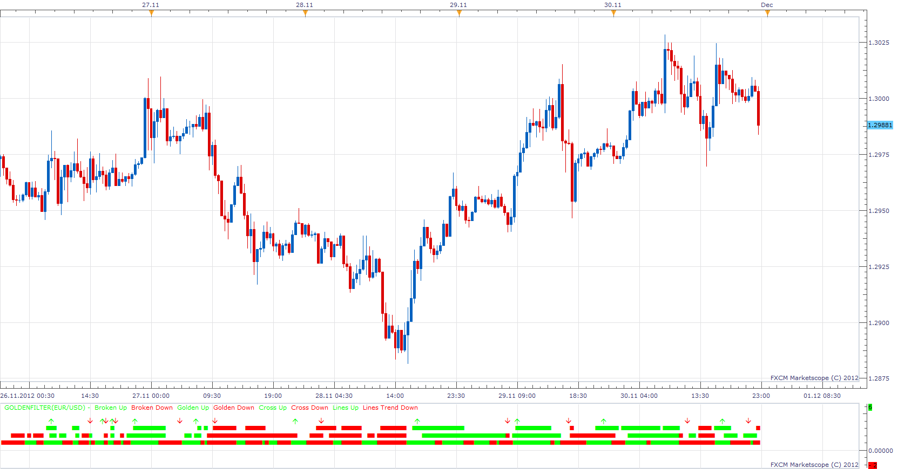

# GoldenFilter

> Source: https://fxcodebase.com/code/viewtopic.php?f=17&t=27295  
> Forum: 17 · Topic 27295 · 8 post(s)

---

## GoldenFilter

**Apprentice** · Sun Dec 02, 2012 10:32 am

**Line 1**
Long
ShortMA / LongMA CrossOver
Short
ShortMA / LongMA CrossUnder

**Line 2**
Long
MACD > SIGNAL
DIP > DIM
RSI > 50
Short
MACD < SIGNAL
DIP < DIM
RSI < 50

**Line 3**
Long
Force Index > 0
DeMarker > 0.5
Short
Force Index < 0
DeMarker < 0.5

**Line 4**
Long
Momentum > 100
Short
Momentum < 100

 [GoldenFilter.lua](files/47668/GoldenFilter.lua)

Install both DeMarker Oscillator & Force Index Indicators
 DeMarker Oscillator (DEM)
[viewtopic.php?f=17&t=22&p=5795&hilit=DeMarker#p5795](https://fxcodebase.com/code/viewtopic.php?f=17&t=22&p=5795&hilit=DeMarker#p5795)
Force Index (AEFI)
[viewtopic.php?f=17&t=1966&p=36260&hilit=Force+Index#p36260](https://fxcodebase.com/code/viewtopic.php?f=17&t=1966&p=36260&hilit=Force+Index#p36260)

MT4/Mq4 version.
[viewtopic.php?f=38&t=64941&p=113698#p113698](https://fxcodebase.com/code/viewtopic.php?f=38&t=64941&p=113698#p113698)

---

## Re: GoldenFilter

**newton** · Sun Dec 02, 2012 8:44 pm

hi,

can u create a strategy based on this indicator.

buy:

Long

ShortMA / LongMA CrossOver
MACD > SIGNAL
DIP > DIM
Force Index > 0
DeMarker > 0.5
Momentum > 100

Short

ShortMA / LongMA CrossUnder
MACD < SIGNAL
DIP < DIM
Force Index < 0
DeMarker < 0.5
Momentum < 100

---

## Re: GoldenFilter

**Apprentice** · Mon Dec 03, 2012 10:28 am

Your request is added to the development list.

---

## Re: GoldenFilter

**Apprentice** · Mon Dec 03, 2012 1:46 pm

Requested can be found here.
[viewtopic.php?f=31&t=27333&p=47770#p47770](https://fxcodebase.com/code/viewtopic.php?f=31&t=27333&p=47770#p47770)

---

## Re: GoldenFilter

**newton** · Mon Dec 03, 2012 8:27 pm

thank you.

---

## Re: GoldenFilter

**southwallholdingsltd** · Fri Aug 09, 2013 4:03 am

what is this indicator like for repainting? i've put this on a chart and looking back it looks to give very good signals....but usually when that happens I find it's because it repaints a lot. Anyone know about this?

---

## Re: GoldenFilter

**Apprentice** · Mon Aug 12, 2013 4:48 am

This indicator gives immediate indication of indicators.
Changing values ​​and changing indications.
For u, is Best to use previous period indication.

---

## Re: GoldenFilter

**Apprentice** · Tue Sep 04, 2018 9:26 am

The indicator was revised and updated.
