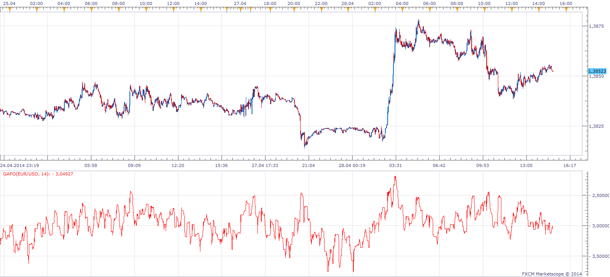

# Gopalakrishnan Range Index

> Source: https://fxcodebase.com/code/viewtopic.php?f=17&t=60132  
> Forum: 17 · Topic 60132 · 3 post(s)

---

## Gopalakrishnan Range Index

**Apprentice** · Thu Dec 19, 2013 2:33 pm

The Gopalakrishnan Range Index (GAPO) by Jayanthi Gopalakrishnan quantifies the variability in a instrument, based on the logarithm of the trading range over an N-day period .

 [GAPO.lua](files/91618/GAPO.lua)

The indicator was revised and updated

---

## Re: Gopalakrishnan Range Index

**Alexander.Gettinger** · Wed Jun 04, 2014 1:17 pm

MQL4 version of Gopalakrishnan Range Index: [viewtopic.php?f=38&t=60768](https://fxcodebase.com/code/viewtopic.php?f=38&t=60768).

---

## Re: Gopalakrishnan Range Index

**Apprentice** · Mon Jun 19, 2017 8:23 am

The indicator was revised and updated.
