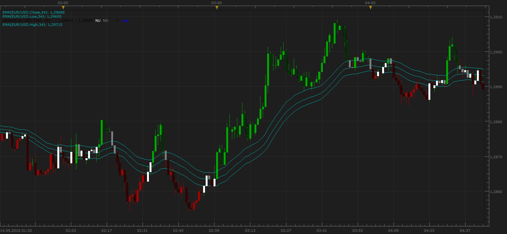

# GRAB Trading System Indicator

> Source: https://fxcodebase.com/code/viewtopic.php?f=17&t=2164  
> Forum: 17 · Topic 2164 · 2 post(s)

---

## GRAB Trading System Indicator

**Apprentice** · Tue Sep 14, 2010 10:07 am

The indicator distinguishes three different situations.
Up and Down trend and the absence of a trend, when the closing price is in the channel,
 which consists of moving averages of High and Low values.

Furthermore Swing within the trend, are colored with different colors.

 [Grab.lua](files/4483/Grab.lua)

---

## Re: GRAB Trading System Indicator

**Apprentice** · Mon Feb 05, 2018 7:46 am

The Indicator was revised and updated.
