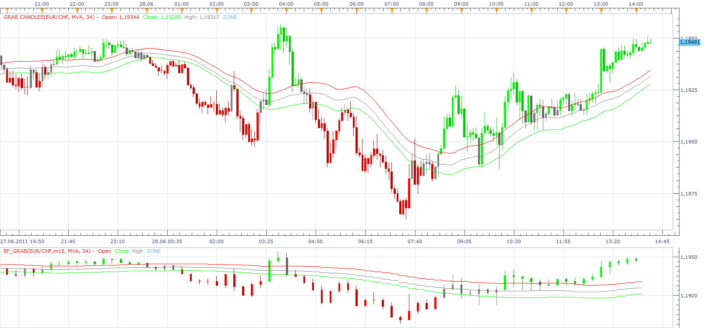
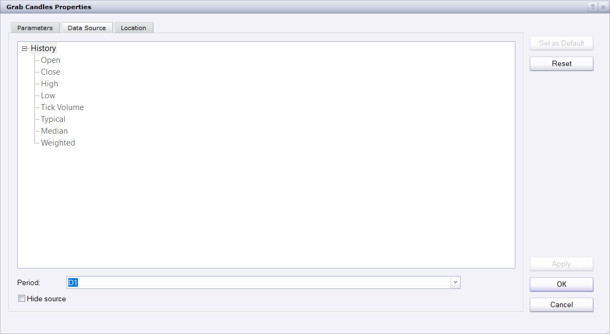

# Grab

> Source: https://fxcodebase.com/code/viewtopic.php?f=17&t=4893  
> Forum: 17 · Topic 4893 · 38 post(s)

---

## Grab

**Apprentice** · Tue Jun 28, 2011 1:33 pm

 [GRAB.lua](files/12150/GRAB.lua)

 [GRAB with Alert.lua](files/12150/GRAB%20with%20Alert.lua)

This indicator provides Audio / Email Alerts on Trend change.
Compatibility issue fixed.
_Alert Helper is not longer needed.

 

 [BF_GRAB.lua](files/12150/BF_GRAB.lua)

---

## Re: Grab

**ThemBonez** · Tue Jun 28, 2011 1:55 pm

Hi...Is it possible to creat the same candles without the moving avgs showing?
Thanx
Barry

---

## Re: Grab

**Apprentice** · Wed Jun 29, 2011 4:01 am

Option to remove Line Added.

---

## Re: Grab

**ThemBonez** · Wed Jun 29, 2011 5:57 am

Hi Apprentice,
Thank you. One more thing I noticed. The indicator is based on the Exponential Moving Avg.
This one is Simple Moving Avg. Can you change it to EMA.
Thanx

---

## Re: Grab

**ThemBonez** · Thu Jun 30, 2011 3:41 am

Hi,
One more correction:

The green 34 EMA is on the High
The Gray 34 EMA is on the Close
The red 34 EMA is on the Low (not the Open)

Thanx
Barry

---

## Re: Grab

**Alexander.Gettinger** · Mon Apr 02, 2012 10:17 am

Strategy based on GRAB indicator: [viewtopic.php?f=31&t=15509](https://fxcodebase.com/code/viewtopic.php?f=31&t=15509)

---

## Re: Grab

**nazaar** · Mon Apr 02, 2012 10:40 am

> **Apprentice wrote:**
>
>
> BF_GRAB.png
>
>

Hello,

how do you get 2 time line candlesticks on 1 screen? Say, the daily chart above and the 4 hour below. If this is possible outside of this indicator, wow!

Thanks

---

## Re: Grab

**Apprentice** · Tue Apr 03, 2012 2:33 am

You have two choices.
Use BF version, or use TS functionality,
simply select desired time frame as indivator source.

---

## Re: Grab

**rtsayers** · Wed Oct 02, 2013 9:29 pm

I would like a alert for this indicator show me when the candles go grey and also the function of when they turn red or green.

ThANKS

---

## Re: Grab

**Apprentice** · Thu Oct 03, 2013 11:55 am

GRAB with Alert added.

---

## Re: Grab

**rtsayers** · Tue Oct 08, 2013 1:15 pm

Is it possible to create multitime frame alert for this indicator

Thanks

---

## Re: Grab

**rtsayers** · Tue Oct 08, 2013 1:52 pm

There is no label alert working

---

## Re: Grab

**Apprentice** · Wed Oct 09, 2013 1:12 pm

First, Do u have activ _Alert yours during testing.
Without active _Alert alerts will not be given.

---

## Re: Grab

**rtsayers** · Wed Oct 09, 2013 1:17 pm

Hi Apprentice

I have the strategy _Alert on the pairs I want and I am getting the sound alert but not the pop up alerts
do I have to change settings in my market scope?

---

## Re: Grab

**Apprentice** · Wed Oct 09, 2013 1:30 pm

As currently written, pop up, is not one of functionalitys of this Indicator.

---

## Re: Grab

**rtsayers** · Wed Oct 09, 2013 1:50 pm

Thanks Apprentice

But it's hard to know where to look when your dealing with 12 pairs and 5 different timeframes.

So I would really appreciate a pop up or label something to let me know what pair and time frame

Thanks!

---

## Re: Grab

**Apprentice** · Fri Oct 11, 2013 2:08 am

I understand, will try to find time to add this functionality.

---

## Re: Grab

**rtsayers** · Wed Oct 23, 2013 10:27 am

Hi Apprentice

Just wondering if had the time to put the pop up label on this indicator yet!

Thanks

---

## Re: Grab

**Apprentice** · Thu Oct 24, 2013 1:35 am

ShowDialog option added.

---

## Re: Grab

**rtsayers** · Thu Oct 24, 2013 2:26 am

Awesome Thanks Apprentice!!!

---

## Re: Grab

**rtsayers** · Thu Oct 24, 2013 2:35 am

Hey Apprentice I get this error code?

An error occurred during the calculation of the indicator 'GRAB WITH ALERT'. The error details: The AsyncOperationFinished method is not defined.

---

## Re: Grab

**Apprentice** · Thu Oct 24, 2013 2:46 am

Try it now.

---

## Re: Grab

**rtsayers** · Thu Oct 24, 2013 3:13 am

Hi Apprentice

I am just getting a box that says GRAB indicator Alert Cross Over with OK and Cancel buttons?

It's not telling me what pair or time frame was triggered this is of no use!

Thanks

---

## Re: Grab

**Apprentice** · Thu Oct 24, 2013 5:41 am

Try Updated Version.

---

## Re: Grab

**Apprentice** · Wed Feb 25, 2015 11:43 am

Bump Up.

---

## Re: Grab

**Apprentice** · Sun Dec 06, 2015 5:05 am

Compatibility issue fixed.
_Alert Helper is not longer needed.

---

## Re: Grab

**deepestblue73** · Wed Jan 27, 2016 9:30 am

Would anyone know if this indicator has been converted to an MQ4 file anywhere?

I've found a couple of references in other forums to lua/MQ4 file conversion being needed to use this indicator in Metatrader4, but can't see if it's ever been done.

I really like the format of this indicator, and would like to be able to use it in Metatrader4 if possible, but can't find a suitable file to download anywhere.

Any advice anyone could offer would be appreciated. Thanks.

---

## Re: Grab

**Apprentice** · Fri Jan 29, 2016 5:19 am

Your request is added to the development list.
Note MT4 have some limitations, it will be challenging to carried out requested.

---

## Re: Grab

**Apprentice** · Fri May 20, 2016 2:57 am

Minor Update.

---

## Re: Grab

**Apprentice** · Mon Aug 28, 2017 9:53 am

The indicator was revised and updated.

---

## Re: Grab

**Alexander.Gettinger** · Mon Nov 27, 2017 11:12 am

> **deepestblue73 wrote:**
> Would anyone know if this indicator has been converted to an MQ4 file anywhere?
>
> I've found a couple of references in other forums to lua/MQ4 file conversion being needed to use this indicator in Metatrader4, but can't see if it's ever been done.
>
> I really like the format of this indicator, and would like to be able to use it in Metatrader4 if possible, but can't find a suitable file to download anywhere.
>
> Any advice anyone could offer would be appreciated. Thanks.

MQL4 version of this indicator: [viewtopic.php?f=38&t=65401](https://fxcodebase.com/code/viewtopic.php?f=38&t=65401)

---

## Re: Grab

**bartwas1** · Mon Nov 27, 2017 4:59 pm

hi

I was looking for this BF_grab indicator, but couldn't find it where to download from. Would like someone to point me in the right direction, please. Thank you in advance.

Kind regards
Bart

---

## Re: Grab

**Apprentice** · Wed Nov 29, 2017 3:39 am

By selection other Period u will have bigger time frame Grab indicator.

---

## Re: Grab

**bartwas1** · Wed Nov 29, 2017 5:58 am

Hi Apprentice

I know about a period selection option. I was looking for that indicator from the first post. You can see it there on the chart, being displayed in separate window (BF_GRAB it's called). You've mentioned about in the post by you on Tue Apr 03, 2012 7:33 am. You said (just pasted your words) about Grab indicator: 'You have two choices. Use BF version, or use TS functionality, simply select desired time frame as indivator source'.
And this is what I was looking for - a BF version.

Kind regards
Bart

---

## Re: Grab

**Apprentice** · Wed Nov 29, 2017 8:57 am

BF_GRAB.lua added.
My recommendation is to use Period option instead.

---

## Re: Grab

**bartwas1** · Wed Nov 29, 2017 9:17 am

I've tested period option, on 15 min. chart by setting Grab's indicator source period at 1h, but it draws Grab candles on top of regular 15 min. candles. It's still very usable, but also a bit messy. I think if there was an option for example to display only MA lines it would be great. They would act as a filter and suggest when the price turning point is aligned with higher time frame and therefore more likely to succeed and lead to some good trades.

---

## Re: Grab

**bartwas1** · Wed Nov 29, 2017 9:20 am

Thanks for adding BF_grab and thank you for your recommendation. Both very useful and insightful.

---

## Re: Grab

**Apprentice** · Mon Apr 23, 2018 8:17 am

The Indicator was revised and updated.
