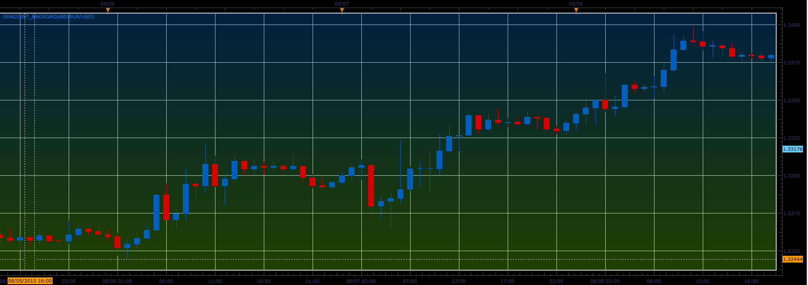
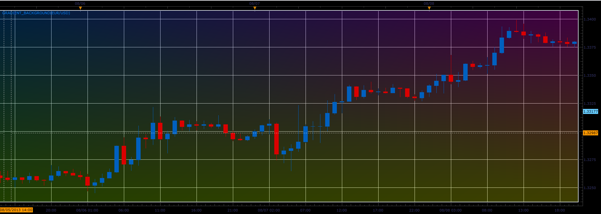
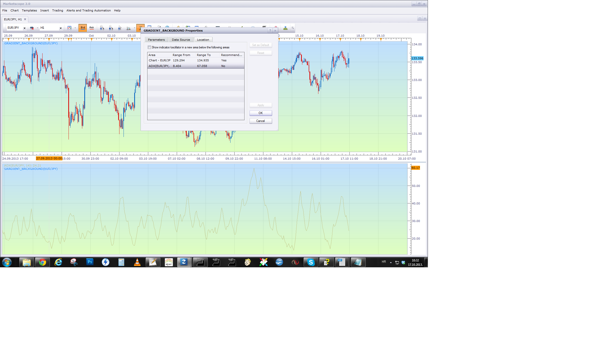

# Gradient background

> Source: https://fxcodebase.com/code/viewtopic.php?f=17&t=59343  
> Forum: 17 · Topic 59343 · 7 post(s)

---

## Gradient background

**Alexander.Gettinger** · Thu Aug 29, 2013 9:48 am

 

Download:

 [Gradient_Background.lua](files/88998/Gradient_Background.lua)

The indicator was revised and updated

---

## Re: 2013-II Beta: Gradient background

**mjf1288** · Fri Aug 30, 2013 12:46 am

This is awesome. Great work and thank you so much! Share your charts here

---

## Re: Gradient background

**Apprentice** · Tue Oct 15, 2013 1:36 am

Bump Up

---

## Re: Gradient background

**Rachid** · Wed Oct 16, 2013 9:39 am

Nice Indicator,

Thank you Alexander. My eyes are Happy

---

## Re: Gradient background

**Outside_The_Box** · Wed Oct 16, 2013 6:41 pm

Very pretty indeed. Eye candy is always welcome. One question though, is it possible to apply this to the indicators too? I tried but marketscope didn't feel like cooperating.

---

## Re: Gradient background

**Apprentice** · Thu Oct 17, 2013 3:33 am

U have to select the desired location, from indicator parameters.

---

## Re: Gradient background

**Apprentice** · Sat Jun 17, 2017 3:48 am

The indicator was revised and updated.
