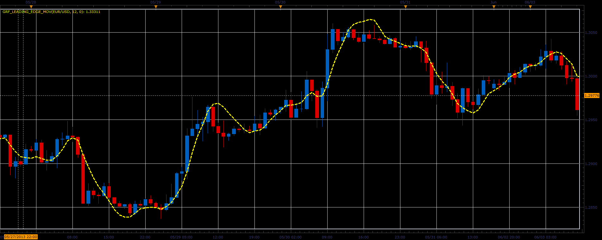

# GRF Leading Edge moving average

> Source: https://fxcodebase.com/code/viewtopic.php?f=17&t=41309  
> Forum: 17 · Topic 41309 · 2 post(s)

---

## GRF Leading Edge moving average

**Alexander.Gettinger** · Tue Jun 18, 2013 2:47 pm

This indicator is a ported MQL5 indicator from [http://www.mql5.com/ru/code/1726](http://www.mql5.com/ru/code/1726) (in Russian).

 

Download:

 [GRF_Leading_Edge_Mov.lua](files/67537/GRF_Leading_Edge_Mov.lua)

The indicator was revised and updated

---

## Re: GRF Leading Edge moving average

**Apprentice** · Sat May 27, 2017 11:52 am

Indicator was revised and updated.
