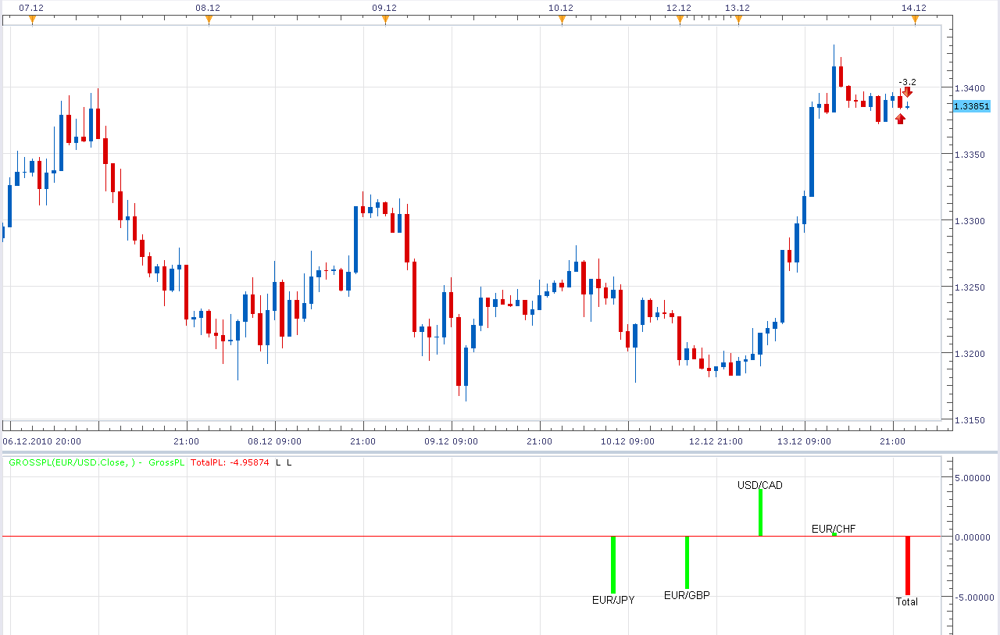

# Gross P/L Indicator

> Source: https://fxcodebase.com/code/viewtopic.php?f=17&t=2948  
> Forum: 17 · Topic 2948 · 5 post(s)

---

## Gross P/L Indicator

**Alexander.Gettinger** · Mon Dec 13, 2010 11:20 pm

Indicator show Profit/Loss for open orders with difference on instruments.

 

Download:

 [GrossPL.lua](files/6744/GrossPL.lua)

The indicator was revised and updated

---

## Re: Gross P/L Indicator

**compulsive** · Mon Jan 17, 2011 2:48 pm

Nice P/L...Is it possible to see the P/L on the upper Left Corner with $ instead of a bar in the bottom? And also, is is possible to add a changeable color? When there are positive profits the $$ is green and when is $$ negative Red?

---

## Re: Gross P/L Indicator

**Apprentice** · Mon Jan 17, 2011 3:12 pm

Added to developmental cue.

---

## Re: Gross P/L Indicator

**compulsive** · Mon Feb 04, 2013 3:40 pm

> **Apprentice wrote:**
> Added to developmental cue.

---

## Re: Gross P/L Indicator

**Apprentice** · Mon May 01, 2017 5:41 am

Indicator was revised and updated.
