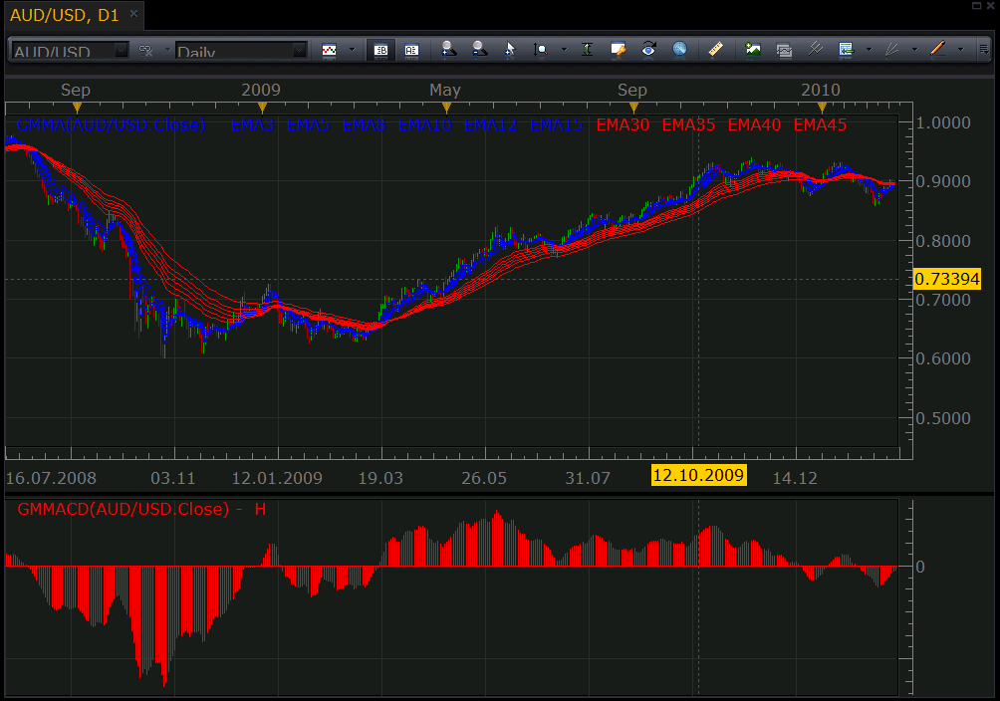
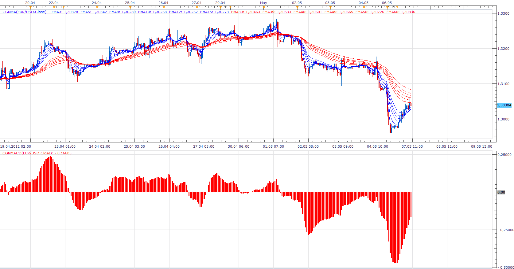

# Guppy's Multiple Moving Average and Convergence/Divergence

> Source: https://fxcodebase.com/code/viewtopic.php?f=17&t=412  
> Forum: 17 · Topic 412 · 61 post(s)

---

## Guppy's Multiple Moving Average and Convergence/Divergence

**Nikolay.Gekht** · Fri Feb 26, 2010 7:49 pm

GMMA (Guppy's Multiple Moving Average) is 12 EMA lines:

1) Short (Fast) Group:
EMA(3), EMA(5), EMA(8), EMA(10), EMA(12), EMA(15)

1) Long (Slow) Group:
EMA(30), EMA(35), EMA(40), EMA(45), EMA(50), EMA(60)

GMMACD (Guppy's Multiple Moving Average Convergence/Divergence) is calculated as:
f = SUM(Fast EMA's)
s = SUM(Slow EMA's)
GMMACD = (s - f) / s * 100

 



GMMA.lua

```lua
function Init()
    indicator:name("Guppy's Multiple Moving Average");
    indicator:requiredSource(core.Tick);
    indicator:type(core.Indicator);

    indicator.parameters:addColor("S_COLOR", "Color for the short EMA group", "", core.rgb(0, 0, 255));
    indicator.parameters:addColor("L_COLOR", "Color for the long EMA group", "", core.rgb(255, 0, 0));
end

local source = nil;
local EMAs = {};    -- an array of outputs

function CreateEMA(index, N, color, name)
    local label;
    -- line label
    label = "EMA" .. N;
    -- create the line
    EMAs[index] = instance:addStream(label, core.Line, name .. label, label,
                                     color, source:first() + N - 1);
end

function Prepare()
    source = instance.source;
    local name;

    -- set the indicator name (use the short name of our indicator: GMMA)
    name = profile:id() .. "(" .. source:name() .. ")";
    instance:name(name);

    CreateEMA(0, 3, instance.parameters.S_COLOR, name);
    CreateEMA(1, 5, instance.parameters.S_COLOR, name);
    CreateEMA(2, 8, instance.parameters.S_COLOR, name);
    CreateEMA(3, 10, instance.parameters.S_COLOR, name);
    CreateEMA(4, 12, instance.parameters.S_COLOR, name);
    CreateEMA(5, 15, instance.parameters.S_COLOR, name);

    CreateEMA(6, 30, instance.parameters.L_COLOR, name);
    CreateEMA(7, 35, instance.parameters.L_COLOR, name);
    CreateEMA(8, 40, instance.parameters.L_COLOR, name);
    CreateEMA(9, 45, instance.parameters.L_COLOR, name);
    CreateEMA(10, 50, instance.parameters.L_COLOR, name);
    CreateEMA(11, 60, instance.parameters.L_COLOR, name);
end

function CalcEMA(index, N, period)
    local first;

    first = source:first() + N - 1;
    if period < first then
       return ;
    elseif period == first then
       -- range: period - N + 1, period - N + 2, ..., period
       local range = core.rangeTo(period, N);
       EMAs[index][period] = core.avg(source, range);
    else
       local k;
       k = 2.0 / (N + 1.0);
       -- EMA - PRICE * K - PREV EMA * (1 - K)
       EMAs[index][period] = source[period] * k + EMAs[index][period - 1] * (1 - k);
    end
end

function Update(period)
    CalcEMA(0, 3, period);
    CalcEMA(1, 5, period);
    CalcEMA(2, 8, period);
    CalcEMA(3, 10, period);
    CalcEMA(4, 12, period);
    CalcEMA(5, 15, period);

    CalcEMA(6, 30, period);
    CalcEMA(7, 35, period);
    CalcEMA(8, 40, period);
    CalcEMA(9, 45, period);
    CalcEMA(10, 50, period);
    CalcEMA(11, 60, period);
end
```

GMMACD.lua

```lua
function Init()
    indicator:name("Guppy's Multiple Moving Average Convergence/Divergence");
    indicator:requiredSource(core.Tick);
    indicator:type(core.Oscillator);

    indicator.parameters:addColor("COLOR", "Indicator's Color", "", core.rgb(255, 0, 0));
end

local source = nil;
local GMMA = nil;
local out = nil;
local first = nil;

function Prepare()
    source = instance.source;
    local name;
    -- set the indicator name (use the short name of our indicator: GMMA)
    name = profile:id() .. "(" .. source:name() .. ")";
    instance:name(name);
    GMMA = core.indicators:create("GMMA", source);
    first = GMMA:getStream(11):first();
    out = instance:addStream("H", core.Bar, name .. ".H", "H", instance.parameters.COLOR, first);
    out:addLevel(0);
end

function Update(period, mode)
    GMMA:update(mode);

    if (period >= first) then
        local f, s;
        f = GMMA:getStream(0)[period] + GMMA:getStream(1)[period] + GMMA:getStream(2)[period] +
            GMMA:getStream(3)[period] + GMMA:getStream(4)[period] + GMMA:getStream(5)[period];
        s = GMMA:getStream(6)[period] + GMMA:getStream(7)[period] + GMMA:getStream(9)[period] +
            GMMA:getStream(9)[period] + GMMA:getStream(10)[period] + GMMA:getStream(11)[period];
        out[period] = (f - s) / s * 100;
    end
end
```

Download:

 [GMMA.lua](files/663/GMMA.lua)

 [GMMACD.lua](files/663/GMMACD.lua)

Note: you must have GMMA.lua installed in order to use GMMACD.lua

 



Version that allows you to define EMA periods.

 [CGMMA.lua](files/663/CGMMA.lua)

 [CGMMACD.lua](files/663/CGMMACD.lua)

Note: you must have CGMMA.lua installed in order to use CGMMACD.lua

 


 [GMMACD Overlay.lua](files/663/GMMACD%20Overlay.lua)

---

## Re: Guppy's Multiple Moving Average and Convergence/Divergence

**air2art** · Mon Jun 07, 2010 4:38 am

hi any chance for a signal when the oscilaltor crossess above/below the 0 line
Thanks

---

## Re: Guppy's Multiple Moving Average and Convergence/Divergence

**Apprentice** · Tue Jun 08, 2010 1:29 pm

The signal can be found here
[http://fxcodebase.com/code/viewtopic.php?f=29&t=1281#p2442](https://fxcodebase.com/code/viewtopic.php?f=29&t=1281#p2442)

---

## Re: Guppy's Multiple Moving Average and Convergence/Divergence

**Jigit Jigit** · Tue Aug 31, 2010 2:24 pm

Thanks a lot for this one.
I've just started using GMMA and I already love it.

But I'm also a very unexperienced demo trader so...
Can someone, please, explain it to me how this GMMACD indicator works?

Cheers

---

## Re: Guppy's Multiple Moving Average and Convergence/Divergence

**Nikolay.Gekht** · Thu Sep 02, 2010 12:10 pm

As said in the first post GMMACD is the indicator which shows relationship between fast and slow moving averages of GMMA indicator. When the indicator is above zero, the sum of fast MA's is above the sum of slow MAs, when it is below zero - the fast MA's are below slow MA's. The using of the "cross zero" signal is similar to use of two MA intersection. When it goes above zero - it indicates the uptrend. When it goes below zero - it indicates the downtrend. Because, like any MA indicator is a bit inertial (i.e. it shows signal with a lag), the trend must be long enough to be successfully detected.

---

## Re: Guppy's Multiple Moving Average and Convergence/Divergence

**Apprentice** · Tue Sep 21, 2010 4:15 pm

GMMA Style Update

---

## Re: Guppy's Multiple Moving Average and Convergence/Divergence

**Jigit Jigit** · Thu Jan 12, 2012 4:14 am

Great job. Thank you.
Could you possibly add a line following the ends of the bars of the histogram - something like the slow CCI line in Woodies CCI indicator. It would make the indicator even more readable. Its colour could be specified by the user.

Cheers

---

## Re: Guppy's Multiple Moving Average and Convergence/Divergence

**Apprentice** · Fri Jan 13, 2012 3:48 am

Your request is added to the developmental cue.

---

## Re: Guppy's Multiple Moving Average and Convergence/Divergence

**jackfx09** · Fri Jan 13, 2012 7:20 am

Nice work!

Simple and effective indicator!

Could we please have the OPTION of changing the time frames for the EMA's used? Example:

2,5,10,17,25,50 for the short (FAST) and
50,100,200,350,500,1000 for the long (SLOW) groups

Thanks!
sjc

---

## Re: Guppy's Multiple Moving Average and Convergence/Divergence

**Apprentice** · Sun Jan 15, 2012 4:42 am

Your request is added to the developmental cue.

---

## Re: Guppy's Multiple Moving Average and Convergence/Divergence

**Alexander.Gettinger** · Wed Jan 18, 2012 4:29 am

> **Jigit Jigit wrote:**
> Great job. Thank you.
> Could you possibly add a line following the ends of the bars of the histogram - something like the slow CCI line in Woodies CCI indicator. It would make the indicator even more readable. Its colour could be specified by the user.
>
> Cheers

Please, see this version of indicator.
Download:

 [GMMACD2.lua](files/23773/GMMACD2.lua)

---

## Re: Guppy's Multiple Moving Average and Convergence/Divergence

**Jigit Jigit** · Fri Jan 20, 2012 6:15 am

Thank you Alexander.

---

## Re: Guppy's Multiple Moving Average and Convergence/Divergence

**Jigit Jigit** · Fri Jan 27, 2012 12:52 pm

Could you please make it change its colour depending on whether it is above or under the zero line. Ideally, I'd like it to change colours like e.g. Golden MACD [http://www.fxcodebase.com/code/viewtopi ... macd#p5549](http://www.fxcodebase.com/code/viewtopic.php?f=17&t=358&p=5549&hilit=gmacd#p5549)

So the first couple of bars after crossing the 0 line could be e.g. gray.

Thanks for all your great work!

---

## Re: Guppy's Multiple Moving Average and Convergence/Divergence

**Apprentice** · Fri Jan 27, 2012 6:17 pm

Your request is added to the developmental cue.

---

## Re: Guppy's Multiple Moving Average and Convergence/Divergence

**waelsaleem** · Sat Jan 28, 2012 12:36 pm

Hello,

I have a request to make this strategy even better: Breakout-GMMACD Strategy:
This would be identical to the breakout strategy. The only difference is that the trade is triggered only if it is confirmed by the GMMACD indicator histogram. if the histogram (GMMACD value) is in the same direction of the trade, then the trade is triggered. Exit strategies are identical to the original strategy.

Note the diagram attached. The improved strategy would prevent the 2 potentially losing triggers that would have been otherwise triggered by the standard strategy.

This will likely prevent many losing trades triggered against the overal trend. Let me know what you think.

Great job as always.

---

## Re: Guppy's Multiple Moving Average and Convergence/Divergence

**Jigit Jigit** · Sun Jan 29, 2012 4:48 am

Hi guys,
while waiting for my request (above) to be dealt with I've tried to modify the lua script myself. Would you be so kind as to have a look and let us know what's wrong with it.

What I'm trying to achieve is to make the indicator change its colour depending on its position against the zero line.

```lua
function Init()
    indicator:name("Guppy's Multiple Moving Average Convergence/Divergence with colouring");
    indicator:requiredSource(core.Tick);
    indicator:type(core.Oscillator);

    indicator.parameters:addColor("COLOR1", "Indicator's Color", "", core.rgb(0, 168, 0));
    indicator.parameters:addColor("COLOR2", "Indicator's Color", "", core.rgb(168, 0, 0));
end

local source = nil;
local GMMA = nil;
local out = nil;
local out1 = nil;
local out2 = nil;
local first = nil;

function Prepare()
    source = instance.source;
    local name;
    -- set the indicator name (use the short name of our indicator: GMMA)
    name = profile:id() .. "(" .. source:name() .. ")";
    instance:name(name);
    GMMA = core.indicators:create("GMMA", source);
    first = GMMA:getStream(11):first();
    out1 = instance:addStream("H", core.Bar, name .. ".H", "H", instance.parameters.COLOR1, first);
    out2 = instance:addStream("H", core.Bar, name .. ".H", "H", instance.parameters.COLOR2, first);
    out:addLevel(0);
end

function Update(period, mode)
    GMMA:update(mode);

    if (period >= first) then
        local f, s;
        f = GMMA:getStream(0)[period] + GMMA:getStream(1)[period] + GMMA:getStream(2)[period] +
            GMMA:getStream(3)[period] + GMMA:getStream(4)[period] + GMMA:getStream(5)[period];
        s = GMMA:getStream(6)[period] + GMMA:getStream(7)[period] + GMMA:getStream(9)[period] +
            GMMA:getStream(9)[period] + GMMA:getStream(10)[period] + GMMA:getStream(11)[period];
       
        out[period] = (f - s) / s * 100;
   
        if out[period] > 0 then out1;
        elseif out[period] <0 then out2;
    end
end
```

Cheers

---

## Re: Guppy's Multiple Moving Average and Convergence/Divergence

**Apprentice** · Sun Jan 29, 2012 1:40 pm

Try this Version of GMMACD.
I have add Coloring Option.

 [GMMACD.lua](files/24533/GMMACD.lua)

---

## Re: Guppy's Multiple Moving Average and Convergence/Divergence

**Jigit Jigit** · Mon Jan 30, 2012 5:15 pm

Thank you Apprentice. It certainly does the trick.

---

## Re: Guppy's Multiple Moving Average and Convergence/Divergence

**zmender** · Mon Feb 06, 2012 10:10 pm

Would it be possible to have a multi frame (BF) version of this indicator?

---

## Re: Guppy's Multiple Moving Average and Convergence/Divergence

**sunshine** · Mon Feb 06, 2012 11:56 pm

You can choose the the bigger timeframe on the Data Source tab in the Indicator Properties dialog box.
Please read also: [Applying other time frame indicator](http://www.fxcodebase.com/wiki/index.php/Applying_other_time_frame_indicator)

---

## Re: Guppy's Multiple Moving Average and Convergence/Divergence

**Apprentice** · Tue Feb 07, 2012 5:43 am

My Multi Time Frame, Multi Currency Pairs GMMACD may help you.
[viewtopic.php?f=17&t=12958](https://fxcodebase.com/code/viewtopic.php?f=17&t=12958)

---

## Re: Guppy's Multiple Moving Average and Convergence/Divergence

**chriswant** · Thu Feb 09, 2012 4:22 am

Hello I'm new... and love the short term gain using 30 to the 5m charts and love the results im getting using these ema lines... So Thank You!

But is there away to through the ema lines into the future by using a prediction from the history data percentiges....? not to far into the future but like 5 to 10 candlesticks...

But Thank You agin for your Time

---

## Re: Guppy's Multiple Moving Average and Convergence/Divergence

**Apprentice** · Fri Feb 10, 2012 4:51 am

If you know of a good algorithm to predict the future,
sharing it with us.
I can compile something simple.
But for an advanced algorithm, I should hire a colleague.
Unfortunately he is not free.

---

## Re: Guppy's Multiple Moving Average and Convergence/Divergence

**cersoz** · Thu Mar 01, 2012 6:02 am

hi alexander

can u add this indicator increase color1 decrease color2

---

## Re: Guppy's Multiple Moving Average and Convergence/Divergence

**Apprentice** · Fri Mar 02, 2012 4:57 am

Can you specify for which version.

---

## Re: Guppy's Multiple Moving Average and Convergence/Divergence

**Apprentice** · Thu Mar 29, 2012 2:56 am

Color Option Added.

 


 [GMMACD Color.lua](files/28938/GMMACD%20Color.lua)

---

## Re: Guppy's Multiple Moving Average and Convergence/Divergence

**cersoz** · Wed Apr 25, 2012 4:41 pm

hi apprentice

Can u add manually editable period of fast and slow ma's... (0-1000)
please..this is very important for me

---

## Re: Guppy's Multiple Moving Average and Convergence/Divergence

**Apprentice** · Thu Apr 26, 2012 2:25 am

[GMMACD Color.lua](files/31324/GMMACD%20Color.lua)

1-1000 added.
Unfortunately 0 is not possible

---

## Re: Guppy's Multiple Moving Average and Convergence/Divergence

**cersoz** · Sat Apr 28, 2012 10:55 am

where is new version? this is old version?

---

## Re: Guppy's Multiple Moving Average and Convergence/Divergence

**cersoz** · Tue May 01, 2012 11:49 pm

Hi aprentice

still waiting your new version?

---

## Re: Guppy's Multiple Moving Average and Convergence/Divergence

**Apprentice** · Wed May 02, 2012 3:30 am

Indicator is updated.
Try to use difrent different computer,
or web browser, delete web browser history / cache.

---

## Re: Guppy's Multiple Moving Average and Convergence/Divergence

**cersoz** · Wed May 02, 2012 1:47 pm

i tried 3 computers but still same old indicator..

---

## Re: Guppy's Multiple Moving Average and Convergence/Divergence

**Apprentice** · Wed May 02, 2012 3:48 pm

I will send it by email...

---

## Re: Guppy's Multiple Moving Average and Convergence/Divergence

**cersoz** · Wed May 02, 2012 4:03 pm

dear apprentice,

i mean i want to can change all fast ma's( 3 5 8 10 12 15) and all slow ma's( 30 35 40 45 50 and 60) period in gmmacd formula!..

not only signal ma

---

## Re: Guppy's Multiple Moving Average and Convergence/Divergence

**Apprentice** · Sun May 06, 2012 4:29 am

Your request is added to the development list.

---

## Re: Guppy's Multiple Moving Average and Convergence/Divergence

**Apprentice** · Mon May 07, 2012 9:33 am

Requested can be found at Top Most post.

---

## Re: Guppy's Multiple Moving Average and Convergence/Divergence

**cersoz** · Mon May 07, 2012 2:07 pm

thanks for r effort... but i need color option like colour macd?

---

## Re: Guppy's Multiple Moving Average and Convergence/Divergence

**Apprentice** · Tue May 08, 2012 12:27 am

Next time write a detailed specification.

---

## Re: Guppy's Multiple Moving Average and Convergence/Divergence

**cersoz** · Thu May 10, 2012 1:40 pm

can u add to cgmmacd some color style like " gmmacd color" indicator ? its would be great!...

---

## Re: Guppy's Multiple Moving Average and Convergence/Divergence

**Apprentice** · Fri May 11, 2012 3:12 am

Your request is added to the development list.

---

## Re: Guppy's Multiple Moving Average and Convergence/Divergence

**cersoz** · Wed Jun 20, 2012 10:33 pm

any progress about "customizable gmmacd colour" indicator?

---

## Re: Guppy's Multiple Moving Average and Convergence/Divergen

**Apprentice** · Fri Jun 22, 2012 1:56 am


I have added two algorithms,
with and without the signal line.
Last Value Line option Added.

 [GMMACD Color.lua](files/35884/GMMACD%20Color.lua)

Note: you must have GMMA.lua installed in order to use GMMACD Color.lua

 


 [GMMACD Color Overlay.lua](files/35884/GMMACD%20Color%20Overlay.lua)

---

## Re: Guppy's Multiple Moving Average and Convergence/Divergence

**cersoz** · Mon Jun 25, 2012 5:58 am

nice improvements but neither i dont have..

ithink my english sux then u dont understand me...

i wanna customizable moving averages but colour gmacd style indicator (like before u make one color cgmacd indicator)

---

## Re: Guppy's Multiple Moving Average and Convergence/Divergence

**RJH501** · Wed Jul 25, 2012 11:59 am

Gentlemen,

Would you please add the capability to change the MACD - EMAs. Instead of just 12 1nd 26 EMA the user would have the ability to select any EMA combination (say 5 and 20 for example).

Your assistance is most appreciated!

Regards & Thanks,

RJH

---

## Re: Guppy's Multiple Moving Average and Convergence/Divergen

**cccornesss** · Fri May 10, 2013 9:04 am

> **Apprentice wrote:**
>
>
> GMMACD Color.png
>
>
> I have added two algorithms,
> with and without the signal line.
> Last Value Line option Added.
>
>
> GMMACD Color.lua
>
>
>
> Note: you must have GMMA.lua installed in order to use GMMACD Color.lua

Could it be possible a MT4 version of GMMA and GMMACD?

Thank you very much in advance.

---

## Re: Guppy's Multiple Moving Average and Convergence/Divergen

**Apprentice** · Sat May 11, 2013 2:12 am

Your request is added to the development list.

---

## Re: Guppy's Multiple Moving Average and Convergence/Divergen

**Apprentice** · Sun May 12, 2013 12:26 pm

GMMA can be found here.
[viewtopic.php?f=38&t=37446](https://fxcodebase.com/code/viewtopic.php?f=38&t=37446)

---

## Re: Guppy's Multiple Moving Average and Convergence/Divergen

**Apprentice** · Mon May 13, 2013 4:48 am

GMMACD can be found here.
[viewtopic.php?f=38&t=37446](https://fxcodebase.com/code/viewtopic.php?f=38&t=37446)

---

## Re: Guppy's Multiple Moving Average and Convergence/Divergen

**cccornesss** · Thu May 16, 2013 2:41 am

That was quick! I really appreciate it, thank you very much!

---

## Re: Guppy's Multiple Moving Average and Convergence/Divergen

**Aboxofdonuts** · Sat Nov 09, 2013 9:54 am

Is there a strategy already made, or can we get one made for the Gmmacd?
Preferably it would Buy on Green, Sell on Red, and close position on Grey.
Would be much appreciated!

---

## Re: Guppy's Multiple Moving Average and Convergence/Divergen

**Apprentice** · Sun Nov 10, 2013 3:11 pm

Strategy Based on GMMACD Color can be found here.
[viewtopic.php?f=31&t=59829](https://fxcodebase.com/code/viewtopic.php?f=31&t=59829)

---

## Re: Guppy's Multiple Moving Average and Convergence/Divergen

**mulligan** · Thu Mar 31, 2016 4:12 pm

I have an idea for a 5 color GMMACD based on the following:
Color 1 - All short (fast) group over all long (slow) group. All MA's in perfect order.
Color 2 - All short group over all long group. MA's not in perfect order.
Color 3 - Any short group MA crossed any long group MA.
Color 4 - All long group over all short group. All MA's in perfect order.
Color 5 - All long group over all short group. MA's not in perfect order.

A Strategy:
Enter long - Choose color#_
Exit long - Choose color#_
Enter short - Choose color#_
Exit short - Choose color#_

Your consideration is appreciated.

---

## Re: Guppy's Multiple Moving Average and Convergence/Divergen

**Apprentice** · Fri Apr 01, 2016 3:12 am

Your request is added to the development list.

---

## Re: Guppy's Multiple Moving Average and Convergence/Divergen

**jrichardson83** · Mon Jan 02, 2017 11:11 am

I wanted to request a basic overlay/paint bar for the GMMACD with customizable colors for the following parameters.

GMMACD Above Zero (Rising)
GMMACD Above Zero (Falling)
GMMACD Below Zero (Falling)
GMMACD Below Zero (Rising)

Also, a divergence engine would be sweet!

---

## Re: Guppy's Multiple Moving Average and Convergence/Divergen

**Apprentice** · Sat Jan 07, 2017 8:56 am

GMMACD Overlay.lua added.

---

## Re: Guppy's Multiple Moving Average and Convergence/Divergen

**jrichardson83** · Sat Jan 07, 2017 8:44 pm

Apprentice,

Thanks! I just noted one little issue. Although there is a neutral color parameter, the overlay doesn't actually plot a neutral overlay on the chart. See screen shot below.

 


---

## Re: Guppy's Multiple Moving Average and Convergence/Divergen

**Apprentice** · Sun Jan 08, 2017 6:13 am

GMMACD Color Overlay.lua added (5 page of topics.)

---

## Re: Guppy's Multiple Moving Average and Convergence/Divergen

**Apprentice** · Tue Apr 04, 2017 5:33 am

Indicator was revised and updated.

---

## Re: Guppy's Multiple Moving Average and Convergence/Divergen

**bartwas1** · Fri Aug 25, 2017 7:43 am

Hi Apprentice,
I would like to ask if it is feasible to build Guppy oscillator with one average calculated out of all Guppy's averages. I use Guppy oscillator on meta trader 4. I have founded it on meta trader forum Guppy Multiple Moving Average ([https://www.mql5.com/en/forum/172971/page](https://www.mql5.com/en/forum/172971/page) 4). I am looking for something similar.
Kind regards, Bart

---

## Re: Guppy's Multiple Moving Average and Convergence/Divergen

**Apprentice** · Fri Aug 25, 2017 3:28 pm

Try this version.
[viewtopic.php?f=17&t=65023&p=114414#p114414](https://fxcodebase.com/code/viewtopic.php?f=17&t=65023&p=114414#p114414)

---

## Re: Guppy's Multiple Moving Average and Convergence/Divergen

**Apprentice** · Mon Feb 05, 2018 7:18 am

The Indicator was revised and updated.
