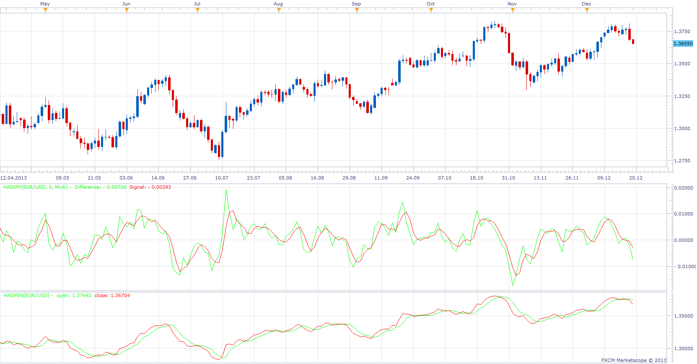

# HA Difference

> Source: https://fxcodebase.com/code/viewtopic.php?f=17&t=60133  
> Forum: 17 · Topic 60133 · 7 post(s)

---

## HA Difference

**Apprentice** · Thu Dec 19, 2013 3:04 pm



As described in Dan Valcu’s article “Using The Heikin-Ashi
Technique” published in S & C magazine.

 [haDiff.lua](files/91620/haDiff.lua)

 [haOpen.lua](files/91620/haOpen.lua)

 


First Indication
Up Arrow - Close Line Up
Down Arrow - Close Line Down

Decond indication
Up Arrow - Close > Open
Down Arrow - Close < Open

 [MTF MCP HaOpen.lua](files/91620/MTF%20MCP%20HaOpen.lua)

---

## Re: HA Difference

**Alexander.Gettinger** · Mon Aug 18, 2014 2:15 pm

MQL4 version of oscillators: [viewtopic.php?f=38&t=61052](https://fxcodebase.com/code/viewtopic.php?f=38&t=61052).

---

## Re: HA Difference

**JOKER83** · Sun Sep 07, 2014 5:58 pm

POSSIBLE?
haOpen

ALL time frame
ONE HAOPEN FOR W1
ONE HAOPEN FOR D1

WHEN I SEE CHART H6 I SEE ALL W1 AND D1 WITH AL TIMES CAN MAKE ON OR OFF
I HOPE YOU ASISTENT ME

---

## Re: HA Difference

**JOKER83** · Sun Sep 07, 2014 6:02 pm

AND E-MAIL ALERT

---

## Re: HA Difference

**Apprentice** · Tue Sep 09, 2014 2:45 am

MTF MCP HaOpen (without Alert) Added.

---

## Re: HA Difference

**STS Trading** · Mon Apr 20, 2015 3:30 am

In the haDiff.lua-file (post of Dec 19, 2013) I fixed a bug calculating the Heikin Ashi open value. From the very beginning the open value is calculated based on the previous Heikin Ashi open value, which doesn't exists in the first period. Comparing the source code of FXCM Trading Station's built-in Heikin Ashi indicator I added an if-survey in the update-function:

```lua
if period == first then
    open[period] = ( source.open[period-1] + source.close[period-1] ) / 2;
else
    open[period] = ( open[period-1] + close[period-1] ) / 2;
end
```

The revised version can be downloaded here:

 [haDiff.lua](files/99901/haDiff.lua)

Chris

---

## Re: HA Difference

**Apprentice** · Tue May 08, 2018 5:01 am

The indicator was revised and updated.
