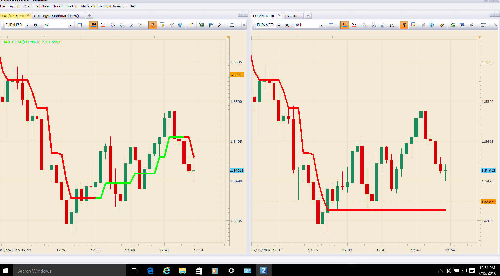

# Half Trend

> Source: https://fxcodebase.com/code/viewtopic.php?f=17&t=63501  
> Forum: 17 · Topic 63501 · 30 post(s)

---

## Half Trend

**Apprentice** · Thu May 19, 2016 6:09 am

Based on request.
[viewtopic.php?f=27&t=63172](https://fxcodebase.com/code/viewtopic.php?f=27&t=63172)

 [HalfTrend.lua](files/106353/HalfTrend.lua)

 

 [Half Trend Overlay.lua](files/106353/Half%20Trend%20Overlay.lua)

MT5/MQ5 version
[viewtopic.php?f=38&t=70379](https://fxcodebase.com/code/viewtopic.php?f=38&t=70379)

Indicator based strategy.
[viewtopic.php?f=29&t=70747](https://fxcodebase.com/code/viewtopic.php?f=29&t=70747)

---

## Re: Half Trend

**mulligan** · Fri Jul 15, 2016 12:37 pm

Apprentice,
I've recently discovered this indicator and it shows great promise. What I have found is that after just a couple of minutes the indicator goes flat and does not respond. If I refresh the screen, it repaints the history as it should have shown. I've attached an image to illustrate. I hope this can be fixed since this indicator would be a scalpers dream come true. If it can be fixed, it would be fantastic to have an alert based on simple color change.

Many thanks

image

 

---

## Re: Half Trend

**pipfix** · Mon Jul 18, 2016 9:41 pm

In regards to the freezing I have noticed that it happens mostly when price is in tight consolidation near the line of the indicator, or a sudden fast price movement (sometimes).. Hopefully the issue can be fix soon. As mentioned a refresh of the chart is needed to reset..hope this can help.. thanx for all your efforts

---

## Re: Half Trend

**pipfix** · Tue Jul 19, 2016 5:33 am

Further observation: the freezing happens when there is a small or slight redraw on the color of the indicator. For example if the line is green and price movement (hesitation) turns the line red and goes back to green (or vice versa), the indicator will freeze as the price action takes direction downward.. So perhaps the issue sits where a redraw or repaint takes place ?

---

## Re: Half Trend

**easytrading** · Tue Aug 02, 2016 3:00 am

kindly Apprentice,
could we have overlay for HalfTrend.lua please ? with many thanks.

---

## Re: Half Trend

**Apprentice** · Tue Aug 02, 2016 7:40 am

Half Trend Overlay.lua added.

---

## Re: Half Trend

**dogxyz** · Wed Sep 28, 2016 3:36 am

Is there anyone to know how to use this Half Trend indicator with a strategy? In a strategy, I just know the HALFTREND data stream. But I can't judge the line color for trend up or down in a strategy. Please help or give a example of strategy to making use of this Half Trend indicator. Thanks.

---

## Re: Half Trend

**Apprentice** · Wed Sep 28, 2016 3:53 pm

Try Overbought Oversold Indicator Strategy.
[viewtopic.php?f=31&t=61489&p=103686&hilit=color+change#p103686](https://fxcodebase.com/code/viewtopic.php?f=31&t=61489&p=103686&hilit=color+change#p103686)

---

## Re: Half Trend

**dogxyz** · Thu Sep 29, 2016 10:27 am

Thank you very much. I understand now. I will try it.

---

## Re: Half Trend Overlay

**pipfix** · Wed Oct 05, 2016 4:32 pm

Hi Apprentice,

As mentioned before this indicator as great promises but there are still issues with it. If you let it run for awhile you will see that the color freezes (overlay) and does not respond to price action. For example you could be in a bearish wave which then changes to a bullish wave and the color of the candles remain red.

Also when changing the drawing mode in the Parameter (close to close, mid to mid, open to open) it does not have any effect on the candle drawing ?

As well in the Parameter, the Style choices shows a blue color (neutral). I have never seen it showing on a chart ?

Hopefully these observations can help you at resolving the issues as it can work very well with the OSOB indicator. Thanks in advance..

---

## Re: Half Trend

**Apprentice** · Fri Oct 07, 2016 4:12 am

You can not change the source for the Half Trend Overlay.lua
Half Trend.lua Source source changes will not affect the Half Trend Overlay.lua

---

## Re: Half Trend

**Apprentice** · Tue Mar 13, 2018 11:00 am

The indicator was revised and updated

---

## Re: Half Trend

**bruno2017** · Fri Mar 23, 2018 9:23 am

hello
the indicator does not work. You have to change the unit of time for it to update.

---

## Re: Half Trend

**Apprentice** · Fri Mar 23, 2018 11:07 am

Can you please describe the specific problem you are experiencing.
I did not find any problem whatsoever.

---

## Re: Half Trend

**bartwas1** · Tue May 28, 2019 6:51 am

Hi Apprentice

I've been trying half trend indicator (not an overlay version), but it doesn't seem to update with price movement. I had to click at the indicator, open its settings and click ok to get it refreshed. Would you mind to have look at it, please.

Kind regards
B.

---

## Re: Half Trend

**Apprentice** · Tue May 28, 2019 4:14 pm

As far as I can see, everything is okay.
The bar will have color same as an underlying line color.

---

## Re: Half Trend

**bartwas1** · Wed May 29, 2019 11:39 am

Hi Apprentice

According to you half trend indicator is fine. So I did check it again to see what happens.

Let see, I've checked half trend indicator (1st indicator in the first post on this topic - NOT AN OVERLAY VERSION) and I applied it on 15m eurjpy chart with period 2 setting (IT WASN'T A CHART WITH HALF TREND OVERLAY - JUST A STANDARD CHART).
After four hours I had look at the chart and half trend line was red suggesting that the price was falling - while the price was rising - then I went to the settings and clicked ok (NOTHING ELSE HAS BEEN CHANGED) and indicator changed into green aligning itself with the price movement. Now everything was fine.
About an hour later the situation has repeated itself. Half trend required a manual refresher, because line was green indicating rising price whereas price was falling.

My conclusion is that half trend doesn't work properly without manual refresher - it seems to freeze.
And as previous posts reported that issue was long present. I've just assumed that updated version will not have this problem.

I've got mt4 file of half trend - maybe it can solve the problem. Maybe this code translated to lua will be better.

Kind regards
B.

---

## Re: Half Trend

**Apprentice** · Thu May 30, 2019 3:04 am

Your request is added to the development list under Id Number 4688

---

## Re: Half Trend

**Apprentice** · Fri May 31, 2019 7:01 am

[HalfTrend.lua](files/126640/HalfTrend.lua)

Try this version.

---

## Re: Half Trend

**bartwas1** · Tue Jun 04, 2019 5:05 am

Hi Apprentice

Thanks for your attempt with half trend indicator. This version doesn't freeze and works absolutely fine.
kind regards
B.

---

## Re: Half Trend

**mulligan** · Thu Jun 20, 2019 11:49 am

Many thanks for the new version of half trend. It works perfectly. Could we please get the new version with the normal alert functions based on color change.

Thanks again

---

## Re: Half Trend

**Apprentice** · Thu Jun 20, 2019 6:16 pm

[HalfTrend with Alert.lua](files/127026/HalfTrend%20with%20Alert.lua)

Try this version.

---

## Request strategy with the HalfTrend indicator

**james.tse** · Tue Dec 15, 2020 12:10 pm

May I request a strategy with this HalfTrend indicator? Your help is appreciated.

---

## Re: Half Trend

**Apprentice** · Wed Dec 16, 2020 9:27 am

Can you please provide strategy rules?

---

## Re: Half Trend

**james.tse** · Mon Dec 21, 2020 1:12 pm

> **Apprentice wrote:**
> Can you please provide strategy rules?

As I am using the indicator of Half Trend with Alert that has up arrow and down arrow, just want to buy at up arrow and sell at down arrow.

Thank you very much.

---

## Re: Half Trend

**Apprentice** · Tue Dec 22, 2020 4:22 am

Your request is added to the development list.
Development reference 2515.

---

## Re: Half Trend

**Apprentice** · Thu Dec 24, 2020 7:09 am

Indicator based strategy.
[viewtopic.php?f=29&t=70747](https://fxcodebase.com/code/viewtopic.php?f=29&t=70747)

---

## Re: Half Trend

**TLBshifted** · Mon Jul 11, 2022 4:43 pm

Hi Apprentice,

Does Half Trend indicator repaints?

Thanks,
TLB

---

## Re: Half Trend

**Apprentice** · Tue Jul 12, 2022 12:40 am

Does not.

---

## Re: Half Trend

**TLBshifted** · Tue Jul 19, 2022 1:27 pm

Thanks Apprentice
