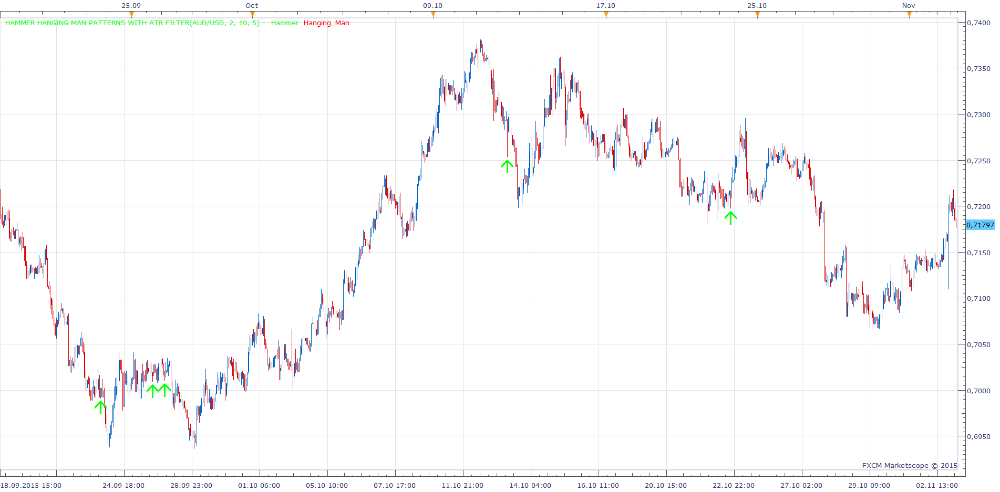

# Hammer Hanging Man Patterns with ATR Filter

> Source: https://fxcodebase.com/code/viewtopic.php?f=17&t=62850  
> Forum: 17 · Topic 62850 · 28 post(s)

---

## Hammer Hanging Man Patterns with ATR Filter

**Apprentice** · Tue Nov 03, 2015 5:04 am

 [Hammer Hanging Man Patterns with ATR Filter.lua](files/103152/Hammer%20Hanging%20Man%20Patterns%20with%20ATR%20Filter.lua)

 [Hammer Hanging Man Patterns with ATR Filter and Alert.lua](files/103152/Hammer%20Hanging%20Man%20Patterns%20with%20ATR%20Filter%20and%20Alert.lua)

---

## Re: Hammer Hanging Man Patterns with ATR Filter

**Apprentice** · Thu Sep 27, 2018 5:56 am

The indicator was revised and updated.

---

## Re: Hammer Hanging Man Patterns with ATR Filter

**HappyFox8** · Tue Jun 23, 2020 9:45 pm

Hi Apprentice, would it be possible to add a sound alert to this indicator?

---

## Re: Hammer Hanging Man Patterns with ATR Filter

**Apprentice** · Wed Jun 24, 2020 4:10 am

Your request is added to the development list.
Development reference 1539.

---

## Re: Hammer Hanging Man Patterns with ATR Filter

**Apprentice** · Wed Jun 24, 2020 7:05 am

Hammer Hanging Man Patterns with ATR Filter and Alert.lua added.

---

## Re: Hammer Hanging Man Patterns with ATR Filter

**HappyFox8** · Wed Jun 24, 2020 9:06 pm

Hi Apprentice, thank so much for your rapid response to my request. Unfortunately I haven't been able to get the alert to sound consistently. I'm trialing it on a 1 minute chart to get more instances. The arrow is working, but the alert only sounds at some of the arrows, more often not sounding. I've attached a file with the settings I am using.

---

## Re: Hammer Hanging Man Patterns with ATR Filter

**HappyFox8** · Wed Jun 24, 2020 9:56 pm

Further to my earlier post, I am realising that on the rare occasions that I do get an alert sound, it is not immediately after the candle has formed ... there is a delay. I thought this information might help to diagnose the problem.

---

## Re: Hammer Hanging Man Patterns with ATR Filter

**Apprentice** · Fri Jun 26, 2020 8:02 am

I have re-write my Alert template.
[viewtopic.php?f=17&t=70082](https://fxcodebase.com/code/viewtopic.php?f=17&t=70082)
Prior to any development, can you test it and provide suggestions on how we can improve it.

---

## Re: Hammer Hanging Man Patterns with ATR Filter

**HappyFox8** · Sun Jun 28, 2020 10:23 pm

I have tested the new alert template and it is working reliably.

My only suggestion for improvement is that it has a few variables that aren't necessary for my needs and I wonder whether this adds unnecessary complexity that increases the chance of problems when the alert is applied to other indicators. For example:
1. I have no need for the execution timer as I would always set this to zero as I always want to hear the alert immediately the pattern has completed. I would be surprised if other traders would want the timer set to anything other than zero either.
2. I have no need for the "convert date" variable. I would always want the date to match the displayed time that I have selected for my charts. Similarly, I doubt that other traders would select the other options either.

I hope these suggestions are helpful.

---

## Re: Hammer Hanging Man Patterns with ATR Filter

**HappyFox8** · Mon Jun 29, 2020 4:17 am

I have tested over a longer period there have been some glitches. I sometimes get a second arrow and second sound alert the bar after (please see attached snip).

---

## Re: Hammer Hanging Man Patterns with ATR Filter

**HappyFox8** · Mon Jun 29, 2020 4:19 am

Sometimes the alert message doesn't match the time of the cross over and is delayed a few seconds (example in 2 snips attached).

---

## Re: Hammer Hanging Man Patterns with ATR Filter

**HappyFox8** · Mon Jun 29, 2020 4:22 am

As this image shows, there is no cross over at the alerted time.

---

## Re: Hammer Hanging Man Patterns with ATR Filter

**HappyFox8** · Mon Jun 29, 2020 4:23 am

Another example where alert message and cross over time do not match.

---

## Re: Hammer Hanging Man Patterns with ATR Filter

**Apprentice** · Mon Jun 29, 2020 7:01 am

Can you share your parameters used?
Also, try to set "Show Unconfirmed Signals" to no.

---

## Re: Hammer Hanging Man Patterns with ATR Filter

**HappyFox8** · Tue Jun 30, 2020 1:57 am

Here are the parameters I am using.

---

## Re: Hammer Hanging Man Patterns with ATR Filter

**Apprentice** · Tue Jun 30, 2020 2:52 am

Not sure will Execution Timer set zero work.
For now, I only changed the parameters section a bit.

---

## Re: Hammer Hanging Man Patterns with ATR Filter

**HappyFox8** · Tue Jun 30, 2020 6:04 pm

Why have you included an execution timer? As I suggested earlier, most (probably all) traders would want the alert to execute immediately. Why not set the indicator up for immediate execution and remove the execution timer all together?

---

## Re: Hammer Hanging Man Patterns with ATR Filter

**HappyFox8** · Tue Jun 30, 2020 6:12 pm

Please remove the execution timer and the convert date function. It seems likely that these are causing the problems as they are both related to time. Please remove them and let me test the template without them.

---

## Re: Hammer Hanging Man Patterns with ATR Filter

**Apprentice** · Wed Jul 01, 2020 3:29 am

Your request is added to the development list.
Development reference 1599.

---

## Re: Hammer Hanging Man Patterns with ATR Filter

**Apprentice** · Wed Jul 01, 2020 5:11 am

In the last update, the condition will be checked on every tick, if selected.
Then execution timer will only failsafe for times lower market activity.

---

## Re: Hammer Hanging Man Patterns with ATR Filter

**HappyFox8** · Wed Jul 01, 2020 8:45 am

I have no interest in the MA CROSS WITH ALERT indicator. It is not something I would use in my trading. I was just trying to help, at your request, by testing it for you and giving feedback.

---

## Re: Hammer Hanging Man Patterns with ATR Filter

**HappyFox8** · Wed Jul 01, 2020 8:09 pm

Do you have time to get back to to working on the alert for HAMMER HANGING MAN PATTERNS WITH ATR FILTER? I am unable to get consistent alerts to sound.

---

## Re: Hammer Hanging Man Patterns with ATR Filter

**Apprentice** · Thu Jul 02, 2020 4:30 am

Hammer Hanging Man Patterns with ATR Filter and Alert.lua updated.

---

## Re: Hammer Hanging Man Patterns with ATR Filter

**HappyFox8** · Thu Jul 30, 2020 6:25 pm

Could you please look into this. When I open the program the next day the indicator has been removed from the chart and there is an error message.

---

## Re: Hammer Hanging Man Patterns with ATR Filter

**Apprentice** · Fri Jul 31, 2020 3:57 am

Unable to repeat. Continu my test.
Can you post the error message, share the parameters used?

---

## Re: Hammer Hanging Man Patterns with ATR Filter

**HappyFox8** · Tue Aug 04, 2020 2:41 pm

*Error message at top of chart*

Settings attached. The error message is at the left hand top of the chart.

---

## Re: Hammer Hanging Man Patterns with ATR Filter

**HappyFox8** · Tue Aug 04, 2020 2:44 pm

Parameters attached

---

## Re: Hammer Hanging Man Patterns with ATR Filter

**HappyFox8** · Tue Aug 04, 2020 2:45 pm

2nd page of the parameters
