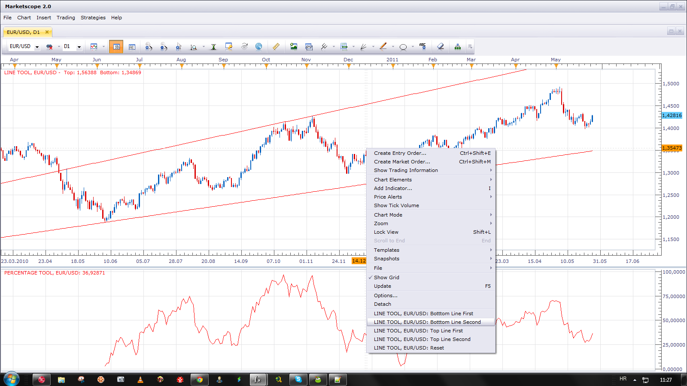

# Hand Drown Channel Percentage Oscillator

> Source: https://fxcodebase.com/code/viewtopic.php?f=17&t=4511  
> Forum: 17 · Topic 4511 · 4 post(s)

---

## Hand Drown Channel Percentage Oscillator

**Apprentice** · Sat May 28, 2011 3:56 pm

This is in development version of indicators on which I work.

This is, two tool combo.
Line Tool indicator is Helper for Percentage Tool.
With Line Tool you can define an arbitrary channel.

 [Line Tool.lua](files/11130/Line%20Tool.lua)

Percentage Tool will show Price percentage position within the channel.

 [Percentage Tool.lua](files/11130/Percentage%20Tool.lua)

With Extend Line Option On

 

To add, define Lines, use the right mouse button menu.

 

---

## Re: Hand Drown Channel Percentage Oscillator

**easytrading** · Sat Jan 31, 2015 12:34 am

Hello Apprentice,

could you please add an option parameter to line tool to extend the beggingn & end of the line by numbor of prriods so we can control the length of line to be extended also line style will be perfect.

many thanks as always for your help.

---

## Re: Hand Drown Channel Percentage Oscillator

**Apprentice** · Sat Jan 31, 2015 8:38 am

Line Style Option Added.

---

## Re: Hand Drown Channel Percentage Oscillator

**Apprentice** · Mon Feb 05, 2018 11:00 am

The indicator was revised and updated.
