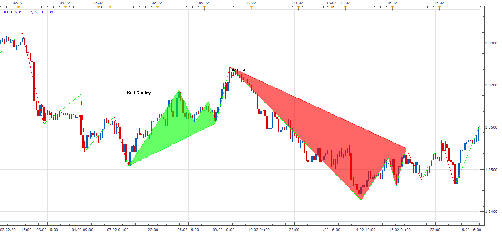
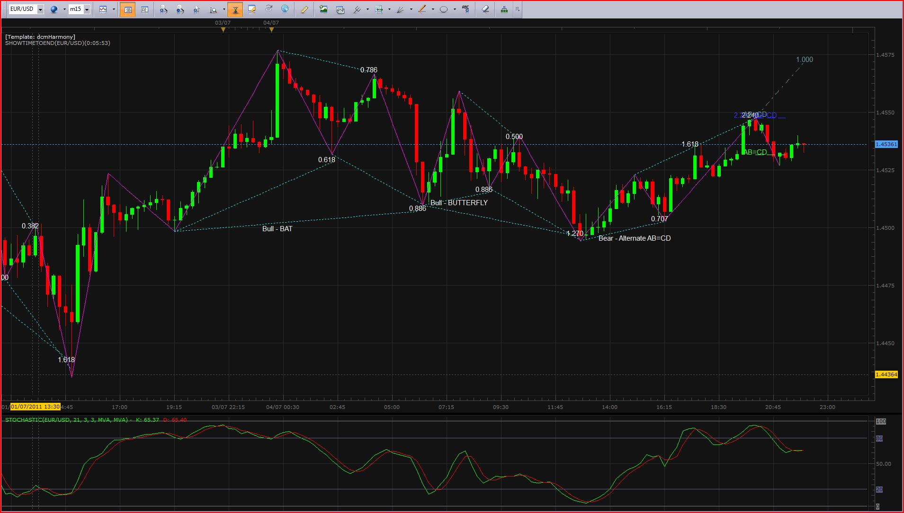

# Harmonic Pattern

> Source: https://fxcodebase.com/code/viewtopic.php?f=17&t=4994  
> Forum: 17 · Topic 4994 · 150 post(s)

---

## Harmonic Pattern

**Apprentice** · Mon Jul 04, 2011 3:39 pm

This indicator. It is based on ZigZag indicator.
I also plan to add support for GannSwing.

 [Harmonic Pattern.lua](files/12321/Harmonic%20Pattern.lua)

 [Harmonic Pattern_with Alert.lua](files/12321/Harmonic%20Pattern_with%20Alert.lua)

 

Harmonic Pattern indicator based strategy.
[viewtopic.php?f=31&t=67393](https://fxcodebase.com/code/viewtopic.php?f=31&t=67393)

---

## Re: Harmonic Pattern

**Prodigalpops** · Mon Jul 04, 2011 4:15 pm

Hi Apprentice.
Looks like a good start; like the solid colour, but I don't think the ratios for those patterns are correct.

I'm still putting my code together but these are a few of the patterns I can currently generate (EUR/USD 15m)

 

*Recent EUR/USD patterns*

---

## Re: Harmonic Pattern

**Apprentice** · Tue Jul 05, 2011 12:27 am

Like I said.
This is the first draft, in order to test the functionality.
The algorithm for finding patterns, needs more work.

---

## Re: Harmonic Pattern

**emjay-short** · Wed Jul 06, 2011 3:49 am

Thank you very much!!! I really like that idea. Bought a book (Trade what you see by Pesavento & Jouflas) about patterns 4 months ago, doing it live is so hard. Only afterwards with hindsight and big picture will I find butterfly patterns, ABCD etc.

Thanks again.

---

## Re: Harmonic Pattern

**Apprentice** · Wed Jul 06, 2011 3:35 pm

I have post New Version.
I need to double-check the algorithms.
But it seems to me that this is it.
Price Targets soon.

---

## Re: Harmonic Pattern

**Apprentice** · Thu Jul 07, 2011 12:59 am

Can you give a little help to friendly programmer.
Provide links to sources which provide a Price Target for all five patterns.

---

## Re: Harmonic Pattern

**Apprentice** · Thu Jul 07, 2011 2:07 am

Price target, Added.

 

This is an example of the ideal Pattern

**Previous request is still valid.**

---

## Re: Harmonic Pattern

**Prodigalpops** · Thu Jul 07, 2011 7:03 am

Snap! I get the same.
Looks good Apprentice, thanks.

---

## Re: Harmonic Pattern

**emjay-short** · Thu Jul 07, 2011 7:18 am

> **Apprentice wrote:**
> Price target, Added.
>
>
> Harmonic Pattern.png
>
>
> This is an example of the ideal Pattern
>
> **Previous request is still valid.**

I've send you an email @ur gmail address with a pdf. Hope that helps a little.

---

## Re: Harmonic Pattern

**Prodigalpops** · Thu Jul 07, 2011 7:22 am

...Also, just had a quick look at the patterns. I think you may need to look at the AB=CD patterns as I saw a number of CD legs that were shorter than the AB leg - and the minimum prerequisite is that CD is the same as AB (allowing for tolerance of course).
I also noticed a Crab pattern that should probably have been a Butterfly.
Good work though - well done.

---

## Re: Harmonic Pattern

**Apprentice** · Thu Jul 07, 2011 10:02 am

This is intentional.
By default i use a large correction factor.
If you set it to zero, you get much less patterns, and will be the regular shape.
All the functionalities are there.
Optimization of code is needed.
Tuning the right settings i leave to the community.

---

## Re: Harmonic Pattern

**ashcroff** · Fri Jul 22, 2011 12:35 pm

Hi Apprentice,
i had error when loading the indicator.

---

## Re: Harmonic Pattern

**Apprentice** · Fri Jul 22, 2011 5:03 pm

Can you post the error message that you have received.

---

## Re: Harmonic Pattern

**ashcroff** · Sun Jul 24, 2011 4:52 am

i successfully had work around the problems, it seems TSII unable to recognize indicator if i load two indicator at the same time. Thanks BTW.

---

## Re: Harmonic Pattern

**boursicoton** · Sun Jul 31, 2011 2:04 pm

Une erreur est survenue pendant le calcul de l'indicateur ' HARMONIC PATTERN '. Détails de l'erreur: [string "Harmonic Pattern.lua"]:599: L'indice est hors de portée.
when show price target is on....

---

## Re: Harmonic Pattern

**Blackcat2** · Mon Aug 01, 2011 9:05 pm

When I enabled price target option, I get the following error,
-------------------------------------------
An error occurred during the calculation of the indicator 'HARMONIC PATTERN'. The error details: [string "Harmonic Pattern.lua"]:599: Index is out of range.
-------------------------------------------

EDIT: The price target is OK with default value but the error above occured if I put in,
Depth : 16
Deviation : 3
Backstep : 2

Any recommendation for settings/parameters for 15M and 1H chart?

Thanks
BC

---

## Re: Harmonic Pattern

**cruiser** · Tue Aug 02, 2011 10:25 am

Good work.Can we have a signal for this indicator?Thanks.

---

## Re: Harmonic Pattern

**Franco** · Tue Aug 16, 2011 1:03 am

Hello,

I am new at trading and I must say that this Harmonic Pattern works well but I would like to understand more about the zigzag calculation. Depth,Deviation,Backstep. Do you have a difference setting for 4Hr-1HR-30MIN.

Also Can anyone help me to understand which trade should I be looking for ( how could I filter the trades so I don't take all the signals)

Thank you

---

## Re: Harmonic Pattern

**Apprentice** · Sun Aug 21, 2011 12:24 pm

Personally I do not use the indicator.
So I have no preference settings.

I have no ready-made strategy for this indicator.

Try to combine several indicator or strategys.

---

## Re: Harmonic Pattern

**xailer** · Tue Nov 15, 2011 2:34 pm

Can we get this with a sound signal?

---

## Re: Harmonic Pattern

**Apprentice** · Wed Nov 16, 2011 5:23 pm

We can write a Signal.

---

## Re: Harmonic Pattern

**didierc65** · Fri Nov 25, 2011 2:26 pm

Hi Apprentice,

thank for this code. I like it very much.
I tested it and found an error on "AB=CD" pattern when parameter "show Price target" is set to true, I get error out of range.

I'm a beginer on Lua but for me it's lines 554-455(458-459) for bull/ bear case that are involved.

 drawline(D, out[D] + AB*1.272, D + (B-A), out[D] + AB*1.272, Color);

If you can check it.
Thanks!!
Didier

---

## Re: Harmonic Pattern

**bomberone3** · Mon Nov 28, 2011 3:21 pm

> **Apprentice wrote:**
>
>
> Harmonic Pattern.png
>
>
> This indicator. It is based on ZigZag indicator.
> I also plan to add support for GannSwing.

Hi Apprentice,

if these patterns are based on ZigZag, why don't you try to elaborate this
 by Elliott Wave Indicator

[viewtopic.php?f=17&t=2380#p5135](https://fxcodebase.com/code/viewtopic.php?f=17&t=2380#p5135)

---

## Re: Harmonic Pattern

**Apprentice** · Mon Nov 28, 2011 6:25 pm

This is slightly more complicated.
The main problem is to find the necessary time.
I have try this several times, the outcome is always uncertain.

---

## Re: Harmonic Pattern

**rod178** · Sat Dec 03, 2011 11:30 pm

I find this Harmonic Pattern Recognition Indicator very useful, although have some questions and enhancement suggestions

I gather that it can be fine tuned using the below values. Could we have a short explantation of how these values are used and derived, especially backstep and deviation?

Pattern Selector
---------> correction -> 25%

ZigZag Calculation
--------> Depth ->12
-------> Deviation -> 5
-------->Backstep -> 3

Show Price Targets - Sometimes causes out of range error
ie "An error occurred during the calculation of the indicator 'HARMONIC PATTERN'. The error details: [string "Harmonic Pattern.lua"]:599: Index is out of range."
Line Selector
-------> Show Price Targets -> Yes

Enhancemnets
A problem with the pattern recognition, is that -
1) Cannot preempt patterns ie takes a min of 3 plus subsequent bars. Can this be changed to less than 3bars?
 - Would like the option of a potential pattern being recogniced about 5 bars before formation ie 5 bars before D confirmed, instead of 3 bars after. eg once CD leg hits a selectable range value (eg 1.2 to 2.6 on close, not zigzag ) times the XA leg
2) requires an audio alarm on a potential or a confirmed pattern formation.
3) The option of automatically adding various Fib retracements and extensions on the different legs. eg on a bull butterfly fib XA and display 1.272 and 1.619 fib extensions, to enable an estimate D entry point ie PRZ.

regards
Rod

---

## Re: Harmonic Pattern

**Apprentice** · Sun Dec 04, 2011 5:09 am

Your request is added to the developmental cue.

---

## Re: Harmonic Pattern

**Average Joe** · Sun Dec 04, 2011 7:47 am

As per Rod178 request, I also find them useful especially some sort of filling the first part of the pattern and alerting in advance the "D" formation. Some kind of automatic alert when pattern is formed.

Cheers

---

## Re: Harmonic Pattern

**Average Joe** · Sun Dec 04, 2011 7:52 am

Like Rod178, I would find all his request very useful to my trading.

Cheers

---

## Re: Harmonic Pattern

**didierc65** · Thu Dec 15, 2011 3:15 am

Hi Apprentice,

could you check the AB=CD formula?
D must be calculated from point C and CD equal to AB or 1.27 or 1.618*AB.
Regards

---

## Re: Harmonic Pattern

**Sviet531** · Fri Jan 27, 2012 8:36 am

Hello,

do you continue the programming of this indicator?

The addition of a signal (sound and / or text) would be welcome, I try to do it myself but this is difficult, I am not a programmer.
Thank you.

---

## Re: Harmonic Pattern

**Apprentice** · Fri Jan 27, 2012 6:15 pm

Unfortunately not.
I had no time to continue development.

---

## Re: Harmonic Pattern

**stupip** · Wed Feb 08, 2012 5:25 pm

Yes, I agree...an email/text alert near C and near D will be good...

Can patterns show up at or near C...and project possible D's?

Please do if possible.

---

## Re: Harmonic Pattern

**ertonm** · Fri Mar 02, 2012 11:49 am

Hi Apprentice,

Is it possible to develop signals ( sound or text alerts) for the harmonic indicator.

Thank you

---

## Re: Harmonic Pattern

**Apprentice** · Sun Mar 04, 2012 3:28 am

Something like that is planned.
But I not had time to work on it.

---

## Re: Harmonic Pattern

**ertonm** · Wed Apr 18, 2012 10:16 am

Hi Apprentice,

Is there any update on development of this strategy.
It will be fantastic to get signals when a pattern is formed.

Thank you

---

## Re: Harmonic Pattern

**sniper012** · Thu Aug 02, 2012 10:30 pm

I've noticed a few times over the past couple of days that this indicator re-paints. Shouldn't that invalidate the pattern?

---

## Re: Harmonic Pattern

**katie2000** · Sun Sep 16, 2012 11:56 am

Apprentice, is it possible to add more harmonic patterns to this indicator?

The following link provides some examples:

[http://www.trade-forex-harmonic-pattern ... terns.html](http://www.trade-forex-harmonic-patterns.com/harmonic-forex-patterns.html)

Thanks for your great work here.

---

## Re: Harmonic Pattern

**Apprentice** · Tue Sep 18, 2012 1:58 am

Yes. Most of these patterns is already included.
True, this indicator has earned redo, but can not seem to find the time.

---

## Re: Harmonic Pattern

**sniper012** · Thu Oct 11, 2012 1:10 pm

Have a look at the current aud/cad chart with the harmonic indicator on your chart. I got long on this pair on tuesday or 10/8/12. If you look at it now, you will see the green shade indicating that the bullish ABCD pattern that it is showing, completed on 10/8/12. The thing is, if you looked at this chart on the 8th and even on the 9th, there was no indication of a harmonic pattern. The indication showed up yesterday although if you look at it, you would think the green shade has been on the chart since 10/8. Doesn't seem very useful if it's two days late but kinda pretending that it's been there all along.

---

## Re: Harmonic Pattern

**sniper012** · Wed Nov 21, 2012 7:27 am

Upon further review...I would not say that this indicator is useless but it it highly flawed and if you are going to use it, I would suggest that you get familiar with harmonics and learn to draw your own fibs. Just as an example, there are tons of abcd patterns that show up when using this indicator. The parameters of the pattern say that there should be a maximum of a 1.618 BC projection. If you look at a lot of the patterns that the indicator identifies as abcd patterns, they go well past the 1.618 projection. The programmer really needs to tighten up this indicator.

---

## Re: Harmonic Pattern

**juju1024** · Wed Nov 21, 2012 6:49 pm

Hi all,

i have two questions for this indicator :

 - patterns appear instantly ?
 - Indicator repaint or not repaint ?

Cordialy

---

## Re: Harmonic Pattern

**Apprentice** · Thu Nov 22, 2012 4:00 am

Patterns Will Appear, if the conditions are met.
No it does not.

---

## Re: Harmonic Pattern

**juju1024** · Thu Nov 22, 2012 7:54 am

Thank you for your answer,

what is the use of Correction ?

---

## Re: Harmonic Pattern

**Apprentice** · Fri Nov 23, 2012 3:48 am

This is an algorithm parameter that I added.
For example if we have 38.2 fib,
it will add + / - percent zone in which pattern point , is permitted.

---

## Re: Harmonic Pattern

**ervoner53** · Wed Jan 09, 2013 5:09 pm

Hi Apprentice, Many thanks for your positive reply to the request for a signal or sound, that alerts in advance the "D" formation. I notice Rod178/Average Joe/Sviet531 were also interested in same or similar.

thanking you
leonardo

---

## Re: Harmonic Pattern

**ervoner53** · Wed Jan 16, 2013 10:50 am

Hi Apprentice, what is a reasonable time to expect the result for the development of the alert/signal
Tkz

---

## Re: Harmonic Pattern

**Steven Smith** · Fri Jan 18, 2013 2:00 am

Thank you very much!!!
 I really like that idea. Bought a book about patterns 4 months ago, doing it live is so hard.
Only afterwards with hindsight and big picture will I find butterfly patterns, ABCD etc.

---

## Re: Harmonic Pattern

**bwalks** · Fri Jan 25, 2013 11:32 am

hello, great work on all the indicators Apprentice
Ive been drawing harmonic patterns for a couple of years now and its nice to see a free indicator that can assist me now. Any futures updates in the works to get the settings a little more tightened up? Seems like the AB=CD pattern could use some work as i can never find an equal CD leg to match AB leg. Anyone having this issue? I have played with the correction settings but can not seem to find the magic number for a 30min chart.

thx

---

## Re: Harmonic Pattern

**bfleming** · Fri Mar 29, 2013 4:18 am

Any chance of turning this into a strategy? Thanks!

---

## Re: Harmonic Pattern

**Apprentice** · Fri Mar 29, 2013 1:02 pm

Your request is added to the development list.

---

## Re: Harmonic Pattern

**kurlrip** · Mon Apr 01, 2013 7:27 pm

Yes if you could update a little this good indictator that will be good.
I try to update by myself, but it's à little compicated.

If you can add other pattern (eg: 5-0, 121, shark, ...)
If it s possible, if you could put Ratio as parameter (maybe an array with the ratio list for each pattern)
I think the time is not respected actually. Maybe as you have already do with 'Correction' variable, could you put an other 'Correction' variable for pattern respect the time with +/- x%

Thk a lot because it's a long work

---

## Re: Harmonic Pattern

**Apprentice** · Tue Apr 02, 2013 7:11 am

Your request is added to the development list.

---

## Re: Harmonic Pattern

**kurlrip** · Tue Apr 02, 2013 12:47 pm

thk a lot

---

## Re: Harmonic Pattern

**yunior** · Tue Apr 02, 2013 11:21 pm

where would i see the updated version of the file?

---

## Re: Harmonic Pattern

**ouledsayah** · Wed Apr 03, 2013 3:39 am

Hi and thank you for your work.

Could you add also the reciprocal AB=CD, Alternate Bat 0.50/2.00 or 3.618/1.13, Perfect Bat: 0.50/0.50/2.00(1.618), Alternate Shark 1.272/2.00/1.13, Alternate 5-0: 1.272/2.00/1.13/0.50 and Impulse Wave: 1.13 or 1.618/1.618 or 2.24/0.886?

Could you reveal an order of priority for the patterns in XABCD for which we have a AB = CD?

Could you reveal an other order of priority for the patterns in XABCD for which we have a RSI divergence beetween the points X and D?

And maximum priority if we have both of them?

Thx again.

---

## Re: Harmonic Pattern

**Apprentice** · Thu Apr 04, 2013 5:08 am

Updated versions will be posted in this topic.

---

## Re: Harmonic Pattern

**rshoemake** · Thu Apr 18, 2013 12:06 pm

Hi Apprentice,

 Great work on this indicator! I did notice one but in it which I will post later. It doesnt always paint properly. Anyway, I'm actually posting to ask about the prev request in this thread for the additional patterns. Any news on that one?

 Thanks again for all your hard work!

Rich

---

## Re: Harmonic Pattern

**rshoemake** · Thu Apr 18, 2013 12:13 pm

By the way, I am also getting the error that many others are getting.

Show Price Targets - Sometimes causes out of range error
ie "An error occurred during the calculation of the indicator 'HARMONIC PATTERN'. The error details: [string "Harmonic Pattern.lua"]:599: Index is out of range."
Line Selector
when Show Price Targets -> Yes

---

## Re: Harmonic Pattern

**NidalTrader** · Wed Jun 05, 2013 7:59 am

Hi guys,

 any update?

Regards.

---

## Re: Harmonic Pattern

**Coondawg71** · Wed Sep 04, 2013 10:28 pm

I am not sure if this would be of any use compared to already posted version of Harmonic Patterns. It is decompiled and supposedly very useful.

[http://tradingarsenal.com/korharmonics- ... piled.html](http://tradingarsenal.com/korharmonics-indicator-releases/237-korharmonics-source-code-decompiled.html)

This would need conversion to lua format.

thanks,

sjc

---

## Re: Harmonic Pattern

**Apprentice** · Thu Sep 05, 2013 2:00 am

Your request is added to the development list.

---

## Re: Harmonic Pattern

**onkko50** · Wed Sep 11, 2013 5:21 am

hi, i'm new here.

My name is adrian.

first, thank you apprentice for this indicator ..... most powerful i think , i have 92% wins with this.

so, thanks you ... sincerly.

i have a request, can you add a signal alert (sound or email ) when harmonic pattern is draw ?

can you do this ? Many thanks

Best regards

adrian

---

## Re: Harmonic Pattern

**Apprentice** · Fri Sep 13, 2013 12:30 am

Your request is added to the development list.

---

## Re: Harmonic Pattern

**kevinleijh** · Fri Oct 11, 2013 3:55 am

Hi do you have an update about alert when d was formed? thank you very much

---

## Re: Harmonic Pattern

**kris83** · Tue Oct 22, 2013 1:10 pm

Hi

Good plugin! Looks like it can be very powerful tool!

Will there be a future update to this plugin?
I see that there are already posted requests about this earlier:

quote
"
a potential pattern being recogniced about X bars before formation ie X bars before D confirmed,
audio alarm/email on a potential or a confirmed pattern formation.
"

thank you!

---

## Re: Harmonic Pattern

**Apprentice** · Tue Oct 22, 2013 5:02 pm

Yes at some point.
Unfortunately, I have not had time to get back to it.

---

## Re: Harmonic Pattern

**kris83** · Tue Oct 22, 2013 10:35 pm

great to hear!
looking forward to the update!

---

## Re: Harmonic Pattern

**corkrro** · Sat Nov 16, 2013 6:04 pm

I am new to codebase and just found 2 indicators I like,harmonic patterns and support resistance along
with few simple and expotential moving averages.the moving averages I have already set up on my charts.When I try setting charts up with custom indicators my platform freezes up or says error has occurred and shuts down.Can you have two custom indicators on chart at same time,or is it a problem in one of the indicators from download causing the system to freeze up and shut down.

---

## Re: Harmonic Pattern

**Apprentice** · Sun Nov 17, 2013 3:23 am

Can you specify which two Indicators.
Harmonic Pattern and Auto Trend Line can be demanding on your CPU.
This could be the reason.
I should review of the Harmonic Pattern, it is pretty old code.

---

## Re: Harmonic Pattern

**markltbl** · Mon Jan 06, 2014 3:08 pm

> **onkko50 wrote:**
> hi, i'm new here.
>
> My name is adrian.
>
> first, thank you apprentice for this indicator ..... most powerful i think , i have 92% wins with this.
>
> so, thanks you ... sincerly.
>
> i have a request, can you add a signal alert (sound or email ) when harmonic pattern is draw ?
>
> can you do this ? Many thanks
>
> Best regards
>
> adrian

Hi Adrian where can i get hold of the .lua code for this that apprentice has written?

---

## Re: Harmonic Pattern

**markltbl** · Mon Jan 06, 2014 3:56 pm

> **Prodigalpops wrote:**
> Snap! I get the same.
> Looks good Apprentice, thanks.

Does any one know where i can get Apprentice's latest Harmonics Indicator/Strategy. It seems to use price action instead of zig zags.

---

## Re: Harmonic Pattern

**chimpy** · Tue Jan 07, 2014 3:24 am

This one works on zigzags from what i can tell.

---

## Re: Harmonic Pattern

**i2adnan** · Wed Jan 08, 2014 7:36 pm

Hi, guys do you know if the lag of pattern occurring can be cured ?

cheers.
A.

---

## Re: Harmonic Pattern

**chimpy** · Tue Jan 21, 2014 7:40 am

> **i2adnan wrote:**
> Hi, guys do you know if the lag of pattern occurring can be cured ?
>
> cheers.
> A.

i2adnan,

I did not notice any significant lag with this indicator? I only noticed that the pattern cancels itself if something changes within a few bars after forming, but then it stays static even if the targets are nowhere near met, which is a good behaviour.

I did put a request in with Apprentice to fix some small errors that appear and at Alerts to this indicator but it would be good if you could if you could explain what you experienced with 'lag' in detail to give the developer as much info as possible as there is limited resources to fix and it would be good to get all problems solved in one chance.

Thank you

---

## Re: Harmonic Pattern

**chimpy** · Tue Jan 21, 2014 8:14 am

by the way, have a look at the harmonic pattern in this thread. It has more patterns included and may assist you in assessing any possible lag with the indcator your using
[viewtopic.php?f=27&t=60111#p91550](https://fxcodebase.com/code/viewtopic.php?f=27&t=60111#p91550)
Its a popular pattern indicator in the metatrader world.

Chimpy

---

## Re: Harmonic Pattern

**Laventus** · Fri Dec 12, 2014 10:44 pm

Awesome indicator! Just had a couple requests. Would it be possible to turn this indicator into a strategy? Secondly would you be able to put a sound alert on pattern completion for any pair the indicator is on. Example on sound alert popup:

Pattern type: Bearish Bat Pattern completed
Currency pair: GBP/USD
Timeframe: 1H

Thanks in advance!

---

## Re: Harmonic Pattern

**FxLowe** · Tue Apr 28, 2015 7:54 am

I think there's a bug on line 503, 511, 552 and 561 with regards to bat and gartley calculations.

---

## Re: Harmonic Pattern

**Apprentice** · Wed Apr 29, 2015 4:05 am

Can you elaborate on your statement.

---

## Re: Harmonic Pattern

**FxLowe** · Wed Apr 29, 2015 5:01 am

Line 503 (testing for a Bull Bat) -

> and (out[A] + (1.618-Correction) *AB) >= out[D] and (out[A] + (2.618 +Correction)*AB) <= out[D]

It is testing for point D to be BELOW A + (1.618*AB) and HIGHER than A + (2.618*AB)..., which is impossible. It should be testing for D to be BELOW A - (1.618*AB) and HIGHER than A - (2.618*AB), which would be a point below A as expected.

The other lines are the same.

---

## Re: Harmonic Pattern

**vercinge** · Tue Jun 09, 2015 8:58 am

hi
I'm searc for a detector ratio for harmonic pattern as the one in the picture.
help me.
Anibody can help me ,please?
thanks

---

## Re: Harmonic Pattern

**juju1024** · Sun Aug 23, 2015 8:00 pm

hi, i have a problem
"An error occurred during the calculation of the indicator 'HARMONIC PATTERN'. The error details: Harmonic Pattern.lua:444: Positions shall not be equal."

can you try to correct them ? Thx

---

## Re: Harmonic Pattern

**chimpy** · Wed Aug 26, 2015 8:43 am

> hi, i have a problem
> "An error occurred during the calculation of the indicator 'HARMONIC PATTERN'. The error details: Harmonic Pattern.lua:444: Positions shall not be equal."
>
> can you try to correct them ? Thx

I have seen that error a couple of times also.

---

## Re: Harmonic Pattern

**Apprentice** · Wed Aug 26, 2015 9:55 am

Try it now.

Have presented an additional check,
that should prevent this.

---

## Re: Harmonic Pattern

**Segwin** · Mon May 09, 2016 2:25 pm

Hello Apprentice,

Would you be able to add an alert so that when a pattern forms it would trigger an alarm?

Thanks,

Terry

---

## Re: Harmonic Pattern

**Apprentice** · Tue May 10, 2016 3:18 am

Your request is added development list.

---

## Re: Harmonic Pattern

**ntrader** · Sun Aug 07, 2016 3:57 am

Hi Threre,

Is it possible to get the latest version of the Harmonic Pattern. Thank you for the first post, it works great.

Many thanks

NT

---

## Re: Harmonic Pattern

**Apprentice** · Mon Aug 08, 2016 3:07 am

Unfortunately, I have not made any updates.

---

## Re: Harmonic Pattern

**ntrader** · Mon Aug 08, 2016 3:54 am

> **Apprentice wrote:**
> Unfortunately, I have not made any updates.

Thank you for the response. Much appreciated.

So there are no new updates since the first post?

Many thanks
Pieter

---

## Re: Harmonic Pattern

**Apprentice** · Wed Aug 10, 2016 3:27 am

Unfortunately no.

---

## Re: Harmonic Pattern

**ntrader** · Wed Aug 17, 2016 7:51 am

Hi Aprentice,

Sorry to trouble again. Could you perhaps send me this version if possible?
Many thanks.

User: rob178 (page 3)

Enhancemnets
A problem with the pattern recognition, is that -
1) Cannot preempt patterns ie takes a min of 3 plus subsequent bars. Can this be changed to less than 3bars?
- Would like the option of a potential pattern being recogniced about 5 bars before formation ie 5 bars before D confirmed, instead of 3 bars after. eg once CD leg hits a selectable range value (eg 1.2 to 2.6 on close, not zigzag ) times the XA leg
2) requires an audio alarm on a potential or a confirmed pattern formation.
3) The option of automatically adding various Fib retracements and extensions on the different legs. eg on a bull butterfly fib XA and display 1.272 and 1.619 fib extensions, to enable an estimate D entry point ie PRZ.

---

## Re: Harmonic Pattern

**Apprentice** · Wed Aug 17, 2016 2:05 pm

Your request is added to the development list, Under Id Number 3601
 If someone is interested to do this or any task other from list please contact me.

---

## Re: Harmonic Pattern

**stalinkov** · Tue Oct 25, 2016 3:02 am

First, I would like to thank Apprentice for the free codes he is providing and asking nothing in return, and we should all contribute to his work with a donation what ever we can.

Second, I have applied this indicator to the charts and seems working fine, but the requests that have been made before are really essential for it, and I would love to provide help in coding but I don't know, so Apprentice what do you suggest we do? requests are more than 3 years ago, should we stay waiting? what if we can contribute to your work to finish this?

---

## Re: Harmonic Pattern

**Apprentice** · Fri Oct 28, 2016 4:42 am

I spend every available moment on coding,
 Unfortunately workflow is greater than my abilitys.

If you help, any help will be appreciated.

---

## Re: Harmonic Pattern

**markltbl** · Wed Jan 18, 2017 5:30 pm

Hi apprentice, Is there a strategy for the Harmonics indicator i can obtain?
Or one that works with the Alert Indicator?
Would just like to receive email notifications

---

## Re: Harmonic Pattern

**Apprentice** · Thu Jan 19, 2017 3:05 pm

Your request is added to the development list, Under Id Number 3720
 If someone is interested to do this task, please contact me.

---

## Re: Harmonic Pattern

**Alexander.Gettinger** · Mon Oct 16, 2017 12:49 pm

> **markltbl wrote:**
> Hi apprentice, Is there a strategy for the Harmonics indicator i can obtain?
> Or one that works with the Alert Indicator?
> Would just like to receive email notifications

Please, try this version of the indicator.

 [Harmonic Pattern.lua](files/115437/Harmonic%20Pattern.lua)

---

## Re: Harmonic Pattern

**Osmex95** · Mon May 14, 2018 7:32 am

Hey guys.
Which are the best setting for this indicator in your opinion?

---

## Re: Harmonic Pattern

**Osmex95** · Fri May 25, 2018 6:58 am

This indicator doesn't show any gartley or bat patterns.

---

## Re: Harmonic Pattern

**SANTOSH** · Wed Jan 02, 2019 12:39 pm

Hello Apprentice ,

Logically it should alert and play sound and pop up message only if it draws a complete pattern on any time frame chart ,
but currently its not doing so ,
it alerts every closed bar without even drawing a pattern on chart .

Can you fix it?

---

## Re: Harmonic Pattern

**SANTOSH** · Thu Jan 03, 2019 12:58 am

> **ervoner53 wrote:**
> Hi Apprentice, Many thanks for your positive reply to the request for a signal or sound, that alerts in advance the "D" formation. I notice Rod178/Average Joe/Sviet531 were also interested in same or similar.
>
> thanking you
> leonardo

Yes ,
Apprentice we all are looking forward to fix it .
The alert should come after the complete formation of the pattern and not on every closed bar .
Request you to fix it !

Regards ,
Santosh .

---

## Re: Harmonic Pattern

**Apprentice** · Thu Jan 03, 2019 4:51 am

Your request is added to the development list under Id Number 4396

---

## Re: Harmonic Pattern

**SANTOSH** · Thu Jan 03, 2019 6:31 am

Thanks buddy ..
Will await.

---

## Re: Harmonic Pattern

**papynou34** · Thu Jan 03, 2019 10:04 am

Hello,
Can you tell me which is the uptodate indicator? Page 1 or 11?
Thanks a lot

---

## Re: Harmonic Pattern

**Apprentice** · Sat Jan 05, 2019 4:56 am

Try Harmonic Pattern_with Alert.lua
(First post in the topic.)

---

## Re: Harmonic Pattern

**SANTOSH** · Sat Jan 05, 2019 8:51 am

> **Apprentice wrote:**
> Try Harmonic Pattern_with Alert.lua
> (First post in the topic.)

Yeah , but that's bugged Apprentice.
The alert comes at every bar close irrespective of no complete formation of the pattern .

Please fix it buddy

---

## Re: Harmonic Pattern

**SANTOSH** · Tue Jan 08, 2019 11:13 pm

Any recent updates on the alert fix ?

---

## Re: Harmonic Pattern

**SANTOSH** · Wed Feb 20, 2019 4:55 pm

Hello Apprentice,
Still awaiting for the alert fix from past month

Request you to alert fix ..

---

## Re: Harmonic Pattern

**Alexander.Gettinger** · Thu Feb 21, 2019 12:31 pm

Please try this indicator:

 [Harmonic Pattern_with Alert.lua](files/124053/Harmonic%20Pattern_with%20Alert.lua)

---

## Re: Harmonic Pattern

**SANTOSH** · Thu Feb 21, 2019 1:49 pm

Thanks Alexander ,
Seems working .
Great work as always .

Does it repaint the completed pattern??

---

## Re: Harmonic Pattern

**Alexander.Gettinger** · Thu Feb 21, 2019 1:59 pm

The indicator remained unchanged, I just fixed the alert.

---

## Re: Harmonic Pattern

**SANTOSH** · Thu Feb 21, 2019 3:14 pm

Hi Alexander ,
Can you check if its repainting or not ?

---

## Re: Harmonic Pattern

**SANTOSH** · Fri Feb 22, 2019 12:34 am

Can a strategy file be made for the alert ??
Could be a great help ...!!

Regards,
Santosh

---

## Re: Harmonic Pattern

**Alexander.Gettinger** · Fri Feb 22, 2019 11:46 am

> **SANTOSH wrote:**
> Hi Alexander ,
> Can you check if its repainting or not ?

The indicator does not repainting.

---

## Re: Harmonic Pattern

**SANTOSH** · Fri Feb 22, 2019 12:01 pm

Yes Alex ,
I checked the same , its not repainting .

Just awaiting a strategy file for the indicator .

Regards,
santosh .

---

## Re: Harmonic Pattern

**Apprentice** · Mon Feb 25, 2019 5:46 pm

Your request is added to the development list under Id Number 4495

---

## Re: Harmonic Pattern

**Apprentice** · Wed Feb 27, 2019 6:32 am

Try this version.
[viewtopic.php?f=31&t=67393](https://fxcodebase.com/code/viewtopic.php?f=31&t=67393)

---

## Re: Harmonic Pattern

**SANTOSH** · Mon Mar 18, 2019 3:37 pm

> **Alexander.Gettinger wrote:**
>
>
> > **SANTOSH wrote:**
> > Hi Alexander ,
> > Can you check if its repainting or not ?
>
>
> The indicator does not repainting.

Hello Alexander,
I checked today the whole day ,

The indicator repaints .
Whenever the zig makes a new high low , or repaints a new high low , the pattern too repaints .

Also the pattern which is formed , whenever I reclick the indicator, some pattern are gone or a new pattern is formed ..

Please fix it buddy !!

---

## Re: Harmonic Pattern

**SANTOSH** · Thu Mar 21, 2019 4:17 pm

Hi Apprentice,
Can the strategy be made multi time frame and multi currency pair ??
It would be a great help ...

---

## Re: Harmonic Pattern

**Apprentice** · Fri Mar 22, 2019 4:54 pm

Your request is added to the development list under Id Number 4561

---

## Re: Harmonic Pattern

**SANTOSH** · Sat Apr 06, 2019 3:07 am

> **SANTOSH wrote:**
>
>
> > **Alexander.Gettinger wrote:**
> >
> >
> > > **SANTOSH wrote:**
> > > Hi Alexander ,
> > > Can you check if its repainting or not ?
> >
> >
> > The indicator does not repainting.
>
>
>
> Hello Alexander,
> I checked today the whole day ,
>
> The indicator repaints .
> Whenever the zig makes a new high low , or repaints a new high low , the pattern too repaints .
>
> Also the pattern which is formed , whenever I reclick the indicator, some pattern are gone or a new pattern is formed ..
>
> Please fix it buddy !!

Hello Everyone ,
Is anyone working on this indicator to make it non -repaint , the indicator makes a new low and the pattern repaints .....

Regards,
Santosh .

---

## Re: Harmonic Pattern

**Apprentice** · Tue Apr 09, 2019 5:15 am

Try this version.
[viewtopic.php?f=17&t=68312](https://fxcodebase.com/code/viewtopic.php?f=17&t=68312)

---

## Re: Harmonic Pattern

**SANTOSH** · Thu Jul 11, 2019 5:40 am

> **Apprentice wrote:**
>
>
> Harmonic Pattern.png
>
>
> This indicator. It is based on ZigZag indicator.
> I also plan to add support for GannSwing.
>
>
>
> Harmonic Pattern.lua
>
>
>
>
> Harmonic Pattern_with Alert.lua
>
>
>
>
> Test.png
>
>
>
> Harmonic Pattern indicator based strategy.
> [viewtopic.php?f=31&t=67393](https://fxcodebase.com/code/viewtopic.php?f=31&t=67393)

Hello ,
Can you add the following in the menu section .
1. Print to log with respective instrument with their respective pattern . so that the alerts will be visible in the events section of TS2.
2. A Telegram Alert .

Regards ,
Santosh

---

## Re: Harmonic Pattern

**Apprentice** · Fri Jul 12, 2019 6:04 am

Your request is added to the development list under Id Number 4778

---

## Re: Harmonic Pattern

**Apprentice** · Mon Jul 15, 2019 7:53 am

[Harmonic Pattern_with Alert v4.lua](files/127363/Harmonic%20Pattern_with%20Alert%20v4.lua)

Try this version.

---

## Re: Harmonic Pattern

**Macmenmen** · Wed Jul 24, 2019 3:43 pm

Dear Sir ,

1- Since you kindly first uploaded this amazing and powerful indicator in 2011 , and many of who tested the indicator have informed you that " THE INDICATOR SHOWS ONLY AB=CD , BUTTERFLY , 3 DRIVES PATTERNS AND IT DOESN'T SHOW CRAB NOR BAT NOR GARTLEY PATTERNS " , even in the latest update which is named " Harmonic Pattern_with Alert v4.lua " the same problem still not fixed !!

Is this ever going to be fixed , plzzzzzz ???

2- Please , kindly note that ; the ZigZag of the indicator does repaint when a new candle is formed making it impossible to detect new patterns in live mode unless i do refresh the chart by pressing F5 in keyboard . Kindly seed the attached pic ..
Can you please fix this ???

Many thanks in advanced and I will e waiting for your kind feedback

---

## Re: Harmonic Pattern

**SANTOSH** · Wed Jul 31, 2019 10:53 am

> **Macmenmen wrote:**
> Dear Sir ,
>
> 1- Since you kindly first uploaded this amazing and powerful indicator in 2011 , and many of who tested the indicator have informed you that " THE INDICATOR SHOWS ONLY AB=CD , BUTTERFLY , 3 DRIVES PATTERNS AND IT DOESN'T SHOW CRAB NOR BAT NOR GARTLEY PATTERNS " , even in the latest update which is named " Harmonic Pattern_with Alert v4.lua " the same problem still not fixed !!
>
> Is this ever going to be fixed , plzzzzzz ???
>
> 2- Please , kindly note that ; the ZigZag of the indicator does repaint when a new candle is formed making it impossible to detect new patterns in live mode unless i do refresh the chart by pressing F5 in keyboard . Kindly seed the attached pic ..
> Can you please fix this ???
>
> Many thanks in advanced and I will e waiting for your kind feedback

I am experiencing the same flaws ,
Kindly fix it team .

---

## Re: Harmonic Pattern

**SANTOSH** · Tue Aug 06, 2019 8:03 pm

Hello team , is anybody working on it ??

---

## Re: Harmonic Pattern

**Gilles** · Fri Aug 09, 2019 9:26 am

hi all,

You use the fibonacci suite for harmonics ?

see you soon

---

## Re: Harmonic Pattern

**Apprentice** · Fri Aug 09, 2019 5:00 pm

The indicator is conversion.
Can you provide conversion suggestions
(code or detailed description)

---

## Re: Harmonic Pattern

**SANTOSH** · Fri Aug 09, 2019 8:33 pm

> **Gilles wrote:**
> hi all,
>
> You use the fibonacci suite for harmonics ?
>
> see you soon

No , it's using zig zag indicator suite.

---

## Re: Harmonic Pattern

**SANTOSH** · Fri Aug 09, 2019 8:36 pm

> **Apprentice wrote:**
> The indicator is conversion.
> Can you provide conversion suggestions
> (code or detailed description)

Just need to get rid of repainting harmonic patterns because the zig high and low repaints, whenever a new high and low repaints.

The moment the zig high/ low repaints, the harmonic pattern too repaints.

This indicator will be very useful if it stops repainting .

---

## Re: Harmonic Pattern

**Apprentice** · Mon Aug 12, 2019 6:48 am

That's not possible.

---

## Re: Harmonic Pattern

**SANTOSH** · Mon Aug 12, 2019 12:26 pm

> **Apprentice wrote:**
> That's not possible.

Any alternative :

1. Like instead of using zig ( which repaints) , can use moving average or price action as the basis of calculating the length of harmonic patterns.

2. Idea is avoid using zig for calculating the length of legs , using something which non repaints to calculate the length of legs .

3. That something could be Ma , parabolic SAR. Pivot high lows, support resistance ( important the length of leg should non repaint , irrespective that patterns goes as a wrong signal and hits the stop loss , that's doesn't really matter ) .

Hoping you can get the best as always

Regards ,
Santosh.

---

## Re: Harmonic Pattern

**Samurai 24** · Fri Dec 06, 2019 1:17 pm

Dear Apprentice can you make manual harmonic pattern indicator in trading station platform by drawing a manual X-A-B-C-D or A-B-C-D like on **The Trading View** chart?

---

## Re: Harmonic Pattern

**Apprentice** · Fri Dec 06, 2019 2:02 pm

Your request is added to the development list.
Development reference 404.

---

## Re: Harmonic Pattern

**Apprentice** · Mon Dec 09, 2019 8:58 am

Try this version.
[viewtopic.php?f=17&t=69213](https://fxcodebase.com/code/viewtopic.php?f=17&t=69213)

---

## Re: Harmonic Pattern

**MemphisRokudo** · Wed Dec 25, 2019 4:45 pm

is there a mt4 version with alerts?

---

## Re: Harmonic Pattern

**Apprentice** · Thu Dec 26, 2019 9:23 am

Your request is added to the development list.
Development reference 483.

---

## Re: Harmonic Pattern

**Apprentice** · Fri Dec 27, 2019 6:37 am

Try this version.
[viewtopic.php?f=38&t=67445](https://fxcodebase.com/code/viewtopic.php?f=38&t=67445)

---

## Re: Harmonic Pattern

**swingtrader** · Thu Apr 02, 2020 11:37 am

hi apprentice ,
**can u create harmonic pattern strategy for trading station**

buy; when harmonic pattern(any pattern) signals buy
sell: when harmonic pattern ( any pattern) signals sell

thank you.

---

## Re: Harmonic Pattern

**Apprentice** · Fri Apr 03, 2020 5:37 am

Your request is added to the development list.
Development reference 1003.

---

## Re: Harmonic Pattern

**Apprentice** · Mon Apr 06, 2020 4:44 am

Try this version.
[viewtopic.php?f=31&t=67393](https://fxcodebase.com/code/viewtopic.php?f=31&t=67393)

---

## Re: Harmonic Pattern

**Macmenmen** · Fri May 08, 2020 4:45 pm

Sir ,

1- Plzzz , the zigzag of the indicator is repainting as shown in the attached photo "harm.jpg"

2- Also , the indicator shows only crab & butterfly & AB=CD .. NO BAT NOR GARTLEY NOR 3 DRIVES ARE SHOWN BY THE INDICATOR , EVEN IN THE LAST UPDATE THIS PROBLEM STILL EXISTING SINCE THE FIRST VERSION OF THAT AMAZING INDICATOR

Plzz sir , this indicator is more than amazing , would you kindly fix those two issues stated above

Also , can you add a potential reversal zone "PRZ" to patterns before they completely form ??

Many thanks ,
Best Regards

---

## Re: Harmonic Pattern

**Dante88** · Fri Jun 26, 2020 11:30 am

Hi Apprentice, thanks for your amazing work.
I am using this indicator and I must say that filtering the signals the results are excellent.
Is it possible to insert a kind of "HEAT MAP" index as in other indicators?
In this way it would be possible to use a single graph with which to keep several time frames checked.
Thank you and good week end

---

## Re: Harmonic Pattern

**papynou34** · Thu Nov 19, 2020 3:08 pm

Hello,
Can you tell me which is the last indicators i have to use?
Thanks a lot

---

## Re: Harmonic Pattern

**papynou34** · Mon Nov 30, 2020 3:20 am

Hello,
As i did not have any answer to my question, i Used the one on first page.
I have the following error with it.

Paire	Strategie/Indicateur	Message	Heure
GER30	HARMONIC PATTERN WITH ALERT(GER30, 12, 5, 3)	Une erreur est survenue pendant le calcul de l'indicateur ' HARMONIC PATTERN WITH ALERT(GER30, 12, 5, 3) '. Details de l'erreur : C:/Program Files (x86)/Candleworks/FXTS2.Dev/Indicators/Custom/Harmonic Pattern with Alert.lua:740: Specified index is out of range.	30/11/2020 15:08:55

---

## Re: Harmonic Pattern

**Apprentice** · Mon Nov 30, 2020 10:06 am

Your request is added to the development list.
Development reference 2374.

---

## Re: Harmonic Pattern

**Apprentice** · Tue Dec 01, 2020 5:14 am

It looks like you are using some unknown Harmonic Pattern with Alert.lua
The error happened at line 740 despite Harmonic Pattern with Alert.lua have less that 700 lines of code

---

## Re: Harmonic Pattern

**papynou34** · Wed Dec 02, 2020 2:29 pm

Thanks Apprentice, I did some cleaning of the folder Indicators. It is working well now.

---

## Re: Harmonic Pattern

**papynou34** · Thu Dec 10, 2020 2:51 am

Hello,
It seems a Gartley is not detected on DAX m5 as shown on the picture.
