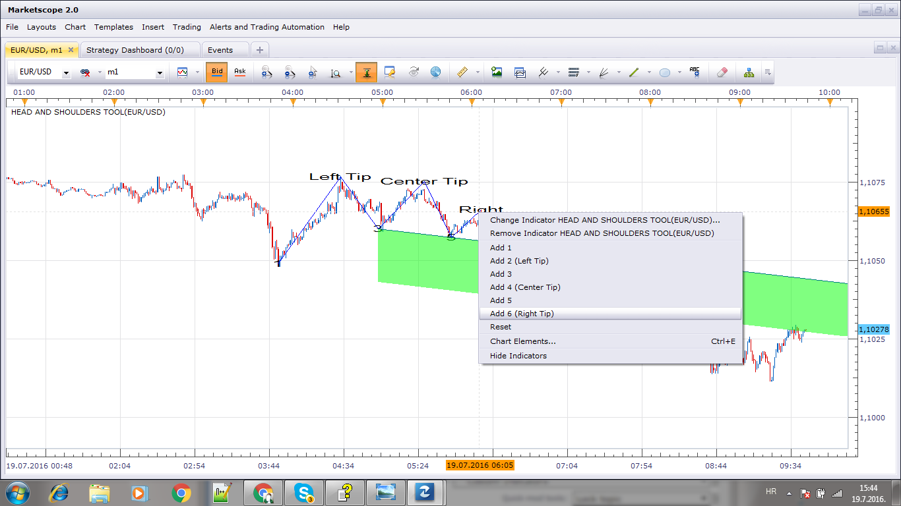

# Head and Shoulders Tool

> Source: https://fxcodebase.com/code/viewtopic.php?f=17&t=63686  
> Forum: 17 · Topic 63686 · 5 post(s)

---

## Head and Shoulders Tool

**Apprentice** · Tue Jul 19, 2016 9:14 am

 [Head and Shoulders Tool.lua](files/107222/Head%20and%20Shoulders%20Tool.lua)

 

---

## Re: Head and Shoulders Tool

**[email protected]** · Sun Jul 24, 2016 7:00 pm

Hello,

The indicator installs and loads, or appears to load. The legend on the chart's top left displays (Error) in the indicator's name. EURUSD on the daily formed H&S recently. Can you please see why it is not showing the H&S? It displays nothing for me.

---

## Re: Head and Shoulders Tool

**Apprentice** · Mon Jul 25, 2016 1:24 am

Try it now.
Also, make sure to define all six points.

---

## Re: Head and Shoulders Tool

**[email protected]** · Sun Aug 07, 2016 12:00 pm

Thank you! It works now.

---

## Re: Head and Shoulders Tool

**Apprentice** · Sun Feb 04, 2018 1:39 pm

The indicator was revised and updated.
