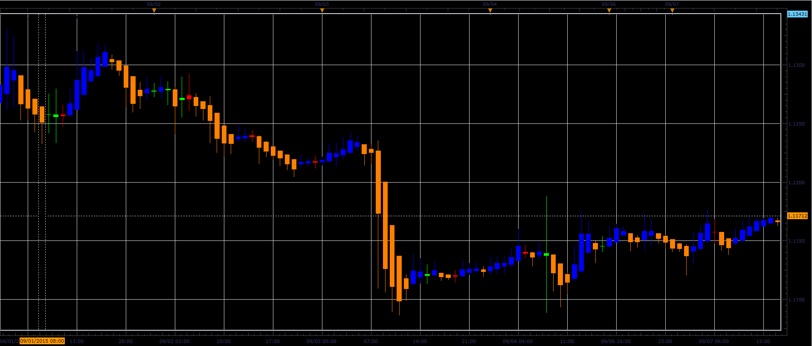

# Heiken Ashi Doji spotter

> Source: https://fxcodebase.com/code/viewtopic.php?f=17&t=62648  
> Forum: 17 · Topic 62648 · 2 post(s)

---

## Heiken Ashi Doji spotter

**Alexander.Gettinger** · Fri Sep 11, 2015 1:37 pm

Based on request.
[viewtopic.php?f=27&t=62429](https://fxcodebase.com/code/viewtopic.php?f=27&t=62429)

The indicator paints the Heiken Ashi candles depending on their direction and size of body relative to bar range.

 

Download:

 [HA_Doji_Spotter.lua](files/102301/HA_Doji_Spotter.lua)

 [HA_Doji_Spotter with Alert.lua](files/102301/HA_Doji_Spotter%20with%20Alert.lua)

The indicator was revised and updated

---

## Re: Heiken Ashi Doji spotter

**Apprentice** · Tue Oct 18, 2016 6:36 am

HA_Doji_Spotter with Alert.lua added.
