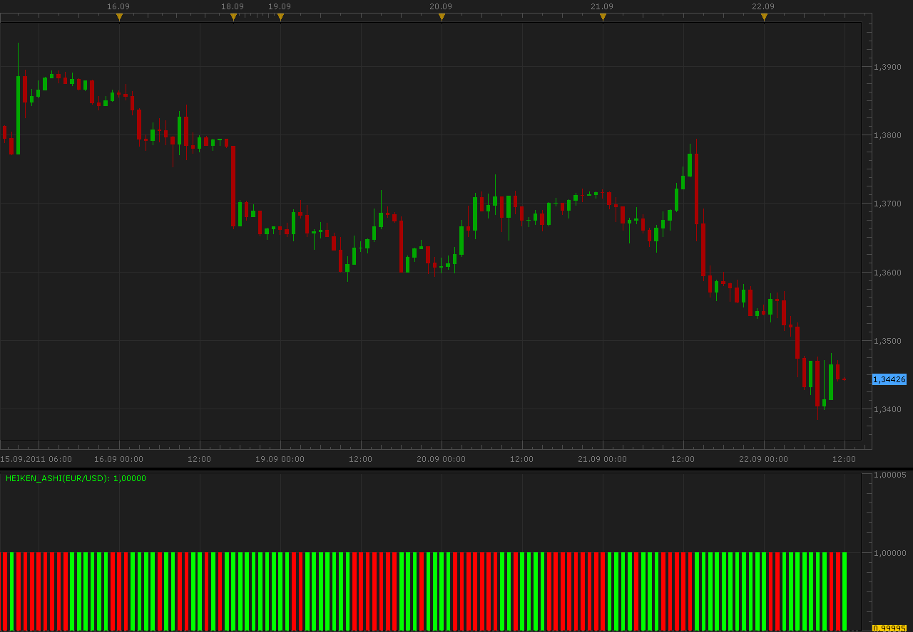

# Heiken Ashi indicator

> Source: https://fxcodebase.com/code/viewtopic.php?f=17&t=6720  
> Forum: 17 · Topic 6720 · 2 post(s)

---

## Heiken Ashi indicator

**Alexander.Gettinger** · Thu Sep 22, 2011 11:02 am

This indicator is a ported MQL4 indicator from request: [viewtopic.php?f=27&t=5585](https://fxcodebase.com/code/viewtopic.php?f=27&t=5585)

 

Download:

 [Heiken_Ashi.lua](files/15295/Heiken_Ashi.lua)

The indicator was revised and updated

---

## Re: Heiken Ashi indicator

**Apprentice** · Thu Mar 16, 2017 1:52 pm

Indicator was revised and updated.
