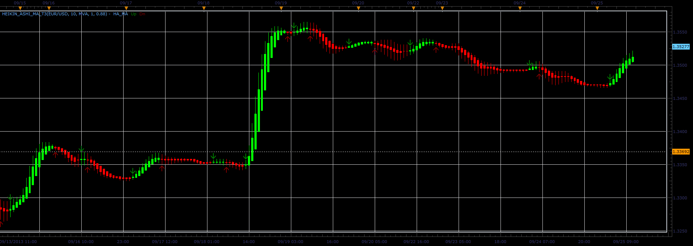

# Heiken Ashi Ma T3 indicator

> Source: https://fxcodebase.com/code/viewtopic.php?f=17&t=59572  
> Forum: 17 · Topic 59572 · 9 post(s)

---

## Heiken Ashi Ma T3 indicator

**Alexander.Gettinger** · Wed Sep 25, 2013 2:00 pm

The indicator is written based on request.

 

Download:

 [Heikin_Ashi_MA_T3.lua](files/89680/Heikin_Ashi_MA_T3.lua)

 20 in 1 Moving Average Indicator a.k.a. Averages is available here.
[viewtopic.php?f=17&t=2430](https://fxcodebase.com/code/viewtopic.php?f=17&t=2430)

T3_MA.lua is available here.
[viewtopic.php?f=17&t=60294](https://fxcodebase.com/code/viewtopic.php?f=17&t=60294)

The strategy based on this indicator.
[viewtopic.php?f=31&t=65489&p=116668#p116668](https://fxcodebase.com/code/viewtopic.php?f=31&t=65489&p=116668#p116668)

---

## Re: Heiken Ashi Ma T3 indicator

**Apprentice** · Sat Jul 29, 2017 9:32 am

The indicator was revised and updated.

---

## Re: Heiken Ashi Ma T3 indicator

**papynou34** · Thu Oct 19, 2017 6:38 am

Hello,
It seems this indicator needs T3_MA to run, but unfortunately I did not find it.
The link of the request is wrong.

Thanks

---

## Re: Heiken Ashi Ma T3 indicator

**papynou34** · Thu Oct 19, 2017 8:07 am

Thanks a lot Appendice for your quick answer.
I have installed the first T3.lua of your link, then renamed it in TA_MA and run the Heiken Ashi MA T3. You will find in the attachment the result I got.

---

## Re: Heiken Ashi Ma T3 indicator

**Apprentice** · Thu Oct 19, 2017 8:24 am

Oops.
T3_MA.lua is available here.
[viewtopic.php?f=17&t=60294](https://fxcodebase.com/code/viewtopic.php?f=17&t=60294)

---

## Re: Heiken Ashi Ma T3 indicator

**papynou34** · Thu Oct 19, 2017 8:33 am

A great thanks to you.

---

## Re: Heiken Ashi Ma T3 indicator

**papynou34** · Thu Dec 28, 2017 7:37 am

Hello,
Is there a strategy related to this indicator?
Thanks

---

## Re: Heiken Ashi Ma T3 indicator

**Apprentice** · Fri Dec 29, 2017 9:09 am

Try this version.
[viewtopic.php?f=31&t=65489&p=116668#p116668](https://fxcodebase.com/code/viewtopic.php?f=31&t=65489&p=116668#p116668)

---

## Re: Heiken Ashi Ma T3 indicator

**Apprentice** · Wed Jun 20, 2018 5:58 am

The Indicator was revised and updated.
