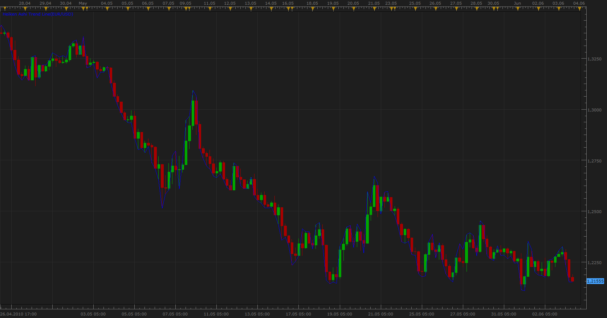

# Heiken Ashi Trend Line

> Source: https://fxcodebase.com/code/viewtopic.php?f=17&t=1256  
> Forum: 17 · Topic 1256 · 30 post(s)

---

## Heiken Ashi Trend Line

**Apprentice** · Thu Jun 03, 2010 3:05 pm

*Heiken Ashi Trend Line*

The algorithm used by this indicator

If Heiken Ashi for current period is rising,
Trend line connecting trend line for the former period,
with the current High value.

If Heiken Ashi for current period is falling,
Trend line connecting trend line for the former period,
with the current Low value.

Buy signal is generated when the trend line cross above closing price.
Sell signal is generated when the trend line cross below closing price.

 [HA Trend Line.lua](files/2386/HA%20Trend%20Line.lua)

MT4 version.
[https://fxcodebase.com/code/viewtopic.php?f=38&t=71379](https://fxcodebase.com/code/viewtopic.php?f=38&t=71379)

---

## Re: Heiken Ashi Trend Line

**Blackcat2** · Thu Jun 17, 2010 1:07 am

Interesting indicator, looks promising but what do you use to confirm the decision to go long/short?
Could you please kindly give couple of example when you have to go long and short?

Thanks heaps..
BC

---

## Re: Heiken Ashi Trend Line

**hawk31003** · Tue Dec 21, 2010 12:45 pm

Hey is it possible to create an email alert on this indicator? Thanks

---

## Re: Heiken Ashi Trend Line

**Apprentice** · Tue Dec 21, 2010 2:22 pm

Added to developmental cue.

---

## Re: Heiken Ashi Trend Line

**hawk31003** · Tue Dec 21, 2010 11:36 pm

you dont have to worry about it...i found the smoothed HA and signal. but one question. how do i get the email notification to work? thank you

---

## Re: Heiken Ashi Trend Line

**Apprentice** · Wed Dec 22, 2010 5:50 am

This might help.
[viewtopic.php?f=29&t=2232](https://fxcodebase.com/code/viewtopic.php?f=29&t=2232)

---

## Re: Heiken Ashi Trend Line

**rjmah319** · Sun Mar 06, 2011 11:11 pm

Is it possible to creat a stratagy for the HA trend Line and HA candles.
Enters long when HA trendline breaks the close of the red candle
Exits long and enters short when HA trend line breaks the close of the green candle.

---

## Re: Heiken Ashi Trend Line

**Apprentice** · Wed Feb 27, 2013 8:03 am

Style option Added.

---

## Re: Heiken Ashi Trend Line

**RunVert** · Wed Feb 27, 2013 12:28 pm

Apprentice -- thank you!

---

## Re: Heiken Ashi Trend Line

**Apprentice** · Wed Mar 06, 2013 9:16 am

Standard HA Strategy can be applied for this Indicator.
[viewtopic.php?f=31&t=32828](https://fxcodebase.com/code/viewtopic.php?f=31&t=32828)

---

## Re: Heiken Ashi Trend Line

**Apprentice** · Wed May 03, 2017 2:10 pm

Indicator was revised and updated.

---

## Re: Heiken Ashi Trend Line

**xpertize** · Wed Sep 18, 2019 7:20 am

Hi Apprentice,

This indicator draws high line when Heiken ashi is UP.
and draws low line when Heiken ashi is DOWN.

I need a similar indicator which draws high line when regular candlestick is UP
and draws low line when regular candlestick is DOWN.

Thanks. I appreciate.

Regards,
xpertize

---

## Re: Heiken Ashi Trend Line

**Apprentice** · Thu Sep 19, 2019 1:06 pm

[Price Trend Line.lua](files/128786/Price%20Trend%20Line.lua)

Try this version.

---

## Re: Heiken Ashi Trend Line

**xpertize** · Sun Sep 22, 2019 12:29 pm

Thanks Apprentice!!

Regards

---

## Re: Heiken Ashi Trend Line

**xpertize** · Fri Oct 25, 2019 1:04 am

Hello,

It would be great if we can have heiken ashi trend line aligned with heiken ashi closing price.
Instead of high and low.

Thanks,
Xpetize

---

## Re: Heiken Ashi Trend Line

**Apprentice** · Fri Oct 25, 2019 5:39 am

To have HA candles instead of the regular price?

---

## Re: Heiken Ashi Trend Line

**xpertize** · Fri Oct 25, 2019 6:13 am

I mean,

this indicator shows 'high' of Heiken ashi when heiken ashi is up
and 'low' of heiken ashi when heiken ashi is down.

I want it to show 'close' of heiken ashi when heiken ashi is up
and again 'close' of heiken ashi when it is down.

Thanks

---

## Re: Heiken Ashi Trend Line

**xpertize** · Mon Nov 04, 2019 3:24 am

Something like this.
Picture attached.

 

---

## Re: Heiken Ashi Trend Line

**Apprentice** · Mon Nov 04, 2019 6:52 am

Your request is added to the development list.
Development reference 274.

---

## Re: Heiken Ashi Trend Line

**Apprentice** · Tue Nov 05, 2019 7:15 am

Try this version.

 [Price_Trend_Line.lua](files/129577/Price_Trend_Line.lua)

---

## Re: Heiken Ashi Trend Line

**xpertize** · Wed Nov 13, 2019 2:13 am

Thanks a lot!! Accurate work as always Apprentice!

---

## Re: Heiken Ashi Trend Line

**Checkz** · Fri Jul 23, 2021 9:41 am

Can the Heiken Ashil Trend Line indicator be made for MT4?

---

## Re: Heiken Ashi Trend Line

**Apprentice** · Tue Jul 27, 2021 2:53 am

Your request is added to the development list.
Development reference 682.

---

## Re: Heiken Ashi Trend Line

**Apprentice** · Thu Jul 29, 2021 4:04 am

MT4 version.
[https://fxcodebase.com/code/viewtopic.php?f=38&t=71379](https://fxcodebase.com/code/viewtopic.php?f=38&t=71379)

---

## Re: Heiken Ashi Trend Line

**TLBshifted** · Sat Apr 30, 2022 11:17 pm

Is it possible to add another feature to heiken ashi trend line please.

If heiken ashi is green, plot line by connecting middle points of upper wick
If heiken ashi is red, plot line by connecting middle points of lower wick.

Thanks a lot.
Regards

---

## Re: Heiken Ashi Trend Line

**Apprentice** · Mon May 02, 2022 8:48 am

Connect current candle middle points with previous candle middle points?
Middle points will depend on the up or down candle?

---

## Re: Heiken Ashi Trend Line

**TLBshifted** · Mon May 02, 2022 11:12 pm

> **Apprentice wrote:**
> Connect current candle middle points with previous candle middle points?
> Middle points will depend on the up or down candle?

Yes Exactly.

But not middle points of body. Instead, middle points of wicks.

Middle points of upper wicks for green heiken candles
Middle points of lower wicks for red heiken candles

---

## Re: Heiken Ashi Trend Line

**Apprentice** · Fri May 06, 2022 5:35 am

We have added your request to the development list.
Development reference 283.

---

## Re: Heiken Ashi Trend Line

**Apprentice** · Fri May 06, 2022 5:54 am

Try this version.
[https://fxcodebase.com/code/viewtopic.php?f=17&t=72153](https://fxcodebase.com/code/viewtopic.php?f=17&t=72153)

---

## Re: Heiken Ashi Trend Line

**TLBshifted** · Fri May 06, 2022 11:49 pm

Thanks a lot Apprentice!
