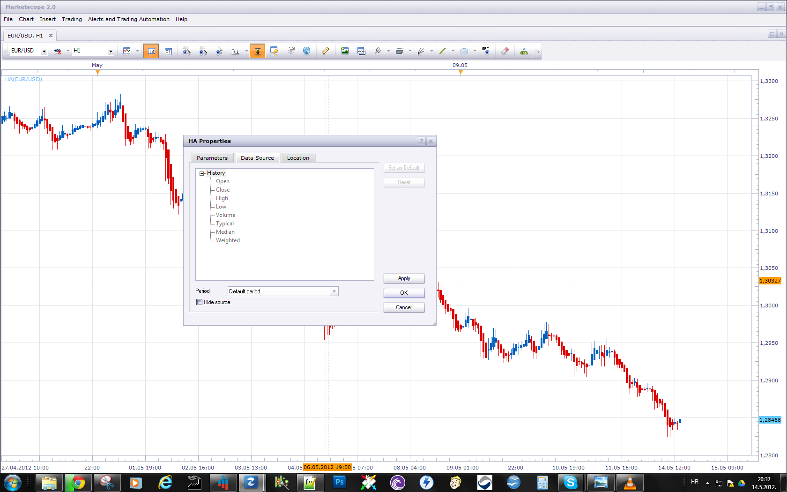
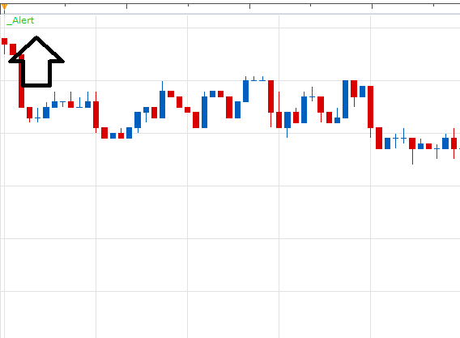
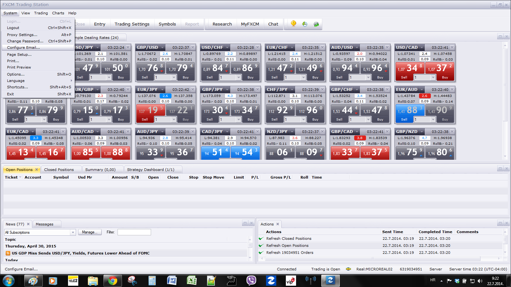

# Heikin-Ashi Alert

> Source: https://fxcodebase.com/code/viewtopic.php?f=17&t=18230  
> Forum: 17 · Topic 18230 · 24 post(s)

---

## Heikin-Ashi Alert

**Apprentice** · Sun May 13, 2012 6:31 am

The indicator shows the change in the trend for HA.
Email, Sound Alert are also available.

 [HA Alert.lua](files/32873/HA%20Alert.lua)

The indicator was revised and updated

---

## Re: Heikin-Ashi Alert

**lbikhope** · Sun May 13, 2012 11:41 am

It is possible put that two chart on one? first one candels second one is HA smooth

---

## Re: Heikin-Ashi Alert

**Apprentice** · Mon May 14, 2012 1:37 pm

Please use, hide source option.
I believe that this will be a satisfactory solution for you.

---

## Re: Heikin-Ashi Alert

**lbikhope** · Mon May 14, 2012 4:51 pm

i got it THANX a LOT OF

---

## Re: Heikin-Ashi Alert

**smatthew** · Mon Feb 18, 2013 4:54 pm

> **Apprentice wrote:**
> Fixed.

Downloaded both updated HA Alert.lua and _Alert.lua from your opening post.
Deinstalled the old versions from Trading Station.
Installed the new versions.
Added the indi and strategy to Marketscope.
So far so good... Until I switched "Send E-mail" to Yes:

> An error occurred during the calculation of the indicator 'HA ALERT'. The error details: [string "HA Alert.lua"]:151: [string "_Alert.lua"]:19: The first parameter must be a string.

---

## Re: Heikin-Ashi Alert

**Apprentice** · Tue Feb 19, 2013 3:46 am

Strange. I can not confirm this.
Line 19 of _Alert is about Sound.
 terminal alertSound (soundfile, RecurrentSound);
Can you post or send your version of indicator to my private email for testing.

---

## Re: Heikin-Ashi Alert

**smatthew** · Tue Feb 19, 2013 2:47 pm

I've attached both versions that are installed on my machine.
They' should be the same files as the ones in your first post.
Hopefully this problem is due to some small error on my part..

---

## Re: Heikin-Ashi Alert

**Apprentice** · Wed Feb 20, 2013 5:40 am

Will continue my testing.
Unfortunately, I can not replicate this error.
Is anyone else have this problem.

---

## Re: Heikin-Ashi Alert

**Apprentice** · Wed Feb 20, 2013 5:48 am

Looks like a compatibility issue.
I have using development version.
 Topmost Indicator is updated so everyone can use it now.

---

## Re: Heikin-Ashi Alert

**smatthew** · Wed Feb 20, 2013 6:21 pm

Woohoo no more errors!! Sounds and e-mail work both just fine.
Thanks Apprentice!

---

## Re: Heikin-Ashi Alert

**JOKER83** · Sun Jul 20, 2014 6:25 pm

Wo kann ich die zeit ebebene einstellen von der er mir das Signal senden soll??

Where can I ebebene set the time by which it is to send me the signal??

---

## Re: Heikin-Ashi Alert

**Apprentice** · Mon Jul 21, 2014 6:34 am

Time is nested in Email send to you.

---

## Re: Heikin-Ashi Alert

**JOKER83** · Mon Jul 21, 2014 2:26 pm

SORRY versteh ich nicht?
Finde keine zeit einsellung
und bekomme auch keine mail?

I do not understand?
Find no time einsellung
and get no mail?

HELPPPPPP
CAN YOU MAKE A PICTURE

---

## Re: Heikin-Ashi Alert

**Apprentice** · Tue Jul 22, 2014 2:20 am

1) You need to have Active Alert Helper for the respective currency pair.

 

2) If you have any already, configure and test your email settings.

 

---

## Re: Heikin-Ashi Alert

**JOKER83** · Wed Jul 23, 2014 5:49 am

Hello from the Heikin Ashi alarm I need a strategy
with
TIME FRAME
SRTATEGY PARAMETERS -TYPE OF SIGNALS
TIME PARAMETERS
TRADING PARAMETERS
ALARM -SHOW ALERT -E-MAIL
AND ARROW SIZE
SAME WITH Heikin-Ashi Strategy

SORRY WHEN CAN I HAVE IT

---

## Re: Heikin-Ashi Alert

**JOKER83** · Mon Sep 01, 2014 5:44 pm

HI NEED HA STRATEGY ALERT
ENTRY WHEN COMING ARROW !DONT CLOSE TRADE I MAKE SELF
WITH ALL PARAMETERS
ONLY ENTRY DONT CLOSE TRADES PLEAS

---

## Re: Heikin-Ashi Alert

**Paul W** · Wed Nov 05, 2014 6:56 pm

could you add a second, additional, sound file option - for separate up/down sounds

thanks,

---

## Re: Heikin-Ashi Alert

**Apprentice** · Thu Nov 06, 2014 6:17 am

Additional sound file option added.

---

## Re: Heikin-Ashi Alert

**SenseClash** · Tue Jan 13, 2015 2:09 am

I get an alert when the HA candle first begins to change color. Is it possible to get the alert only after the candle has closed? I tried changing the "Data Source," but all the options are grayed out.

---

## Re: Heikin-Ashi Alert

**Apprentice** · Tue Jan 13, 2015 9:15 am

Live/End of Turn Mode Added.

---

## Re: Heikin-Ashi Alert

**zl068565** · Tue Sep 08, 2015 10:11 pm

Hi,

Can you add in show dialog box alert? Right now it just plays a sound or do email but doesnt do box alert. This would be helpful.

Thanks in advance.

---

## Re: Heikin-Ashi Alert

**Apprentice** · Thu Sep 10, 2015 3:24 am

Dialog box option added.

---

## Re: Heikin-Ashi Alert

**Apprentice** · Mon Dec 07, 2015 7:14 am

Compatibility issue fixed.
_Alert Helper is not longer needed.

---

## Re: Heikin-Ashi Alert

**Apprentice** · Fri Jul 21, 2017 8:37 am

The indicator was revised and updated.
