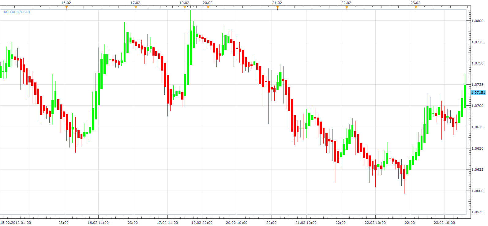
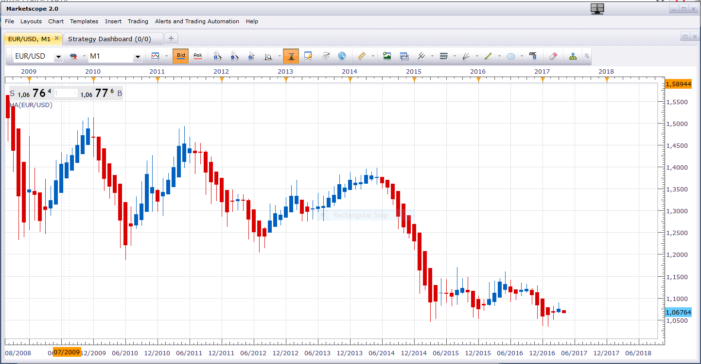

# Heikin-Ashi Chart with Colouring

> Source: https://fxcodebase.com/code/viewtopic.php?f=17&t=13974  
> Forum: 17 · Topic 13974 · 6 post(s)

---

## Heikin-Ashi Chart with Colouring

**Apprentice** · Fri Feb 24, 2012 1:38 pm

This is a standard HA indicator.
The user can change the color of the candles.
Useful if you have more that one HA placed on Chart.
Each on another Time frame for example.

 [HAC.lua](files/26814/HAC.lua)

The indicator was revised and updated

---

## Re: Heikin-Ashi Chart with Colouring

**Jigit Jigit** · Fri Feb 24, 2012 2:13 pm

Apprentice you're the man!

Thanks a million.

---

## Re: Heikin-Ashi Chart with Colouring

**dementedgr** · Sun Feb 26, 2012 7:39 am

Could it be possible a Heikin-Ashi chart with GRAB colouring?

---

## Re: Heikin-Ashi Chart with Colouring

**Apprentice** · Sun Apr 02, 2017 7:00 am

Indicator was revised and updated.

---

## Re: Heikin-Ashi Chart with Colouring

**pacer_** · Sun Apr 02, 2017 7:39 pm

I have HA indicator installed in many of my layouts and pretty much I have it almost on all of my charts.

My biggest daily problem with my charts is whenever i call a layout with HA installed, the charts open up with mixed candle colors due to HA indicator.

Like this :

[https://www.screencast.com/t/Ber8sF8rQKSi](https://www.screencast.com/t/Ber8sF8rQKSi)
(HA indicator is loaded in this chart )

When i saw this upgraded HAC file under this topic, i hoped this new version would not do the same thing but unfortunately it was not different than the previous HA indicator in TSII.

What could be the reason of my candles colors looking mixed ?

When i remove the HA from the chart and reload HA, there is no problem.
But i have to do this with each of my charts with HA everyday.

---

## Re: Heikin-Ashi Chart with Colouring

**Apprentice** · Mon Apr 03, 2017 2:57 am

As you can see,I do not have this problem.
Deinstall / install yout TS.
If the problem persists, sharing your complete screenshots/layout.
