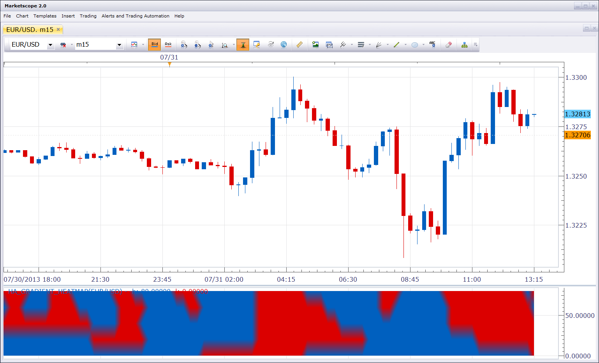

# Heikin-Ashi Gradient Heatmap

> Source: https://fxcodebase.com/code/viewtopic.php?f=17&t=58437  
> Forum: 17 · Topic 58437 · 3 post(s)

---

## Heikin-Ashi Gradient Heatmap

**Nikolay.Gekht** · Wed Jul 31, 2013 12:42 pm

This indicator is a new visualization of [Heikin-Ashi heat map indicator](http://www.fxcodebase.com/code/viewtopic.php?f=17&t=7610). It uses gradient transitions for easier reading of the indicator.

 

Download:

 [ha_gradient_heatmap.lua](files/87598/ha_gradient_heatmap.lua)

The indicator was revised and updated

---

## Re: Heikin-Ashi Gradient Heatmap

**Apprentice** · Tue Oct 15, 2013 1:48 am

Bump Up

---

## Re: Heikin-Ashi Gradient Heatmap

**Apprentice** · Wed Jun 14, 2017 4:56 am

The indicator was revised and updated.
