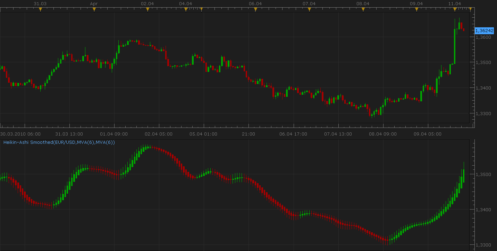

# Heikin-Ashi Smoothed

> Source: https://fxcodebase.com/code/viewtopic.php?f=17&t=606  
> Forum: 17 · Topic 606 · 51 post(s)

---

## Heikin-Ashi Smoothed

**Nikolay.Gekht** · Sun Apr 11, 2010 8:14 pm



The Heikin-Ashi smoothed indicator is similar to the regular Heikin-Ashi, but:

a) uses the smoothed open, close, high and low prices
b) smooths the candles

So, formula of the indicator is:

open = MVA(MVA(OPEN, N1)[-1] + MVA(CLOSE, N1) / 2, N2)
close = MVA(MVA(OPEN, N1) + MVA(CLOSE, N1) + MVA(HIGH, N1) + MVA(LOW, N1)/ 2, N2)
high = MAX(open, close, MVA(HIGH, N1), N2)
low = MIN(open, close, MVA(LOW, N1), N2)

By default, the indicator hides the source data and is shown instead of the source.
To show the both, source data and Heikin-Ashi chart:

1) Uncheck "Hide Source" on the "Data Source" tab of the indicator properties.
2) Check "Show indicator/oscillator in an new area..." on the "Location" tab of the indicator properties.

As the standard HA indicator, the HASM indicator result is a regular bar source, so you can apply any existing indicator on it.

 [HASM.lua](files/1075/HASM.lua)

 [HASM with Alert.lua](files/1075/HASM%20with%20Alert.lua)

 [Transparent Heikin Ashi Smoothed.lua](files/1075/Transparent%20Heikin%20Ashi%20Smoothed.lua)

 


 [MTF MCP Heikin-Ashi Smoothed.lua](files/1075/MTF%20MCP%20Heikin-Ashi%20Smoothed.lua)

Indicator will show the current direction of Heikin-Ashi Smoothed indicator for all selected time frames and currency pairs.
Active Cross is graphically presented.

 


 [MTF MCP Heikin-Ashi Smoothed (2).lua](files/1075/MTF%20MCP%20Heikin-Ashi%20Smoothed%20%282%29.lua)

A similar indicator can be found here.
[viewtopic.php?f=17&t=63347&p=105655#p105655](https://fxcodebase.com/code/viewtopic.php?f=17&t=63347&p=105655#p105655)

The indicator was revised and updated

---

## Re: Heikin-Ashi Smoothed

**koyote44** · Thu May 27, 2010 4:30 pm

Hi Nikolay,

i think you have missing a part in your code.
see lines 60 and 75

[upd by ng:]
Download:

 [HASM.lua](files/2237/HASM.lua)

The original version does not use, in fact, the specified N1 and N2 parameters, so, therefore, the default Moving Average parameter is used. This update fixes this error.

```lua
function Init()
    indicator:name("Heikin-Ashi Smoothed");
    indicator:description("");
    indicator:requiredSource(core.Bar);
    indicator:type(core.Indicator);
    indicator:setTag("group", "Trend");
    indicator:setTag("replaceSource", "t");

    indicator.parameters:addString("Method1", "The smoothing method for prices", "The methods marked by the star (*) requires to have approriate indicators installed", "MVA");
    indicator.parameters:addStringAlternative("Method1", "MVA", "", "MVA");
    indicator.parameters:addStringAlternative("Method1", "EMA", "", "EMA");
    indicator.parameters:addStringAlternative("Method1", "LWMA", "", "LWMA");
    indicator.parameters:addStringAlternative("Method1", "SMMA*", "", "SMMA");
    indicator.parameters:addStringAlternative("Method1", "Vidya (1995)*", "", "VIDYA");
    indicator.parameters:addStringAlternative("Method1", "Vidya (1992)*", "", "VIDYA92");
    indicator.parameters:addStringAlternative("Method1", "Wilders*", "", "WMA");

    indicator.parameters:addInteger("N1", "Periods to smooth prices", "", 6, 1, 1000);

    indicator.parameters:addString("Method2", "The smoothing method for candles", "The methods marked by the star (*) requires to have approriate indicators installed", "MVA");
    indicator.parameters:addStringAlternative("Method2", "MVA", "", "MVA");
    indicator.parameters:addStringAlternative("Method2", "EMA", "", "EMA");
    indicator.parameters:addStringAlternative("Method2", "LWMA", "", "LWMA");
    indicator.parameters:addStringAlternative("Method2", "SMMA*", "", "SMMA");
    indicator.parameters:addStringAlternative("Method2", "Vidya (1995)*", "", "VIDYA");
    indicator.parameters:addStringAlternative("Method2", "Vidya (1992)*", "", "VIDYA92");
    indicator.parameters:addStringAlternative("Method2", "Wilders*", "", "WMA");

    indicator.parameters:addInteger("N2", "Periods to smooth candles", "", 6, 1, 1000);
end

local smopen = nil;
local smhigh = nil;
local smlow = nil;
local smclose = nil;

local iopen = nil;
local ihigh = nil;
local ilow = nil;
local iclose = nil;

local smiopen = nil;
local smihigh = nil;
local smilow = nil;
local smiclose = nil;

local open = nil;
local high = nil;
local low = nil;
local close = nil;

local first1 = 0;
local first2 = 0;

-- Routine
function Prepare()
    source = instance.source;
   
    -- was missing, so N1 was not set
    local N1 = instance.parameters.N1;
   
    smopen = core.indicators:create(instance.parameters.Method1, source.open, N1);
    smclose = core.indicators:create(instance.parameters.Method1, source.close, N1);
    smhigh = core.indicators:create(instance.parameters.Method1, source.high, N1);
    smlow = core.indicators:create(instance.parameters.Method1, source.low, N1);

    first1 = smopen.DATA:first() + 1;

    iopen = instance:addInternalStream(first1, 0);
    iclose = instance:addInternalStream(first1, 0);
    ihigh = instance:addInternalStream(first1, 0);
    ilow = instance:addInternalStream(first1, 0);
   
    -- was missing, so N2 was not set
    local N2 = instance.parameters.N2;
   
    smiopen = core.indicators:create(instance.parameters.Method2, iopen, N2);
    smiclose = core.indicators:create(instance.parameters.Method2, iclose, N2);
    smihigh = core.indicators:create(instance.parameters.Method2, ihigh, N2);
    smilow = core.indicators:create(instance.parameters.Method2, ilow, N2);

    first2 = smiopen.DATA:first() + 1;

    local name = "Heikin-Ashi Smoothed" .. "(" .. source:name() .. "," .. instance.parameters.Method1 .. "(" .. instance.parameters.N1 .. ")," .. instance.parameters.Method2 .. "(" .. instance.parameters.N2.. "))"
    instance:name(name);
    open = instance:addStream("open", core.Line, name, "open", core.rgb(0, 0, 0), first2)
    high = instance:addStream("high", core.Line, name, "high", core.rgb(0, 0, 0), first2)
    low = instance:addStream("low", core.Line, name, "low", core.rgb(0, 0, 0), first2)
    close = instance:addStream("close", core.Line, name, "close", core.rgb(0, 0, 0), first2)
    instance:createCandleGroup("HAS", "HAS", open, high, low, close);
end

-- Indicator calculation routine
function Update(period, mode)
    -- smooth source
    smopen:update(mode);
    smhigh:update(mode);
    smlow:update(mode);
    smclose:update(mode);

    if period >= first1 then
        -- calculate candles
        if (period == first1) then
            iopen[period] = (smopen.DATA[period - 1] + smclose.DATA[period - 1]) / 2;
        else
            iopen[period] = (iopen[period - 1] + iclose[period - 1]) / 2;
        end
        iclose[period] = (smopen.DATA[period] + smhigh.DATA[period] + smlow.DATA[period] + smclose.DATA[period]) / 4;
        ihigh[period] = math.max(iopen[period], iclose[period], smhigh.DATA[period]);
        ilow[period] = math.min(iopen[period], iclose[period], smlow.DATA[period]);

        -- smooth candles
        smiopen:update(mode);
        smihigh:update(mode);
        smilow:update(mode);
        smiclose:update(mode);
    end

    if period >= first2 then
        open[period] = smiopen.DATA[period];
        close[period] = smiclose.DATA[period];
        high[period] = math.max(open[period], close[period], smihigh.DATA[period]);
        low[period] = math.min(open[period], close[period], smilow.DATA[period]);
    end
end
```

---

## Re: Heikin-Ashi Smoothed

**Nikolay.Gekht** · Thu May 27, 2010 7:43 pm

Thank you very much for spotting and fixing the problem.

---

## Re: Heikin-Ashi Smoothed

**kitar01** · Fri May 13, 2011 9:49 am

all ok but this indicator cancel all the candles and do not allow to watch both...

---

## Re: Heikin-Ashi Smoothed

**kitar01** · Fri May 13, 2011 9:56 am

ok it is working.
would be better if we can have a separated colour option...
thank you

---

## Re: Heikin-Ashi Smoothed

**Apprentice** · Fri May 13, 2011 11:26 am

Color option added.

 [HASM.lua](files/10600/HASM.lua)

---

## Re: Heikin-Ashi Smoothed

**lisa_baby_xx** · Mon May 16, 2011 4:03 am

Hi,

I have only yesterday discoverd the joy of the Heikin-Ashi Smoothed Indicator.

 Is there a signal available for this type of indicator? One that signals when the bars change colour?

Many thanks and much love. XX
lisa_baby_xx

---

## Re: Heikin-Ashi Smoothed

**Apprentice** · Mon May 16, 2011 5:22 am

Signal that you seek is available here.
[viewtopic.php?f=29&t=2344&p=5013&hilit=Heikin+Ashi#p5013](https://fxcodebase.com/code/viewtopic.php?f=29&t=2344&p=5013&hilit=Heikin+Ashi#p5013)

---

## Re: Heikin-Ashi Smoothed

**lisa_baby_xx** · Mon May 16, 2011 5:24 am

Thanks sweetie. XX.

lisa_baby_xx

---

## Re: Heikin-Ashi Smoothed

**Platinum** · Wed Jul 06, 2011 1:48 pm

Hi,

I love this indicator. Can anyone please explain wht MVA is?

I would like to program this indcator into excel Can anyone please help me with the formula? Any help would be greatly appreciated.

Many Thanks

---

## Re: Heikin-Ashi Smoothed

**sunshine** · Wed Jul 06, 2011 11:34 pm

The formula of Heikin-Ashi Smoothed is in the top post.
MVA is a simple moving average. Please see:
[Simple Moving Average (MVA, SMA)](https://fxcodebase.com/wiki/index.php/Simple_Moving_Average_%28MVA,_SMA%29)

---

## Re: Heikin-Ashi Smoothed

**motoko123** · Tue Oct 11, 2011 4:14 pm

What does N1 and N2 refer to?

Thanks

---

## Re: Heikin-Ashi Smoothed

**Apprentice** · Tue Oct 11, 2011 4:34 pm

N1 and N2 are variables, which retain information on the period for moving averages,
that the user has selected.

---

## Re: Heikin-Ashi Smoothed

**TheEdge** · Wed Jan 11, 2012 11:28 am

Hello,

Is there anyway to have this indicator show as hollow boxes rather than a solid color?

Thanks

---

## Re: Heikin-Ashi Smoothed

**Apprentice** · Wed Jan 11, 2012 4:38 pm

Unfortunately not.
I will forward the request to the development team.

---

## Re: Heikin-Ashi Smoothed

**Alexander.Gettinger** · Sat Feb 04, 2012 9:28 pm

Heikin-Ashi Smoothed indicator with Averages indicator smoothing.

Download:

 [HASM2.lua](files/25187/HASM2.lua)

For this indicator must be installed AVERAGES indicator ([viewtopic.php?f=17&t=2430](https://fxcodebase.com/code/viewtopic.php?f=17&t=2430)).

---

## Re: Heikin-Ashi Smoothed

**TheEdge** · Thu Feb 09, 2012 7:18 am

Feature Request,

Is it possible to have the standard Heikin-Ashi and this indicator without the high and low shadows so they only show the "Real Body" of the candle?

I realize this would be 2 different indicators but this would help clean up the charts.

Thanks

---

## Re: Heikin-Ashi Smoothed

**Apprentice** · Fri Feb 10, 2012 4:34 am

Your request is added to the development list.
When we find the time someone will help you.

---

## Re: Heikin-Ashi Smoothed

**Alexander.Gettinger** · Fri Feb 17, 2012 3:10 pm

> **TheEdge wrote:**
> Is it possible to have the standard Heikin-Ashi and this indicator without the high and low shadows so they only show the "Real Body" of the candle?

See this version of indicator:

 [HASM3.lua](files/26233/HASM3.lua)

 [MTF MCP HASM.lua](files/26233/MTF%20MCP%20HASM.lua)

---

## Re: Heikin-Ashi Smoothed

**chriswant** · Sun Feb 19, 2012 12:29 am

hello, This indicator is Great... would it be possible to add some future candle say 5-10, maybe in a different color, based on the past, maybe with a percentage of accuracy of just for its general movement

---

## Re: Heikin-Ashi Smoothed

**Apprentice** · Mon Feb 20, 2012 4:01 am

The algorithm for the prediction would be a great help.
Unfortunately I'm not sure how to write such an algorithm.
The development of this something takes time and money.
I have people who have experience with such problems.
However, no funding for such work.

---

## Re: Heikin-Ashi Smoothed

**brunettesrule** · Thu Mar 15, 2012 8:00 pm

Hi

I have tried to download this indicator. HASM.lau (after your posting of fixing 2 lines) and HASMTB.lau. But when I try to get it on my chart it doesn't change and comes up as a strategy? can someone please help me with what I am doing wrong.

Cheers, Jane

---

## Re: Heikin-Ashi Smoothed

**briansummy** · Tue Mar 20, 2012 10:50 pm

> **Alexander.Gettinger wrote:**
>
>
> > **TheEdge wrote:**
> > Is it possible to have the standard Heikin-Ashi and this indicator without the high and low shadows so they only show the "Real Body" of the candle?
>
>
>
> See this version of indicator:
>
>
> HASM3.lua

Can you do a system with HASM3 BUY/SELL when in agreement to TSF (Data Source = HASM3 Close) GREEN/RED signal where exit is a disagreement? A Daily chart for NZDJPY looks amazing. I'd be curious to back test that. As long as there is no repainting or anything false, it's very nice.

---

## Re: Heikin-Ashi Smoothed

**Apprentice** · Wed Mar 21, 2012 6:13 am

Your request is added to the development list.

---

## Re: Heikin-Ashi Smoothed

**jdjones23** · Sun Jul 29, 2012 8:52 pm

Is there a way to update this indicator so that you can select the color of the up and down candles. Right now, can only use green and red. Great indicator!.. thanks

---

## Re: Heikin-Ashi Smoothed

**rtsayers** · Sat Sep 01, 2012 3:23 am

I was wondering if you code this indicator for the heikin ashi? Its called the Hadelta oscillator. Also this one in the post uses divergence. But without divergence would be just fine!

Thanks!!

[http://www.forex-tsd.com/blogs/newdigit ... -prev.html](http://www.forex-tsd.com/blogs/newdigital/1527-new-elite-section-indicators-swing-line-binary-2-indicators-prev.html)

---

## Re: Heikin-Ashi Smoothed

**Apprentice** · Mon Sep 03, 2012 2:47 pm

Do you have a description, formula or code for this indicator.
Try my version.
[viewtopic.php?f=17&t=22967](https://fxcodebase.com/code/viewtopic.php?f=17&t=22967)

---

## Re: Heikin-Ashi Smoothed

**trendwatch** · Mon Nov 05, 2012 10:22 am

Hi,

Could you possibly add the color option to this version too: HASM3.lua (hide wick version).

The original HASM version has this already, so maybe it isn't a lot of work for you.

Thanks in advance.

---

## Re: Heikin-Ashi Smoothed

**Apprentice** · Tue Nov 06, 2012 7:21 am

Your request is added to the development list.

---

## Re: Heikin-Ashi Smoothed

**Apprentice** · Fri Oct 17, 2014 8:11 am

Transparent Heikin Ashi Smoothed.lua Added.
See First post in topic.

---

## Re: Heikin-Ashi Smoothed

**Apprentice** · Fri Oct 17, 2014 11:54 am

MTF MCP Heikin-Ashi Smoothed Added.

---

## Re: Heikin-Ashi Smoothed

**easytrading** · Sun Oct 19, 2014 6:24 pm

hello ,
could anyone help to develop a strategy for this indicator based on HA smothed bar color changing with the option of deferent timeframes please, thanks.

---

## Re: Heikin-Ashi Smoothed

**Apprentice** · Mon Oct 20, 2014 10:45 am

U can use Heiken_AshiSmoothed_N_Bars_Strategy.lua
Set Count of bars Parameter to 1
[viewtopic.php?f=31&t=3655](https://fxcodebase.com/code/viewtopic.php?f=31&t=3655)

---

## Re: Heikin-Ashi Smoothed

**Apprentice** · Wed Aug 19, 2015 4:10 am

MTF MCP Heikin-Ashi Smoothed Added.

---

## Re: Heikin-Ashi Smoothed

**gregoryyul** · Thu Aug 20, 2015 11:06 am

Hi

Thanks for creating the MTF MCP Indicator.

It's working well for me but I can't figure out how to get the bar graph representation for the current chart, I only get the coloured arrows.

Can you pls explain how to do this?

Thanks for your time

---

## Re: Heikin-Ashi Smoothed

**all_in** · Tue Aug 25, 2015 9:45 am

> **gregoryyul wrote:**
> Hi
>
> Thanks for creating the MTF MCP Indicator.
>
> It's working well for me but I can't figure out how to get the bar graph representation for the current chart, I only get the coloured arrows.
>
> Can you pls explain how to do this?
>
> Thanks for your time

I'd like to know this as well.

Also, am I right in saying, that until the bar closes, the indicator could repaint?
If so, could it be made to only display when the specific timeframe period has completed?
i.e. Looking at the M5 chart, the H1 HA is bullish, but the H1 candle hasn't completed and could change.

Thanks

---

## Re: Heikin-Ashi Smoothed

**Apprentice** · Wed Aug 26, 2015 10:05 am

gregoryyul
Try MTF MCP Heikin-Ashi Smoothed (2).lua
ALL_IN
MTF MCP indicator will reflect change in HASM indicator.

---

## Re: Heikin-Ashi Smoothed

**all_in** · Mon Sep 07, 2015 2:04 pm

Thanks

---

## Re: Heikin-Ashi Smoothed

**jarmush** · Sun Oct 25, 2015 8:55 pm

all_in: Yes, it can change colors. Heikin Ashi OPEN is allways in the middle of the previous Heikin Ashi candle, but other candles use most actual values so can change colors (including HA CLOSE - have a look at this: [http://www.technicalindicators.net/indi ... hi-candles](http://www.technicalindicators.net/indicators-technical-analysis/96-heikin-ashi-candles)). And the HA variations behave the same. Hope this helps.

---

## Re: Heikin-Ashi Smoothed

**Apprentice** · Tue Oct 27, 2015 3:39 am

"HASM" will not use HA formula to calculate.
It is calculated as follows.
open = MVA(MVA(OPEN, N1)[-1] + MVA(CLOSE, N1) / 2, N2)
close = MVA(MVA(OPEN, N1) + MVA(CLOSE, N1) + MVA(HIGH, N1) + MVA(LOW, N1)/ 2, N2)
high = MAX(open, close, MVA(HIGH, N1), N2)
low = MIN(open, close, MVA(LOW, N1), N2)

---

## Re: Heikin-Ashi Smoothed

**DAVIDR** · Mon Jan 18, 2016 7:21 am

Hi, is it possible to display this over a candle chart, so that both this indicator and candles are displayed at the same time.

All the best.

---

## Re: Heikin-Ashi Smoothed

**Apprentice** · Wed Jan 20, 2016 5:48 am


Sure, try this version.

 [HASM.lua](files/104355/HASM.lua)

---

## Re: Heikin-Ashi Smoothed

**Apprentice** · Mon May 16, 2016 10:06 am

HASM with Alert.lua added.

---

## Re: Heikin-Ashi Smoothed

**sagymmm** · Sun Jun 05, 2016 9:02 pm

Hello Apprentice, can we have a strategy that opens a trade automatically in the direction that we choose manually.
For example I choose to buy a certain pair, when The HASM closes the candle green we go long and when it closes red the trade automatically close and the opposite.
Thanks

---

## Re: Heikin-Ashi Smoothed

**Apprentice** · Mon Jun 06, 2016 2:38 am

You can use Heiken_AshiSmoothed_N_Bars_Strategy.lua
[viewtopic.php?f=31&t=3655&p=12016&hilit=HASM#p12016](https://fxcodebase.com/code/viewtopic.php?f=31&t=3655&p=12016&hilit=HASM#p12016)

---

## Re: Heikin-Ashi Smoothed

**Apprentice** · Mon Jun 06, 2016 2:50 am

Try this version.
[viewtopic.php?f=31&t=63566](https://fxcodebase.com/code/viewtopic.php?f=31&t=63566)

---

## Re: Heikin-Ashi Smoothed

**pizzaboy** · Fri Jun 17, 2016 11:18 am

Do we have any strategy that uses the MTF MCP Heikin-Ashi Smoothed? I just need a reference to build my own.
TIA

---

## Re: Heikin-Ashi Smoothed

**Apprentice** · Sun Jun 19, 2016 3:21 am

Here you can find a few of the MTF and MCP strategies templates.
[viewtopic.php?f=28&t=2712](https://fxcodebase.com/code/viewtopic.php?f=28&t=2712)

---

## Re: Heikin-Ashi Smoothed

**jrichardson83** · Sun Jul 09, 2017 9:25 pm

> **Apprentice wrote:**
>
>
> EURUSD m1 (01-20-2016 1113).png
>
>
> Sure, try this version.
>
>
> HASM.lua

I wanted to request an update to the implementation of the "On-Chart" smoothed heiken ashi.
1. Could the moving average options be updated to reflect all the moving averages available in the "Averages" indicator. I believe that the HASM3 indicator has this implementation?

2. Can the indicator be coded into an oscillator, much like the MTF version, which would just show red or green when the colors of the heiken ashi candles change?

---

## Re: Heikin-Ashi Smoothed

**Apprentice** · Mon Jul 10, 2017 3:51 pm

Can you define the "On-Chart"

 About 2. request.
Your request is added to the development list, Under Id Number 3821
 If someone is interested to do this task, please contact me.

---

## Re: Heikin-Ashi Smoothed

**Apprentice** · Wed Jul 12, 2017 4:34 pm

MTF MCP HASM .lua added.
