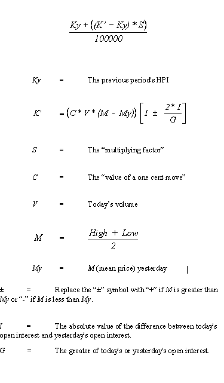

# HERRICK PAYOFF INDEX

> Source: https://fxcodebase.com/code/viewtopic.php?f=17&t=64939  
> Forum: 17 · Topic 64939 · 1 post(s)

---

## HERRICK PAYOFF INDEX

**Apprentice** · Sat Jul 22, 2017 7:58 am

Based on an article
[http://www.motivewave.com/studies/herri ... _index.htm](http://www.motivewave.com/studies/herrick_payoff_index.htm)
The Herrick Payoff Index is designed to show the amount of money flowing into or out of a futures contract. The Index uses open interest during its calculations, therefore, the security being analyzed must contain open interest.
The Herrick Payoff Index was developed by John Herrick.

Tick volume was used.

 [HERRICK PAYOFF INDEX.lua](files/113693/HERRICK%20PAYOFF%20INDEX.lua)

The original formula requires an open interest.
Data source/surrogate suggestions are welcome.

 

The indicator was revised and updated
