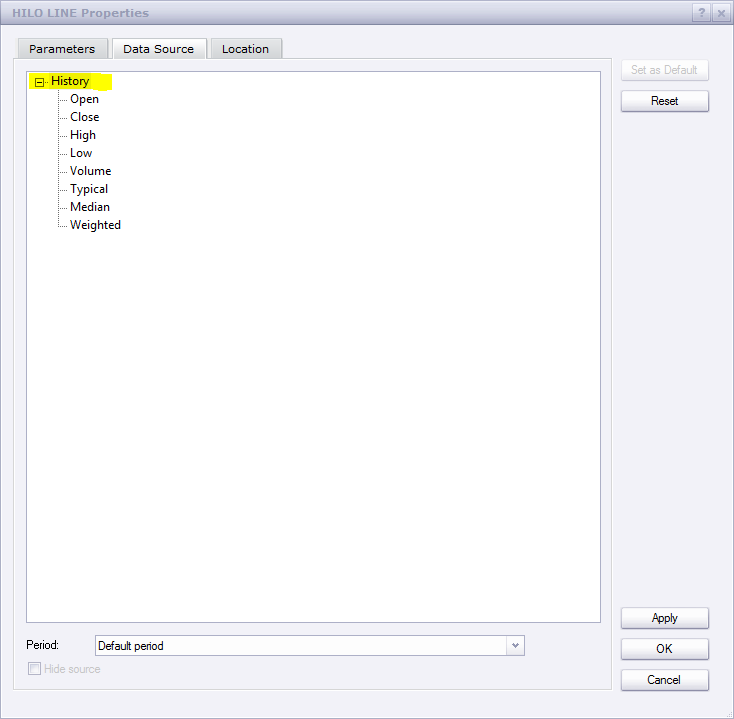

# Hi/Lo Line

> Source: https://fxcodebase.com/code/viewtopic.php?f=17&t=59801  
> Forum: 17 · Topic 59801 · 9 post(s)

---

## Hi/Lo Line

**Apprentice** · Mon Nov 04, 2013 7:57 am

Indicator will show min, max values,
for the visible portion of the screen, or entire data stream.

 [HiLo Line.lua](files/90556/HiLo%20Line.lua)

Select history for entire Bar source,
Or a particular component for Tick source.

 

---

## Re: Hi/Lo Line

**speakinmymind** · Wed Nov 06, 2013 2:31 pm

Could you please put the distance in pips from the two lines? Displayed in front of the low line price would be a good place.

Thanks for all you do!!

---

## Re: Hi/Lo Line

**Apprentice** · Thu Nov 07, 2013 4:14 am

Try Updated Version.

---

## Re: Hi/Lo Line

**speakinmymind** · Thu Nov 07, 2013 6:18 pm

Thanks! Could you please allow for option to put distance on the bottom line? I have the "info overlay" indicator that has data in the upper-right.

---

## Re: Hi/Lo Line

**Apprentice** · Fri Nov 08, 2013 4:16 am

Try updated version.

---

## Re: Hi/Lo Line

**Alexander.Gettinger** · Mon Dec 02, 2013 10:39 am

MQL4 version of Hi/Lo Line: [viewtopic.php?f=38&t=60044](https://fxcodebase.com/code/viewtopic.php?f=38&t=60044).

---

## Re: Hi/Lo Line

**speakinmymind** · Tue May 27, 2014 11:48 am

Could you please add a midpoint line? So as to always know the exact middle of the high and low.

Thanks!

---

## Re: Hi/Lo Line

**Apprentice** · Thu May 29, 2014 4:28 am

Midpoint Line Added.

---

## Re: Hi/Lo Line

**Apprentice** · Wed Sep 12, 2018 5:57 am

The indicator was revised and updated.
