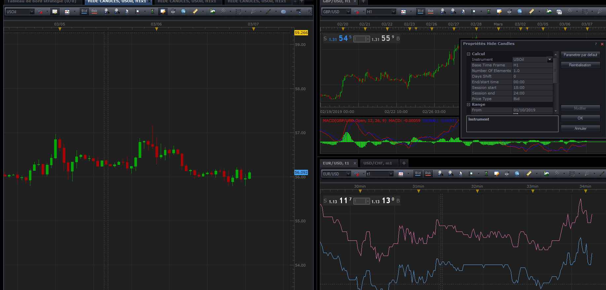

# Hide Candles

> Source: https://fxcodebase.com/code/viewtopic.php?f=17&t=67419  
> Forum: 17 · Topic 67419 · 10 post(s)

---

## Hide Candles

**Apprentice** · Wed Mar 06, 2019 5:23 am

Based on request.
[viewtopic.php?f=27&t=67410](https://fxcodebase.com/code/viewtopic.php?f=27&t=67410)

 [Hide Candles.lua](files/124269/Hide%20Candles.lua)

---

## Re: Hide Candles

**Hailkayy** · Wed Mar 06, 2019 11:31 am

Hey Apprentice how are you?

I have tried it I am not sure I can use it per attachement.

I tried different session hour to only see the candles between 18-24h, or 12-04 etc.
But none of em work do you have an idea why ?

 

Best,

---

## Re: Hide Candles

**Apprentice** · Thu Mar 07, 2019 5:16 pm

em?

---

## Re: Hide Candles

**Hailkayy** · Fri Mar 08, 2019 3:43 am

As you can see on the picture I selected only 6 hours for the trading session, which means that every day I should only see candles from 18h till 24h, or only 6 H1 candle in this example, however I am seeing every 24hour span candle like if no indicator was applied.

Maybe I am using it incorrectly, did I set something incorrectly ?

Thanks.

---

## Re: Hide Candles

**Apprentice** · Fri Mar 08, 2019 7:17 am

Your request is added to the development list under Id Number 4524

---

## Re: Hide Candles

**Apprentice** · Thu Mar 14, 2019 6:46 am

Fixed.
I found another bug which presents on the original indicator too.

---

## Re: Hide Candles

**Hailkayy** · Fri Mar 15, 2019 2:09 am

Thanks for the fix apprentice, works like a charm.

Best,

Hailkayy.

---

## Re: Hide Candles

**douvanik** · Sat Nov 14, 2020 9:03 am

30m period if it is possible?? Thanks.

---

## Re: Hide Candles

**Apprentice** · Sun Nov 15, 2020 3:49 am

Your request is added to the development list.
Development reference 2310.

---

## Re: Hide Candles

**Apprentice** · Tue Nov 17, 2020 6:47 am

[Hide Candles.lua](files/138938/Hide%20Candles.lua)

Try this version.
