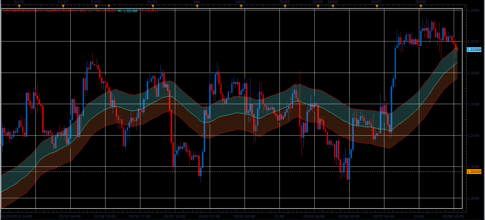
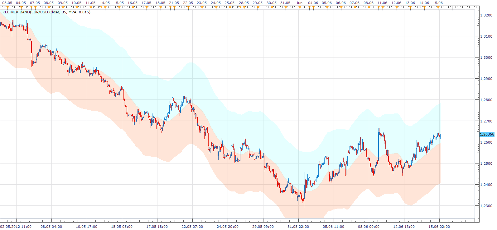

# High Customizable Keltner

> Source: https://fxcodebase.com/code/viewtopic.php?f=17&t=280  
> Forum: 17 · Topic 280 · 66 post(s)

---

## Re: High Customizable Keltner

**tradingkevin** · Thu Feb 04, 2010 6:11 am

Thanks a lot Nikolay ! You rule ! It will be very usefull to me ...

Best to you
Kevin

---

## Re: High Customizable Keltner

**ausjus18** · Sun May 30, 2010 6:33 am

Thanks for this very useful indicator. Is there an easy way to either not plot the centre line or colour it transparent? Thanks.

---

## Re: High Customizable Keltner

**ausjus18** · Tue Jun 01, 2010 8:14 pm

Thank you Nikolay! Really appreciate your help.
Jürgen

---

## Re: High Customizable Keltner

**7510109079** · Fri Jul 15, 2011 7:55 am

THx for the Keltner indicator which i refer to bollingers.

Could I request you put a single option for changing the size and style of the lines.

I would like to differentiate different deiviations buy line thickness and dotted/solid/dashed

many thx in advance

---

## Re: High Customizable Keltner

**Apprentice** · Sat Jul 16, 2011 3:59 am

Style Option Added.

---

## Re: High Customizable Keltner

**7510109079** · Sat Jul 16, 2011 6:08 am

thx very much Apprentice. do i just download the KELTNER1.LUA once again?

---

## Re: High Customizable Keltner

**7510109079** · Sat Jul 16, 2011 6:11 am

thx very much Apprentice.

---

## Re: High Customizable Keltner

**7510109079** · Sat Jul 16, 2011 6:11 am

works great! ignore last query

---

## Re: High Customizable Keltner

**7510109079** · Wed Aug 03, 2011 7:27 am

this is proving to be a nice reliable signal for XAU/USD when used in conjunction with others.

I am therefore requesting if you guys could possibly add a further enhancement:

Is it possible to customise an alert so the user is notified audibly when the candle bar touches either the upper or lower keltner band. (would this have to be a 'on close of bar' alert or can it be immediately we get a touch?)

If you could do it in such a way that one could set different alert tones for upper and lower bands & choose to have only upper or lower alerts active at one time that would be awesome.

muchos gracias in advance

---

## Re: High Customizable Keltner

**7510109079** · Tue Aug 09, 2011 10:27 am

hi guys,
just checking if the last request for an automated alert for hitting the limits of the bands was queued.
Any one able to work on this?
thx Lawrence

---

## Re: High Customizable Keltner

**Apprentice** · Sun Aug 21, 2011 12:10 pm

This is possible using / writing signal not with indicator.

---

## Re: High Customizable Keltner

**7510109079** · Fri Aug 26, 2011 6:54 am

Hi Apprentice,

Sorry I just saw your post while checking back on this thread. For some reason i did not get an email alert.

would you be able to spend some time on creating a signal? And if so would it be possible to work into the signal an automated buy/sell option as i have seen in some of your other signals that work in MarketScope/FXCM trading stn?

I trade the XAU/USD and find Keltner bands provide very good signals. Enclosed is a screen shot of some good buy entries, when combined with other indicators and trendlines and MM stops (not shown here). Good uptrends initiated when the lower 4th dev. of the 20EMA line is touched.

Thus the signal would be very warmly welcomed.

many thx

LAwrence

---

## Re: High Customizable Keltner

**7510109079** · Fri Aug 26, 2011 7:10 am

>>> to see whole image above, right click and copy image url into new browser page

---

## Re: High Customizable Keltner

**7510109079** · Thu Oct 13, 2011 7:24 am

Would it be possible to add a time period option so one could superimpose/plot the Kelt line of a different period chart e.g. plot an m5 Kelt channel on an m1 chart or vice versa?

---

## Re: High Customizable Keltner

**sunshine** · Thu Oct 13, 2011 8:19 am

> **7510109079 wrote:**
> Would it be possible to add a time period option so one could superimpose/plot the Kelt line of a different period chart e.g. plot an m5 Kelt channel on an m1 chart or vice versa?

It is possible in the new version of Marketscope which comes to productions pretty soon. For now the beta version is available here: [viewtopic.php?f=30&t=6490](https://fxcodebase.com/code/viewtopic.php?f=30&t=6490)
You can choose the time frame in the Indicator Properties dialog box -> Data Source tab.

---

## Re: High Customizable Keltner

**zmender** · Wed Jan 25, 2012 9:32 pm

Hi Apprentice, is the strategy for this indicator still on the developmental cue? - Thx

---

## Re: High Customizable Keltner

**Alexander.Gettinger** · Wed Feb 08, 2012 9:13 pm

Keltner indicator with color clouds.

 

Download:

 [Keltner2.lua](files/25480/Keltner2.lua)

---

## Re: High Customizable Keltner

**7510109079** · Fri Feb 10, 2012 5:55 am

thx Apprentice. Saw your msg about time period. Thx also for the cloud lua

---

## Re: High Customizable Keltner

**lbikhope** · Wed Jun 13, 2012 4:09 am

im looking keltner bands but with seting like Trade Stations
-PLength
-NumATRs
-Displace
Please and Thx

---

## Re: High Customizable Keltner

**lbikhope** · Wed Jun 13, 2012 12:52 pm

---------------------------------
 inputs: Price( Close ), Length( 35 ), pct( .15 ), Displace( 0 ),NumDays(4), NumHours(0), NumMinutes(0) ;

variables: Avg( 0 ), Shift( 0 ), LowerBand( 0 ), UpperBand( 0 ), mp(0), setup(false);

Avg = AverageFC( Price, Length ) ;
Shift = pct * AverageFC( Length,35 ) ;
UpperBand = Avg + Shift ;
LowerBand = Avg - Shift ;

condition1 = price <= UpperBand and price >= LowerBand;
condition2 = Price crosses under UpperBand or Price crosses over LowerBand;

if Displace <= 0 or CurrentBar > AbsValue( Displace )or BarStatus(1) = 2
 then if condition2 then begin
 if countif(condition1,35)>= 35 then setup = true
 else setup = false;
 end;
 ----- maybe that help

---

## Re: High Customizable Keltner

**Apprentice** · Thu Jun 14, 2012 3:01 am

Cental = Moving Average
Top =Central + Central * Percentage
Bottom =Central - Central * Percentage

 [Keltner Band.lua](files/35496/Keltner%20Band.lua)

---

## Re: High Customizable Keltner

**lbikhope** · Thu Jun 14, 2012 5:49 am

look perfect thx a lot of but can u add cloud? please

---

## Re: High Customizable Keltner

**Apprentice** · Fri Jun 15, 2012 3:55 am

With Cloud Version.

 [Keltner Band.lua](files/35539/Keltner%20Band.lua)

---

## Re: High Customizable Keltner

**Eric1704** · Tue Mar 05, 2013 9:18 pm

The Keltner from the June 14, 2012 post does not seem to work in shorter time frames. It goes way off from the price.
Thank you.

---

## Re: High Customizable Keltner

**Apprentice** · Wed Mar 06, 2013 8:14 am

Try to use smaller Percentage value.
This should fix your problem.

---

## Re: High Customizable Keltner

**POPPJOBB** · Mon May 20, 2013 7:29 am

Did the Alert get added into this indicator?
If so I cannot find it(I tried 2-3 versions)
The Alert is for price closing above or below Keltner channel.
Thanks

---

## Re: High Customizable Keltner

**Apprentice** · Wed May 22, 2013 10:26 am

See top most post.
I just uploaded the version that has alert functionality.

---

## Re: High Customizable Keltner

**michlen** · Thu Jun 20, 2013 6:24 pm

1. How can I download Keltner bands using Wilder's ATR instead of percentage?
2. Would there be a possibility of choosing MA, EMA ,...?
3. And choosing Low or High instead of Close?

Being a beginner simple download is probably the maximum I can manage.

---

## Re: High Customizable Keltner

**michlen** · Fri Jun 21, 2013 4:52 pm

Answering (partly) my last posting:

I've found and downloaded an ATR based Keltner Band indicator. I.e. only my 3rd question remains:

How can I use Low or High instead of Close?

The changes in the code -probably (H+H)/2 instead of (H+L)/2- might not be too complicated but being a beginner simple download is probably the maximum I can manage.

---

## Re: High Customizable Keltner

**Apprentice** · Sun Jun 23, 2013 2:38 pm

In this implementation, it is not possible,
We use the ATR, which requires a complete bar (open, close, high, low)

---

## Re: High Customizable Keltner

**michlen** · Sun Jun 23, 2013 11:09 pm

I understand that:
Keltner.High(i) = Smooth(Source) + Variation * Factor
Keltner.Low(i) = Smooth(Source) - Variation * Factor

The choice of source for the center line is C , (H+L)/2 or (H+L+C)/3.
Could it be also only H or only L?
If yes how can I download it?

P.S.I guess the coding shouldn't be too complicated even though it is beyond the scope of my skills i.e. I don't know how to turn a new code into a downloadable .lua version.

---

## Re: High Customizable Keltner

**Apprentice** · Mon Jun 24, 2013 1:29 am

Only if we use Tick ATR
 [viewtopic.php?f=17&t=34094&p=57962&hilit=tick+atr#p57962](https://fxcodebase.com/code/viewtopic.php?f=17&t=34094&p=57962&hilit=tick+atr#p57962)
Note, ATR and TickATR have different values​​.

---

## Re: High Customizable Keltner

**Apprentice** · Fri Jun 28, 2013 2:32 am

Simply set style for medium line to "No Line"

---

## Re: High Customizable Keltner

**virgilio** · Wed Oct 30, 2013 1:40 pm

could we have a strategy based on Keltner.lua?
Long when price closes below the bottom of the keltner band
Short when the price closes above the top of the keltner band

Thank you.

---

## Re: High Customizable Keltner

**Apprentice** · Thu Oct 31, 2013 2:46 pm

Requested can be found here.
[viewtopic.php?f=31&t=59755](https://fxcodebase.com/code/viewtopic.php?f=31&t=59755)

---

## Re: High Customizable Keltner

**Coondawg71** · Sun Feb 16, 2014 1:54 pm

Can we please request Tick version of "Keltner with Alert".

Thanks,

sjc

---

## Re: High Customizable Keltner

**Apprentice** · Mon Feb 17, 2014 2:38 am

In theory, yes.
Unfortunately, this is not possible without major under the hood, changes,
as ATR require a full bar for the calculation.

---

## Re: High Customizable Keltner

**7510109079** · Mon May 26, 2014 5:20 am

May I request a slight change to the alert?

Can we get an alert even if the price action only touches the high/low K line, but fails to completely cross

thx

---

## Re: High Customizable Keltner

**7510109079** · Thu May 29, 2014 5:25 am

to clarify, i mean similar functionality to the built-in chart price alert condition options

[http://tinypic.com/r/29yhz0j/8](http://tinypic.com/r/29yhz0j/8)

---

## Re: High Customizable Keltner

**Apprentice** · Fri May 30, 2014 4:05 am

Your request is added to the development list.

---

## Re: High Customizable Keltner

**7510109079** · Fri May 30, 2014 5:01 am

thx

---

## Re: High Customizable Keltner

**klutzy** · Mon Sep 01, 2014 12:34 pm

Please let user displace lines to left up to half the period span.

---

## Re: High Customizable Keltner

**JOKER83** · Wed Jan 21, 2015 7:12 am

HALLO
CAN YOU MAKE PLEAS
Highly adaptable Keltner Strategy.lua
Averages.lua
combination

AVERAGES IS OTHER TIMEFRAME
AND CLOSE OPTION YES/NO

WHEN AVERAGES BUY =KELTNER MAKE ONLY BY OPTION
WHEN AVERAGES SELL=KELTNER MAKE ONLY SELL OPTION

WHEN IT WOULD BE DONE

---

## Re: High Customizable Keltner

**Apprentice** · Thu Jan 22, 2015 3:20 am

Highly adaptable Keltner Strategy with Confirmation Added.
[viewtopic.php?f=31&t=59755&p=98279#p98279](https://fxcodebase.com/code/viewtopic.php?f=31&t=59755&p=98279#p98279)

---

## Re: High Customizable Keltner

**JOKER83** · Sat Jan 24, 2015 2:22 pm

> **Apprentice wrote:**
> Highly adaptable Keltner Strategy with Confirmation Added.
> [viewtopic.php?f=31&t=59755&p=98279#p98279](https://fxcodebase.com/code/viewtopic.php?f=31&t=59755&p=98279#p98279)

HI
can you make a Indicatot with signal Dots
THX

---

## Re: High Customizable Keltner

**ThemBonez** · Wed Jul 15, 2015 10:45 am

Hi,
Is it possible to create a version of Keltner2 that projects the 3 lines 3 to 5 bars into the future based on current slope.
Thank You

---

## Re: High Customizable Keltner

**rtsayers** · Tue Dec 08, 2015 10:46 pm

The center line cross alert not working? All of the alerts are on and the alerts are working for other indicators?

---

## Re: High Customizable Keltner

**Apprentice** · Thu Dec 10, 2015 6:06 am

Compatibility issue fixed.
_Alert Helper is not longer needed.

---

## Re: High Customizable Keltner

**Panther** · Thu Apr 14, 2016 12:54 pm

Could you make a tick based version of Keltner1.lua ?
Thanks

---

## Re: High Customizable Keltner

**Apprentice** · Fri Apr 15, 2016 12:07 pm

Try this version.
[viewtopic.php?f=17&t=63381](https://fxcodebase.com/code/viewtopic.php?f=17&t=63381)

---

## Re: High Customizable Keltner

**Apprentice** · Thu Jun 01, 2017 6:17 am

Indicator was revised and updated.

---

## Re: High Customizable Keltner

**Mohamed85** · Sun Sep 24, 2017 10:19 am

Hi Apprentice, Have a nice day, Could it be possible to modify this indicator in order to apply it to different indicator like RSI as an Example.
Regards.

---

## Re: High Customizable Keltner

**Apprentice** · Mon Sep 25, 2017 3:36 pm

Try this version.
[viewtopic.php?f=17&t=63381&p=114825&hilit=Keltner#p114825](https://fxcodebase.com/code/viewtopic.php?f=17&t=63381&p=114825&hilit=Keltner#p114825)

---

## Re: High Customizable Keltner

**Mohamed85** · Sun Oct 01, 2017 4:13 pm

Thank you Apprentice so much, you are always such a great help

---

## Re: High Customizable Keltner

**Apprentice** · Mon Sep 24, 2018 9:53 am

The indicator was revised and updated.

---

## Re: High Customizable Keltner

**Phamilton630** · Fri Nov 02, 2018 7:00 am

Hello

just a quick bug alert and request.

Bug- (do u also see this?)
top band re-entry alerts do not show an entry marker

Request-
We have six individual sound alerts but only two marker alerts
Can we have a customisable (color & size) marker for each type of 6 sound alerts?

thank you

---

## Re: High Customizable Keltner

**Apprentice** · Fri Nov 02, 2018 12:21 pm

Your request is added to the development list under Id Number 4293

---

## Re: High Customizable Keltner

**Phamilton630** · Fri Nov 02, 2018 12:39 pm

OK great thx.

Did you manage to reproduce/sort out the bug?

---

## Re: High Customizable Keltner

**Apprentice** · Sun Nov 04, 2018 6:25 am

Try it now, file Id: 9218
Id will be shown in you hover over the file with your mouse cursor.

---

## Re: High Customizable Keltner

**Phamilton630** · Wed Nov 07, 2018 7:46 am

Thanks but why the change of marker symbol? It is better with the dot on the cross over

---

## Re: Keltner personnalisable élevé

**bruno2017** · Mon Mar 29, 2021 3:16 am

hello
can I have the moving averages "jurisk" and "HMA" to calculate keltner
thank you

---

## Re: High Customizable Keltner

**Apprentice** · Tue Mar 30, 2021 6:12 am

Your request is added to the development list.
Development reference 326.

---

## Re: Keltner personnalisable élevé

**bruno2017** · Tue Mar 30, 2021 7:01 am

thank you

---

## Re: High Customizable Keltner

**Apprentice** · Fri Apr 23, 2021 5:54 am

Try this version.
[https://fxcodebase.com/code/viewtopic.php?f=17&t=71126](https://fxcodebase.com/code/viewtopic.php?f=17&t=71126)

---

## Re: High Customizable Keltner

**mayk01** · Thu Jul 17, 2025 2:13 am

Hi, I get an error:
"Keltner with Alert.lua:184: Specified index is out of range."
I'm also on a completely new Marketscipe, using almost only this.

M.

---

## Re: High Customizable Keltner

**Apprentice** · Fri Jul 18, 2025 7:02 am

We have added your request to the development list.
Development reference 461
