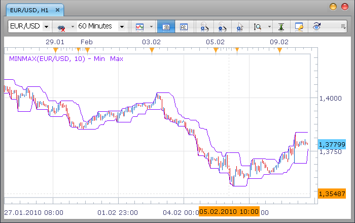

# High/Low (aka Min/Max) bands

> Source: https://fxcodebase.com/code/viewtopic.php?f=17&t=302  
> Forum: 17 · Topic 302 · 10 post(s)

---

## High/Low (aka Min/Max) bands

**Nikolay.Gekht** · Tue Feb 09, 2010 9:27 pm

The simple indicator which shows bands on the base of highest high and lowest low the last N periods.

 

The indicator was revised and updated

Download:

 [MINMAX.lua](files/526/MINMAX.lua)

---

## Re: High/Low (aka Min/Max) bands

**trade4** · Thu Mar 04, 2010 5:21 am

Hi!
I tried to install the Indacator, but inly a message comes out - 45 a nil value
Is there an axplnation for it, please?

---

## Re: High/Low (aka Min/Max) bands

**Nikolay.Gekht** · Mon Mar 08, 2010 12:41 pm

Could you please provide a bit more details:
1) Which version of the Marketscope do you use?
2) When the error appears? When the indicator is just installed or when you apply the indicator?
3) What is the exact error message?

---

## Re: High/Low (aka Min/Max) bands

**barbs666** · Mon Mar 08, 2010 10:44 pm

Hi,

any chance that this could be modified to show on any chart with data from a higher time frame?

for eg: viewing 30min chart and indicator showing high/low bands from a daily chart?

---

## Re: High/Low (aka Min/Max) bands

**trade4** · Tue Mar 09, 2010 3:11 am

Hi!
1.I use the latest Version 01,07. 012810
2.It appears when I want to put it into the chart - it is already installed.
3. string"MINMAX.lua" : 45: attempt to call field ´minmax´(a nil value)

---

## Re: High/Low (aka Min/Max) bands

**Nikolay.Gekht** · Tue Mar 09, 2010 10:14 am

> **barbs666 wrote:**
> any chance that this could be modified to show on any chart with data from a higher time frame?
> for eg: viewing 30min chart and indicator showing high/low bands from a daily chart?

Yes, it will be possible shortly. A version of the marketscope which lets indicator to get other timeframes (as well instruments) is on the testing now. I think we will have it released in a few weeks. I have a number of indicators, such as today high/lows, trade profile option and so on which utilizes these new features. I'll publish them as soon as a new version will be released.

---

## Re: High/Low (aka Min/Max) bands

**Nikolay.Gekht** · Tue Mar 09, 2010 10:20 am

> **trade4 wrote:**
> 3. string"MINMAX.lua" : 45: attempt to call field ´minmax´(a nil value)

Yeah, I see. It looks like you have a version which hadn't be updated because of XP SP1 fail during the latest update. I've prepare the version of the indicator which does not utilize this new minmax function.

Please, find the version of the indicator which is compatible with older versions of Marketscope below

 [MINMAX.lua](files/732/MINMAX.lua)

---

## Re: High/Low (aka Min/Max) bands

**trade4** · Wed Mar 10, 2010 6:35 am

Thank You!
It works now.

---

## Re: High/Low (aka Min/Max) bands

**Gidien** · Wed Mar 10, 2010 9:16 am

> **barbs666 wrote:**
> Hi,
>
> any chance that this could be modified to show on any chart with data from a higher time frame?
>
> for eg: viewing 30min chart and indicator showing high/low bands from a daily chart?

Yes you can use my Higher Time Frame Bar Source to do this.

located here
[viewtopic.php?f=17&t=430](http://www.fxcodebase.com/code/viewtopic.php?f=17&t=430)

---

## Re: High/Low (aka Min/Max) bands

**Apprentice** · Sun Dec 25, 2016 7:29 am

Indicator was revised and updated.
