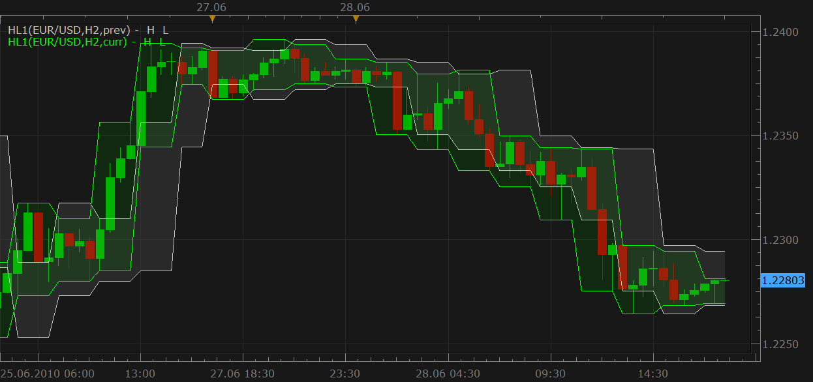
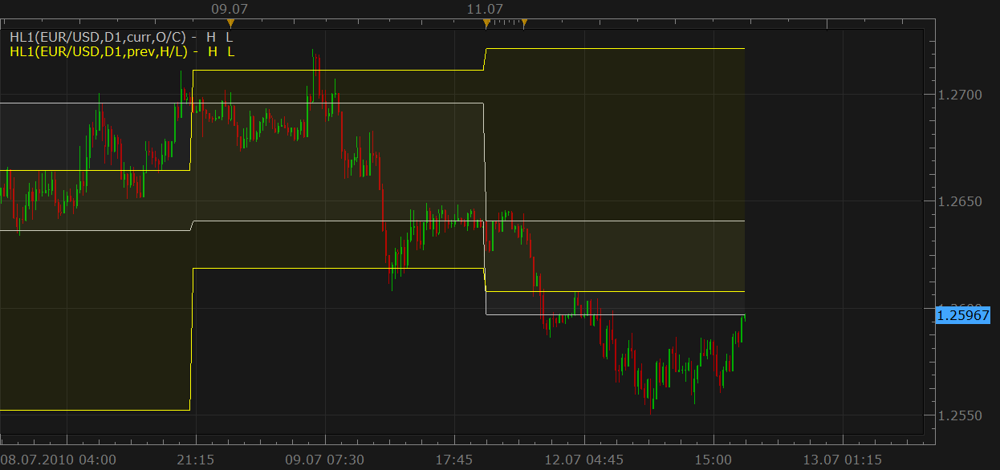
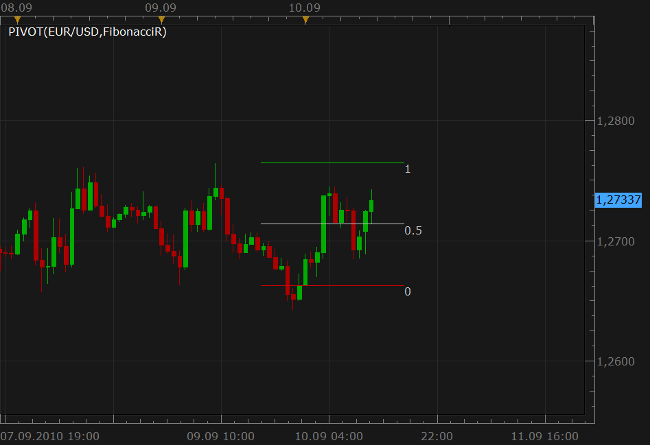
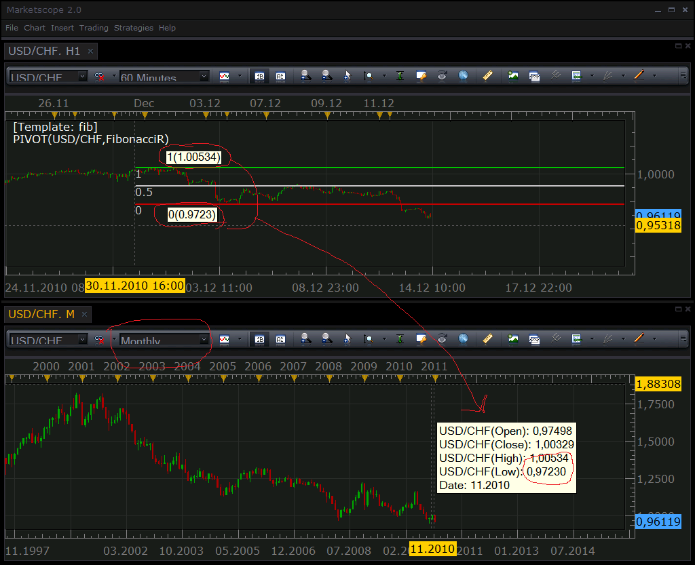
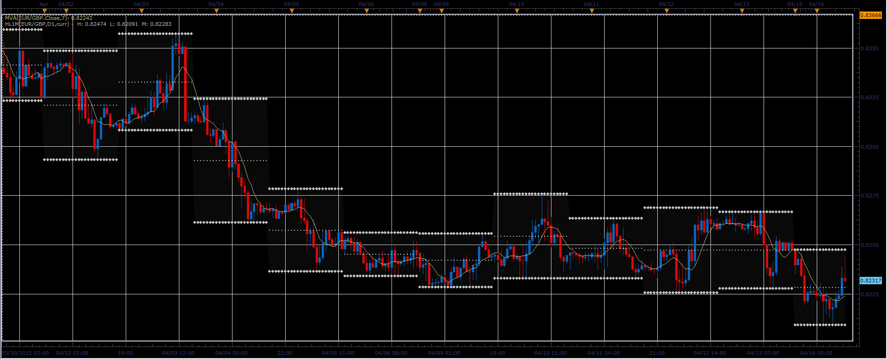

# High/Low band [upd Jun 28]

> Source: https://fxcodebase.com/code/viewtopic.php?f=17&t=607  
> Forum: 17 · Topic 607 · 73 post(s)

---

## High/Low band [upd Jun 28]

**Nikolay.Gekht** · Sun Apr 11, 2010 8:19 pm

Update, Jun 28, ng: Now it's possible to shift the indicator one period right, so, for example, it will show yesterdays rather than today's high/low.

The very simple indicator, which shows high and low lines of the specified timeframe, a day by default.

Can be used as an example of the indicator which uses the data of other timeframe.

 

Download the indicator:

 [hl1.lua](files/1076/hl1.lua)

The indicator was revised and updated

See also a version which can show O/C prices here: [viewtopic.php?f=17&t=607&p=2933#p2933](https://fxcodebase.com/code/viewtopic.php?f=17&t=607&p=2933#p2933)

---

## Re: High/Low band

**barbs666** · Wed Apr 28, 2010 11:09 pm

Hi,

thanks for this indicator, I noticed a possible error? I use this on 60 min chart but used the indicator on the Weekly setting. This is what I saw on occasion (attached chart via link).
[http://yfrog.com/2rpicqqj](http://yfrog.com/2rpicqqj)

Just wanted to also know about the settings on marketscope time scale (UTC, server, financial time?) which one is best....

---

## Re: High/Low band

**barbs666** · Wed Apr 28, 2010 11:13 pm

sorry for got to finish message b4 i submitted....

So as for the image above you can see that the new week started and the hi/lo bands completely missed the low of that week.

---

## Re: High/Low band

**Nikolay.Gekht** · Thu Apr 29, 2010 8:13 am

Thank you for the reporting. I'll check the indicator and the server data, probably it's a glitch in the source data.

---

## Re: High/Low band

**barbs666** · Thu May 06, 2010 10:34 pm

Hi,

just wondering if this has been updated/checked for the error?

Thanks

---

## Re: High/Low band

**Nikolay.Gekht** · Fri May 07, 2010 9:02 am

There was the source data problem. I reported the problem to the server price team. Unfortunately, I don't manage them, so fixing of the such problems is completely out of my hands.

---

## Re: High/Low band

**barbs666** · Fri May 07, 2010 6:51 pm

Thanks mate,

ok cool, I assume when there done (hopefully soon) you will post a message here?

cheers

---

## Re: High/Low band

**Nikolay.Gekht** · Sun May 09, 2010 6:51 pm

I rechecked, so it looks like fixed. Unfortunately, it does not mean that all data is fixed, so, please, do not hesitate to report any other wrong data. I'll do all my best to force server team to fix the data asap.

---

## Re: High/Low band

**barbs666** · Sun May 09, 2010 7:26 pm

Ok Thanks Nikolay!

so I assume there is no need to download the indicator again?....... cheers

---

## Re: High/Low band

**Nikolay.Gekht** · Sun May 09, 2010 8:48 pm

Yes, you do not need to reload or reinstall the indicator. This was the problem with data.
The high/low band is just a good tool for finding historical price discrepancies.

---

## Re: High/Low band

**kerkoules** · Tue Jun 08, 2010 6:34 am

Thank you, this is a very handy indicator.

Is it possible to invert somehow the sketched area? I find it better to have the price action clear and the area outside it to be sketched in order to outline band's High/Low

---

## Re: High/Low band

**brianrben** · Thu Jun 10, 2010 7:29 pm

When I downloaded HL.lua I got an error, "attempt to index global 'indicator', a nil value."

---

## Re: High/Low band

**Nikolay.Gekht** · Fri Jun 11, 2010 10:47 am

> **brianrben wrote:**
> When I downloaded HL.lua I got an error, "attempt to index global 'indicator', a nil value."

I have tried to install is a signal, not as an indicator. Use chart->manage custom indicators command.

---

## Re: High/Low band

**Nikolay.Gekht** · Fri Jun 11, 2010 11:08 am

> **kerkoules wrote:**
> Is it possible to invert somehow the sketched area? I find it better to have the price action clear and the area outside it to be sketched in order to outline band's High/Low

This is impossible in the current version of the Marketscope. I'll discuss with developers whether it could be done in the next release.

---

## Re: High/Low band

**Capie1** · Mon Jun 21, 2010 4:45 pm

Hi Nikolay

Thank you for this great tool.

How would you modify it to display yesterdays High Low band in today?(shift 1 period to the right)

Regards

---

## Re: High/Low band

**Nikolay.Gekht** · Wed Jun 23, 2010 7:18 pm

I'll do, just will finish with the trading sessions and moving average signal.

---

## Re: High/Low band

**Nikolay.Gekht** · Mon Jun 28, 2010 5:08 pm

> **Capie1 wrote:**
> How would you modify it to display yesterdays High Low band in today?(shift 1 period to the right)

I've updated the indicator in the first post of this topic.

---

## Re: High/Low band [upd Jun 28]

**Capie1** · Tue Jun 29, 2010 3:35 am

Hi Nikolay

Thank you very much for the update.

I have two more request please:

A ) Option to show open/close instead of High /Low

B) Show price label on chart in respect of current bands displayed.

Thank you

---

## Re: High/Low band [upd Jun 28]

**Nikolay.Gekht** · Mon Jul 12, 2010 1:15 pm

1) Please find a version with Open/Close price support (see third parameter) below.

2) The current price will be automatically shown in the upcoming version of the Trading Station, so I see no reason to do it right now.

 

Download the indicator.

 [hl2.lua](files/2933/hl2.lua)

---

## Re: High/Low band [upd Jun 28]

**Capie1** · Tue Jul 13, 2010 4:58 am

Thank you

Very nicely done!

Regards

---

## Re: High/Low band [upd Jun 28]

**nica33** · Tue Aug 31, 2010 9:24 pm

Hi Nikolay!!

Thanks for the indicator. Very Useful!

I would like to know if it's possible to select the number of days that I want to apply the indicator, for example: last day, last 2 days,....

If it's not possible at least the option for last day. Before use the indicator, I used to add manually at the end of the day 2 lines: the high and low for the previous day (only).

I love the indicator!!

Thanks

Nica

---

## Re: High/Low band [upd Jun 28]

**nica33** · Fri Sep 10, 2010 1:34 am

Hello Nikolay!!
I'm just checking if the change can be done in this indicator. What I would like to get: Previous day (only previous day) High and low as horizontal lines (just 2 lines in the chart)

Thanks a lot

Nica

---

## Re: High/Low band [upd Jun 28]

**Nikolay.Gekht** · Fri Sep 10, 2010 10:41 am

> **nica33 wrote:**
> Previous day (only previous day) High and low as horizontal lines (just 2 lines in the chart)

You can get it using the standard PIVOT indicator.

1) Choose Daily in time frame
2) Choose Fibonacci retracement in Calculation mode
3) Choose "Today" in Show Mode
4) Switch off all the lines except S3 and R3

 

---

## Re: High/Low band [upd Jun 28]

**nica33** · Sun Sep 12, 2010 6:41 pm

Perfect!!!!!

Thanks a lot Nikolay!!!!

Nica

---

## Re: High/Low band [upd Jun 28]

**aytacasan** · Wed Dec 08, 2010 10:42 am

Hi Nikolay,

I think there is bug this indicator. But I'm not sure. I want to see previous day/week/month high, low and midpoint. For example for month i do these like your said:

1) I choose mouthly in time frame
2) I choose Fibonacci retracement in Calculation mode
3) I choose "Today" in Show Mode
4) I switche off all the lines except S3 and R3

But lines drawed wrong. Could you please inform me what is my fault?

Thanks.

---

## Re: High/Low band [upd Jun 28]

**Nikolay.Gekht** · Tue Dec 14, 2010 9:56 am

I tried to check, but the data looks correct:

 

Could you check please that:
1) You compare bid data with bid data, not with ask data.
2) You compare with the proper instrument/timeframe
3) You have chosen Fibonacci retracement, not just Fibonacnni in pivot mode

---

## Re: High/Low band [upd Jun 28]

**kelvincha** · Sun Dec 19, 2010 11:03 pm

Hi Nikolay
I found some problem when using this Indicator
why the high and low band shift to the open price of today but not previous day
Is that counting from Monday

---

## Re: High/Low band [upd Jun 28]

**Nikolay.Gekht** · Mon Dec 20, 2010 11:57 am

I see. It takes sunday as previous day. You can see a couple of sunday candles formed for this week. These candles "grabbed" Friday's value and these candles formed Monday's channel. I think the best way is to just skip these values.

Well, I plan to rewrite a bit this indicator for new release of TS, I can just ignore sunday candles at all, but it is much easier to make it under new TS. I plan to but the last beta of new TS in a few days and will update the indicator for beta immediately.

---

## Re: High/Low band [upd Jun 28]

**aytacasan** · Fri Dec 31, 2010 10:18 am

Hi Nikolay,

Normally when responsed my post in this site, i informed via email but somehow this time not. I don't know why. Sory i recognize your response presently. Whatever, i'll try your advice step by step for test indicator again. Then i inform you.

Best Regards.

---

## Re: High/Low band - Can you update the indicator?

**emjay-short** · Wed Mar 16, 2011 4:39 pm

> **Nikolay.Gekht wrote:**
> [...]
> Well, I plan to rewrite a bit this indicator for new release of TS, I can just ignore sunday candles at all, but it is much easier to make it under new TS. I plan to but the last beta of new TS in a few days and will update the indicator for beta immediately.

***bump up***

Hi,

I was especially looking for Daily Pivot Points based on previous day OCHL. Just to add to my usual Pivot Points to gauge if we make new highs or lows to previous day on a 5m chart.

I downloaded the code from page 2 (Mon Jul 12, 2010 7:15 pm) and it is a good start with just H&L previous day.

Can you update the code @Nikolay?

- There is still the Sunday Issue (see above),
- Displaying it in form of Pivot Points instead of Bands,
- Add Open and Close to High and Low which already is in the code.

**Thanks a bunch!!!**
emjay

---

## Re: High/Low band [upd Jun 28]

**dspurr624** · Thu Aug 04, 2011 11:48 am

This is a great indicator. It really helps you to evaluate price action in different time frames clearly on the same chart. Great work. I noticed that there were some isses early on with the indicator. I assume the download I got today, they all been resolved....right ? ... Best, DS

---

## Re: High/Low band [upd Jun 28]

**dspurr624** · Thu Aug 04, 2011 12:38 pm

Wondering if it might be possible to add a feature to this ; Would you be able to add a second line for each time frame that would plot a a fixed (user input) number of pips above and below the actual high and low for the period. This might be a good way to buy lows and sell highs in different timeframes. I might like to be watching the 1m chart, but be willing to buy 30m lows less a fixed number of pips. Great work. Thinking that the second line would be a nice visual addition.

---

## Re: High/Low band [upd Jun 28]

**pylim15** · Thu Aug 11, 2011 10:05 am

can you please add an option to change the time?

---

## Re: High/Low band [upd Jun 28]

**pylim15** · Thu Aug 11, 2011 10:26 am

hi is it possible to add an option to change the time? thank you!

---

## Re: High/Low band [upd Jun 28]

**Apprentice** · Sun Aug 21, 2011 12:13 pm

If you think the Biger time frame, version.
This option should be available in the new version of platforms.
By Default.

---

## Re: High/Low band [upd Jun 28]

**LordTwig** · Fri Feb 03, 2012 11:43 am

Hi Nikolay, have you rewritten this yet?

> **Nikolay.Gekht wrote:**
> I see. It takes sunday as previous day. You can see a couple of sunday candles formed for this week. These candles "grabbed" Friday's value and these candles formed Monday's channel. I think the best way is to just skip these values.
>
> Well, I plan to rewrite a bit this indicator for new release of TS, I can just ignore sunday candles at all, but it is much easier to make it under new TS. I plan to but the last beta of new TS in a few days and will update the indicator for beta immediately.

Also, with option of getting previous days (time period) OHLC, or third...fourth days OHLC and so on without using Pivot Indicator.

> **nica33 wrote:**
> Hi Nikolay!!
> Thanks for the indicator. Very Useful!
> I would like to know if it's possible to select the number of days that I want to apply the indicator, for example: last day, last 2 days,....

Can you also make it as a simple strategy so it is like a template if you like.

In fact.... I am actually after a Strategy and Indicator that can get previous several Days data (seperated into days) and buy or sell if higher or lower.
For example if current bid is higher than H 3xdays ago then sell.... or if current bid is higher than H 3xdays ago and 2xdays ago then sell.... and vice versa
Can you help me out with this at all??
Cheers
Lordtwig

---

## Re: High/Low band [upd Jun 28]

**LordTwig** · Fri Feb 17, 2012 12:47 am

So is any action on this request yet??

---

## Re: High/Low band [upd Jun 28]

**kaya_171** · Sun Feb 19, 2012 5:07 am

Hello

Please can you add functionality to allow the customisation of each line weight and style...

Thanks in advance

---

## Re: High/Low band [upd Jun 28]

**Apprentice** · Mon Feb 20, 2012 4:02 am

Your request is added to the development list.

---

## Re: High/Low band [upd Jun 28]

**fx.mda7** · Tue Mar 13, 2012 12:23 pm

Hi
I need a 3rd line for 50% of hh/ll ((hh+ll)/2) for both time period (prev. & curr.).
I mean that same indicator (HL1) with 3rd line.

Best Regards

---

## Re: High/Low band [upd Jun 28]

**Apprentice** · Wed Mar 14, 2012 2:50 am

Your request is added to the development list.

---

## Re: High/Low band [upd Jun 28]

**Alexander.Gettinger** · Fri Mar 16, 2012 9:14 am

> **fx.mda7 wrote:**
> Hi
> I need a 3rd line for 50% of hh/ll ((hh+ll)/2) for both time period (prev. & curr.).
> I mean that same indicator (HL1) with 3rd line.
>
> Best Regards

Indicator with middle line:

 [hl1m.lua](files/28160/hl1m.lua)

---

## Re: High/Low band [upd Jun 28]

**nazaar** · Sat Mar 17, 2012 10:47 pm

Hello,

this is a really **useful**indicator. In an effort to keep charts tidy and clutter free is it possible to add an option where the user can choose how many periods back the indicator is displayed for. For example, in the Pivot tool there is a **Show Mode**option where the use may choose **today**or **historical**.

Is it possible to have it where the user chooses how many periods back it displays the highs/lows and open/close?

Thanks.

---

## Re: High/Low band [upd Jun 28]

**fx.mda7** · Sun Mar 18, 2012 3:54 pm

> **Alexander.Gettinger wrote:**
>
>
> > **fx.mda7 wrote:**
> > Hi
> > I need a 3rd line for 50% of hh/ll ((hh+ll)/2) for both time period (prev. & curr.).
> > I mean that same indicator (HL1) with 3rd line.
> >
> > Best Regards
>
>
>
> Indicator with middle line:
>
>
> hl1m.lua

That is great.
Thank you very much.

---

## Re: High/Low band [upd Jun 28]

**nazaar** · Mon Mar 19, 2012 8:38 am

Hello,

could you please add line width and line style to both hl1 and hl2?

thanks kindly in advance.

---

## Re: High/Low band [upd Jun 28]

**Apprentice** · Tue Mar 20, 2012 2:30 am

Your request is added to the development list.

---

## Re: High/Low band [upd Jun 28]

**Alexander.Gettinger** · Tue Mar 20, 2012 12:53 pm

> **nazaar wrote:**
> could you please add line width and line style to both hl1 and hl2?

I have updated hl1m.lua.
Please, download it again.

---

## Re: High/Low band [upd Jun 28]

**nazaar** · Wed Mar 21, 2012 9:32 am

> **Alexander.Gettinger wrote:**
> I have updated hl1m.lua.
> Please, download it again.

very helpful, thank you very much!

in an effort to de-clutter the chart is it possible to make the vertical lines inbetween periods optional whether to display or not? the lines which connect the low to the low and high to high.

thank you.

---

## Re: High/Low band [upd Jun 28]

**panosd** · Thu Mar 22, 2012 1:24 pm

Hello... first of all i would like to thank's you about this indicator. i would like to know if you can put in a future update the Size option for Yearly hi/lo.Thank's

---

## Re: High/Low band [upd Jun 28]

**Apprentice** · Fri Mar 23, 2012 2:55 am

Yearly hi/lo?
Can you specify the indicator.

---

## Re: High/Low band [upd Jun 28]

**panosd** · Fri Mar 23, 2012 12:30 pm

for example i'm using it to show previews day hi/low band in 1H chart, and as i can see it has D1,W1 and M1 choises but no Y1. is it possible to add this choise so we can use it in daily charts???thank's again and keep the good work .

---

## Re: High/Low band [upd Jun 28]

**nazaar** · Fri Mar 23, 2012 6:49 pm

Hello, the high low middle is quickly becoming one of my favourites.

If possible, in addition to making the vertical line connecting lows to lows and highs to highs optional could you please add a Show Mode option. The show mode would give the option to display the current line or historical lines (similar to the pivot line show mode).

thanks a lot.

---

## Re: High/Low band [upd Jun 28]

**Apprentice** · Sun Mar 25, 2012 4:21 am

> Hello Apprentice, thanks for updating the monthly start line indicator.
>
> I know you wrote that the request for the changes to the high/low band has been added to the development list and thanks for doing that. But, will removing the vertical line connecting low to low and high to high mean you have to start the coding from beginning or can the existing indicator be edited to remove the line or even add a colour option for the vertical line, i can then make it the same colour as my background.
>
> thanks and have a nice tuesday!
> nazaar

Your request is added to the development list.

---

## Re: High/Low band [upd Jun 28]

**fx.mda7** · Fri Apr 06, 2012 5:48 am

Hello! First i thanks for indicator.

....Can you please make an indicator with double time periods?! For EXP. D1 & M1 Shown in chart.
i think there should be duplicate every lines.

Regards

---

## Re: High/Low band [upd Jun 28]

**Alexander.Gettinger** · Mon Apr 16, 2012 8:56 am

Version of the indicator with dots instead of lines.

 

Download:

 [hl1m.lua](files/30113/hl1m.lua)

---

## Re: High/Low band [upd Jun 28]

**nazaar** · Wed Aug 15, 2012 10:04 pm

Hello,

can you please add the option to display or Not display the middle line?

In addition could you add the option to display a horizontal line from the open to the end of the period. Have the line extend to the end of the period right from the beginning of the time period.

Thanks.

---

## Re: High/Low band [upd Jun 28]

**Apprentice** · Thu Aug 16, 2012 11:45 am

Your request is added to the development list.

---

## Re: High/Low band [upd Jun 28]

**nazaar** · Thu Aug 30, 2012 11:33 am

> **Alexander.Gettinger wrote:**
> Version of the indicator with dots instead of lines.
> Download:
>
>
> hl1m.lua

Hello,

the line style is not working as it should and line width option is not available. Any thoughts?

Thanks

---

## Re: High/Low band [upd Jun 28]

**Alexander.Gettinger** · Wed Nov 21, 2012 12:20 pm

> **nazaar wrote:**
> can you please add the option to display or Not display the middle line?
>
> In addition could you add the option to display a horizontal line from the open to the end of the period. Have the line extend to the end of the period right from the beginning of the time period.

Please, see this indicator.

Download:

 [hl1m.lua](files/45315/hl1m.lua)

---

## Re: High/Low band [upd Jun 28]

**jahan jafari** · Fri Apr 05, 2013 2:33 am

Hi Could you please convert hl2.lua to mq4 file?

Thank you

---

## Re: High/Low band [upd Jun 28]

**Apprentice** · Sat Apr 06, 2013 4:31 am

Your request is added to the development list.

---

## Re: High/Low band [upd Jun 28]

**Alexander.Gettinger** · Wed Apr 10, 2013 4:25 pm

> **jahan jafari wrote:**
> Hi Could you please convert hl2.lua to mq4 file?

MQL4 version of this indicator: [viewtopic.php?f=38&t=34369](https://fxcodebase.com/code/viewtopic.php?f=38&t=34369)

---

## Re: High/Low band [upd Jun 28]

**jahan jafari** · Fri Apr 12, 2013 2:27 am

Hi Alexander thank you for converting hl2.lua to mq4.
Bar size to display High /Low is not working . I couldn’t change it to other time frame .
 Is there any way to fix it please?

---

## Diffrence

**Jeffreyvnlk** · Sun Apr 14, 2013 9:24 am

Do anyone notice that in h1 chart, HL1 band drawing from 17EST to next one whereas the daily bar of TradeStation counting from 0EST to next one ? Or just my problem with my eyes only

---

## Re: High/Low band

**Jeffreyvnlk** · Thu Apr 25, 2013 2:52 am

> **Nikolay.Gekht wrote:**
> Yes, you do not need to reload or reinstall the indicator. This was the problem with data.
> The high/low band is just a good tool for finding historical price discrepancies.

Sorry my dumb thing. Actually i change time setting so H1 band and the marks of daily starting on Marketcope not match. So i concluded that h1band always stick to financial time setting when New Zealand opening counted as 0 clock

---

## Re: High/Low band [upd Jun 28]

**fxcyberman** · Tue Jul 30, 2013 5:27 am

How to make it readable by fx strategy wizard ?
There is no option for day high and day low for this indicator at expression section in fx strategy wizard.
Thanks in advance.

---

## Re: High/Low band [upd Jun 28]

**Apprentice** · Sat Jul 29, 2017 9:45 am

The indicator was revised and updated.

---

## Re: High/Low band [upd Jun 28]

**adloule** · Tue Jan 02, 2024 11:30 am

hi

could you please modify the HL1M indicator so we could choose lines instead of dots
thank you

---

## Re: High/Low band [upd Jun 28]

**Apprentice** · Tue Jan 02, 2024 12:30 pm

We have added your request to the development list.
Development reference 1

---

## Re: High/Low band [upd Jun 28]

**ahmedalhosenyy** · Thu Mar 13, 2025 8:10 am

A very nice indicator

May we have oscillator of cross of both bands H1>H2 & L1>L2 = up , and vise versa

IF we have a MTF heat map , also another version main chart background change " green = up , Red = down "

Thanks in advance

---

## Re: High/Low band [upd Jun 28]

**Apprentice** · Sun Mar 16, 2025 3:13 pm

We have added your request to the development list.
Development reference 206

---

## Re: High/Low band [upd Jun 28]

**Apprentice** · Wed Mar 19, 2025 2:46 pm

 [HL1_Dashboard.lua](files/158680/HL1_Dashboard.lua)

---

## Re: High/Low band [upd Jun 28]

**Apprentice** · Fri Jun 20, 2025 2:40 am

Task 1

 [hl1m.lua](files/159643/hl1m.lua)
