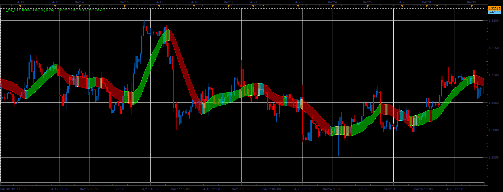

# High/Low MA band

> Source: https://fxcodebase.com/code/viewtopic.php?f=17&t=36271  
> Forum: 17 · Topic 36271 · 3 post(s)

---

## High/Low MA band

**Alexander.Gettinger** · Thu May 02, 2013 11:13 am

The indicator draws the band bounded by two moving averages (for High and Low prices).

 

Download:

 [HL_MA_Band.lua](files/60898/HL_MA_Band.lua)

For this indicator must be installed Averages indicator ([viewtopic.php?f=17&t=2430](https://fxcodebase.com/code/viewtopic.php?f=17&t=2430)).

The indicator was revised and updated

---

## Re: High/Low MA band

**greenfork** · Thu May 02, 2013 9:11 pm

Thank you greatly for this indicator.

---

## Re: High/Low MA band

**Apprentice** · Tue May 23, 2017 6:17 am

Indicator was revised and updated.
