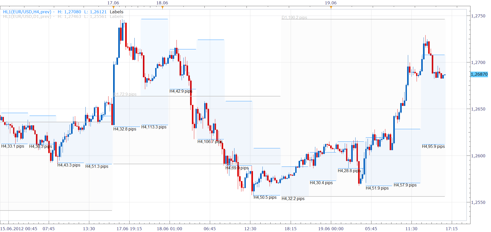

# High/Low Range [Upd Jun 2012]

> Source: https://fxcodebase.com/code/viewtopic.php?f=17&t=20388  
> Forum: 17 · Topic 20388 · 15 post(s)

---

## High/Low Range [Upd Jun 2012]

**Nikolay.Gekht** · Tue Jun 19, 2012 3:24 pm

The indicator is further development of the [High/Low Band](https://fxcodebase.com/code/viewtopic.php?f=17&t=607) indicator.

The indicator can show either current or previous price range of the chosen timeframe on the chart.

The new version allows you manage the line parameters (width, style) and put time frame and range width (in pips) labels above or below the range.

 

Download:

 [hl1.lua](files/35753/hl1.lua)

Source:

Code: [Select all](https://fxcodebase.com/code/)
`function Init()
    indicator:name("High/Low Bands (Advanced)");
    indicator:description("");
    indicator:requiredSource(core.Bar);
    indicator:type(core.Indicator);

    indicator.parameters:addGroup("Calculation");
    indicator.parameters:addString("BS", "Bar Size to display High/Low", "", "D1");
    indicator.parameters:addBoolean("YTD", "Show yesterday band", "Choose yes to show yesterday band and no to show today band", false);
    indicator.parameters:setFlag("BS", core.FLAG_PERIODS);
    indicator.parameters:addGroup("Band");
    indicator.parameters:addBoolean("Extend", "Extend the band till the end of the bar", "", false);
    indicator.parameters:addColor("clrB", "High/Low Band Color", "", core.rgb(192, 192, 192));
    indicator.parameters:addInteger("Width", "Line Width", "", 1, 1, 5);
    indicator.parameters:addInteger("Style", "Line Style", "", core.LINE_SOLID);
    indicator.parameters:setFlag("Style", core.FLAG_LEVEL_STYLE);
    indicator.parameters:addInteger("A", "High/Low Band transparency (%)", "", 95, 0, 100);
    indicator.parameters:addGroup("Labels");
    indicator.parameters:addBoolean("ShowLabelPip", "Show Size Labels", "", false);
    indicator.parameters:addBoolean("ShowLabelFrame", "Show Frame Labels", "", false);
    indicator.parameters:addColor("LabelC", "Label color", "", core.COLOR_LABEL);
    indicator.parameters:addInteger("LabelI", "Label Size", "", 8, 6, 24);
    indicator.parameters:addInteger("LabelLoc", "Label Location", "", 1);
    indicator.parameters:addIntegerAlternative("LabelLoc", "Above", "", 1);
    indicator.parameters:addIntegerAlternative("LabelLoc", "Below", "", 2);
end

local source;                   -- the source
local hilo_data = nil;          -- the high/low data
local H;                        -- high stream
local L;                        -- low stream
local BS;
local BSLen;
local dates;                    -- candle dates
local CLen;
local host;
local offset;
local weekoffset;
local candles;                  -- stream of the candle's dates
local YTD;
local Extend;
local maxBarsPerBS;
local ShowLabelPip;
local ShowLabelFrame;
local LabelLoc;
local Labels;
local pipSize;
local formatPips;

function Prepare()
    source = instance.source;
    host = core.host;
    host = core.host;
    offset = host:execute("getTradingDayOffset");
    weekoffset = host:execute("getTradingWeekOffset");
    BS = instance.parameters.BS;
    YTD = instance.parameters.YTD;
    Extend = instance.parameters.Extend;
    ShowLabelPip = instance.parameters.ShowLabelPip;
    ShowLabelFrame = instance.parameters.ShowLabelFrame;
    LabelLoc = instance.parameters.LabelLoc;
    local YTDn;

    if YTD then
        YTDn = "prev";
    else
        YTDn = "curr";
    end

    local l1, l2;
    local s, e;

    s, e = core.getcandle(source:barSize(), core.now(), 0);
    l1 = e - s;
    s, e = core.getcandle(BS, core.now(), 0);
    l2 = e - s;
    CLen = l1;
    BSLen = l2; -- remember length of the period
    assert(l1 <= l2, "The chosen time frame must be the same of longer than the chart time frame");
    if Extend then
        maxBarsPerBS = math.floor(l2 / l1 + 0.5);
    else
        maxBarsPerBS = 0;
    end

    local name = profile:id() .. "(" .. source:name() .. "," .. BS .. "," .. YTDn .. ")";
    instance:name(name);
    H = instance:addStream("H", core.Line, name .. ".H", "H", instance.parameters.clrB, 0, maxBarsPerBS);
    H:setStyle(instance.parameters.Style);
    H:setWidth(instance.parameters.Width);
    L = instance:addStream("L", core.Line, name .. ".L", "L", instance.parameters.clrB, 0, maxBarsPerBS);
    L:setStyle(instance.parameters.Style);
    L:setWidth(instance.parameters.Width);
    instance:createChannelGroup("HL", "HL", H, L, instance.parameters.clrB, 100 - instance.parameters.A, true);
    candles = instance:addInternalStream(0, 0);
    hilo_data = core.host:execute("getSyncHistory", source:instrument(), BS, source:isBid(), 10, 100, 101);
    if ShowLabelPip or ShowLabelFrame then
        pipSize = source:pipSize();
        formatPips = "%.1f pips";
        local align;
        if LabelLoc == 1 then
            align = core.V_Top;
        else
            align = core.V_Bottom;
        end
        Labels = instance:createTextOutput("Labels", "Lbl", "Arial", instance.parameters.LabelI, core.H_Right, align, instance.parameters.LabelC, 0);
    end
end

local loading = false;

-- the function which is called to calculate the period
function Update(period, mode)
    -- get date and time of the hi/lo candle in the reference data
    local hilo_candle;
    hilo_candle = core.getcandle(BS, source:date(period), offset, weekoffset);

    -- if data for the specific candle are still loading
    -- then do nothing
    if loading or hilo_data:size() == 0 then
        return ;
    end

    -- if the period is before the source start
    -- the do nothing
    if period < source:first() then
        return ;
    end

    local hilo_i = core.findDate(hilo_data, hilo_candle, false);

    -- candle is not found
    if hilo_i < 0 then
        return ;
    end

    if YTD then
        if hilo_i == 0 then
            return;
        end
        hilo_i = hilo_i - 1;
    end

    H[period] = hilo_data.high[hilo_i];
    L[period] = hilo_data.low[hilo_i];
    candles[period] = hilo_candle;
    if period > 0 and candles[period - 1] ~= candles[period] then
        H:setBreak(period, true);
        L:setBreak(period, true);
    else
        H:setBreak(period, false);
        L:setBreak(period, false);
    end

    if source:isAlive() and period > source:first() and period == source:size() - 1 then
        -- update all today's data in case today's high low is changed
        if candles:hasData(period - 1) and candles[period - 1] == hilo_candle and
           ((H[period - 1] ~= H[period]) or (L[period - 1] ~= L[period]))  then
            local i = period - 1;
            local h = hilo_data.high[hilo_i];
            local l = hilo_data.low[hilo_i];
            while i > 0 and candles:hasData(i) and candles[i] == hilo_candle do
                H[i] = h;
                L[i] = l;
                i = i - 1
            end

            if ShowLabelPip or ShowLabelFrame then
                local text;
                text = "";
                if ShowLabelFrame then
                    text = text .. BS;
                end
                if ShowLabelPip then
                    if ShowLabelFrame then
                        text = text .. ",";
                    end
                    text = text .. string.format(formatPips, (H[i + 1] - L[i + 1]) / pipSize);
                end
                local loc;
                if LabelLoc == 1 then
                    loc = H[i + 1];
                else
                    loc = L[i + 1];
                end
                Labels:set(period, loc, text);
            end
        end
    end

    if Extend and period == source:size() - 1 then
        local i = period + 1;
        local b = source:date(period) + CLen;
        local h = hilo_data.high[hilo_i];
        local l = hilo_data.low[hilo_i];
        while i < H:size() and b < hilo_candle + BSLen do
            if H:hasData(i) and H[i] == h and L[i] == l then
                break;
            end
            H[i] = h;
            L[i] = l;
            i = i + 1;
            b = b + CLen;
        end
    end

    if (ShowLabelPip or ShowLabelFrame) and (period == 0 or candles[period - 1] ~= hilo_candle) then
        local text;
        text = "";
        if ShowLabelFrame then
            text = text .. BS;
        end
        if ShowLabelPip then
            if ShowLabelFrame then
                text = text .. ",";
            end
            text = text .. string.format(formatPips, (H[period] - L[period]) / pipSize);
        end
        local loc;
        if LabelLoc == 1 then
            loc = H[period];
        else
            loc = L[period];
        end
        Labels:set(period, loc, text);
    end
end

-- the function is called when the async operation is finished
function AsyncOperationFinished(cookie)
    if cookie == 100 then
        loading = false;
        instance:updateFrom(0);
    elseif cookie == 101 then
        loading = true;
    end
end`

The indicator was revised and updated

---

## Re: High/Low Range [Upd Jun 2012]

**nazaar** · Thu Aug 23, 2012 10:49 pm

Thanks very much for this indicator. It is really helpful and informative as it set horizontal support and resistance lines automatically for your chosen time frame. The only concern is I cannot use it on my live account as it is the beta version. The beta version is not available for live accounts.

Thanks.

---

## Re: High/Low Range [Upd Jun 2012]

**sunshine** · Fri Aug 24, 2012 9:53 am

Unfortunately, there is no schedule for the official release yet. Please watch for the updated on the site.

---

## Re: High/Low Range [Upd Jun 2012]

**Apprentice** · Tue Oct 15, 2013 2:04 am

Bump Up

---

## Re: High/Low Range [Upd Jun 2012]

**syncoopate** · Tue Jan 28, 2014 1:55 pm

hi,
I would like to know if you can enter option flag bid/ask thank you....

---

## Re: High/Low Range [Upd Jun 2012]

**xpertizetrading** · Wed Jan 29, 2014 10:15 am

Is it possible to code a strategy for this indicator? Much needed.

Entry Order: Break of previous hl1.
Stop Loss: Previous hl1 high/low (for short/long trades)
Expiratory: Present hl1 close.

Thanks

---

## Re: High/Low Range [Upd Jun 2012]

**Apprentice** · Thu Jan 30, 2014 4:20 am

Your request is added to the development list.

---

## Re: High/Low Range [Upd Jun 2012]

**moomoofx** · Fri Apr 11, 2014 6:46 pm

Hi,

The strategy requested has been implemented here: [viewtopic.php?f=31&t=60526](https://fxcodebase.com/code/viewtopic.php?f=31&t=60526)

Cheers,
MooMooFX

---

## Re: High/Low Range [Upd Jun 2012]

**fxFox.mb** · Tue Apr 15, 2014 2:34 am

> **Nikolay.Gekht wrote:**
> The indicator is further development of the [High/Low Band](https://fxcodebase.com/code/viewtopic.php?f=17&t=607) indicator.
> ...

Hi Nikolay,

I just came across to this HL1 indicator - thanks a lot for this - very useful.
Is there a possibility to add a parameter that only the last range / band is displayed?

That would give us the possibility to show i.e.
- for "bar size to d. H/L" = "D1" only the high/low of the previous day on the current day or
- for "bar size to d. H/L" = "W1" the previous week on the current week
(in conjunction with the parameter "Show yesterdays band"), without having all the old ranges on the chart, what makes the chart more difficult to read, even if you have other ranges plotted on it.

Kindly Regards
fxfox

---

## Re: High/Low Range [Upd Jun 2012]

**Apprentice** · Tue Apr 15, 2014 11:17 am

Modification could prove to be greater challenge,
If I compare it with a new indicator development.

An alternative could be the Higher Time Frame Support Resistance.
[viewtopic.php?f=17&t=39802&p=65322&hilit=High%2FLow#p65322](https://fxcodebase.com/code/viewtopic.php?f=17&t=39802&p=65322&hilit=High%2FLow#p65322)

---

## Re: High/Low Range [Upd Jun 2012]

**fxFox.mb** · Wed Apr 16, 2014 5:41 am

> **Apprentice wrote:**
> ...
> An alternative could be the Higher Time Frame Support Resistance.
> ...

Thank you very much Apprentice,

that's exaclty what I've looked for.

Regards fxFox

---

## Re: High/Low Range [Upd Jun 2012]

**Gerard MANVUSSA** · Thu May 21, 2015 2:04 am

Hi all,

Thank you for this very interesting indicator.

Could someone be kind enough to do the necessary to enable this program to extend the lines on right to infinity ? (to allow to see the historical High/Low Range since their determination)

Thanks a lot in advance for your action

Have a nice end of week

---

## Re: High/Low Range [Upd Jun 2012]

**Apprentice** · Fri May 22, 2015 4:00 am

Your request is added to the development list.

---

## Re: High/Low Range [Upd Jun 2012]

**Gerard MANVUSSA** · Mon Jun 01, 2015 11:51 am

Very good new. I'm looking forward to be able to installing it on my trading platform.
Is it possible to have an estimated date of availability ?
Thanks a lot

---

## Re: High/Low Range [Upd Jun 2012]

**Apprentice** · Tue Jul 04, 2017 9:27 am

The indicator was revised and updated.
