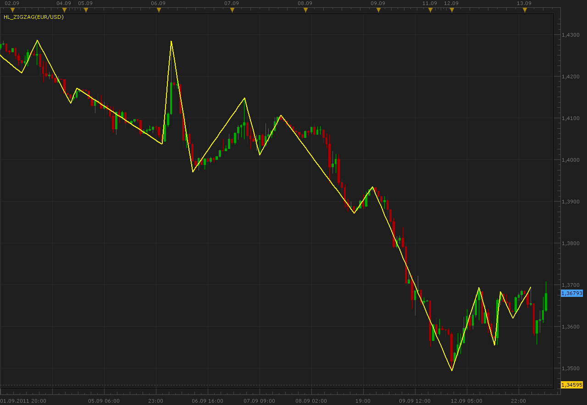

# High-Low ZigZag

> Source: https://fxcodebase.com/code/viewtopic.php?f=17&t=6514  
> Forum: 17 · Topic 6514 · 2 post(s)

---

## High-Low ZigZag

**Alexander.Gettinger** · Tue Sep 13, 2011 7:06 am

This indicator is a ported MQL5 indicator from [http://www.mql5.com/en/code/278](http://www.mql5.com/en/code/278).

Nonparametric zigzag. The monotonicity condition for the ascending segment of the zigzag: the High of any subsequent bar must not be lower than any Low of the ascending segment. Similarly, for the descending segments of the zigzag.

 

Download:

 [HL_ZigZag.lua](files/14879/HL_ZigZag.lua)

The indicator was revised and updated

---

## Re: High-Low ZigZag

**Apprentice** · Thu Mar 16, 2017 2:17 pm

Indicator was revised and updated.
