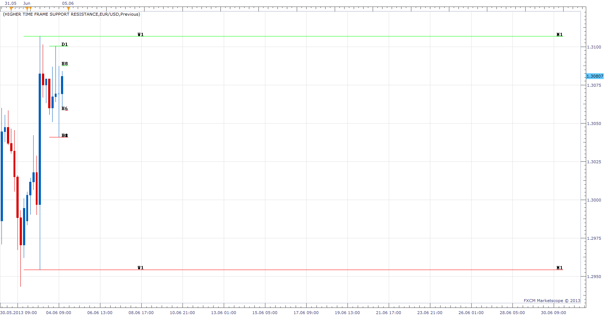

# Higher Time Frame Support Resistance

> Source: https://fxcodebase.com/code/viewtopic.php?f=17&t=39802  
> Forum: 17 · Topic 39802 · 40 post(s)

---

## Higher Time Frame Support Resistance

**Apprentice** · Tue Jun 04, 2013 2:46 pm

This indicator will show, high / low value for all higher time frames,
Current or previous period.

 [Higher Time Frame Support Resistance.lua](files/65322/Higher%20Time%20Frame%20Support%20Resistance.lua)

 [Higher Time Frame Support Resistance Old Implementation.lua](files/65322/Higher%20Time%20Frame%20Support%20Resistance%20Old%20Implementation.lua)

---

## Re: Higher Time Frame Support Resistance

**rtsayers** · Tue Jun 04, 2013 6:33 pm

Nice indicator could you add and remove labels and extend individual lines

Thanks Great Work!!

---

## Re: Higher Time Frame Support Resistance

**Apprentice** · Wed Jun 05, 2013 2:58 am

Your request is added to the development list.

---

## Re: Higher Time Frame Support Resistance

**ThemBonez** · Tue Oct 01, 2013 8:53 am

Hello,
Can you create this so you can choose the time frame, line color and type. For example, I would like to draw a horizontal line at the previous month's and week's highs and lows and put a different color and line type for each of these four lines.

Thx

---

## Re: Higher Time Frame Support Resistance

**nazaar** · Tue Oct 01, 2013 11:03 pm

Hello!

This looks like an excellent tool, I like how one tool can show and label multi time frame highs and lows. Could you give the user the option to choose which time frames are selected?

Attached is an excellent high low tool made by Alexander, it show the period selected, the pips between the high / low and shades in between.

---

## Re: Higher Time Frame Support Resistance

**Apprentice** · Wed Oct 02, 2013 3:34 am

Your request is added to the development list.

---

## Re: Higher Time Frame Support Resistance

**Apprentice** · Fri Oct 04, 2013 10:26 am

Time Frame Selector Added.
Algorithm Update.

---

## Re: Higher Time Frame Support Resistance

**rtsayers** · Sun Oct 06, 2013 11:56 pm

How to remove labels?

Thanks

---

## Re: Higher Time Frame Support Resistance

**Apprentice** · Mon Oct 07, 2013 1:14 am

Use "Show Labels"...
Fixed minor "Show Labels" bug, by mistake I uploaded the wrong version.

---

## Re: Higher Time Frame Support Resistance

**rtsayers** · Mon Oct 07, 2013 6:12 pm

The no labels is still not working I set all to 0 and I can still see the labels could you have a yes and no to labels function thanks!

---

## Re: Higher Time Frame Support Resistance

**Apprentice** · Tue Oct 08, 2013 2:00 am

U have to redownload your indicator.
Updated indicator use Yes / No (True / False), Not Zero/One.

---

## Re: Higher Time Frame Support Resistance

**ThemBonez** · Mon Oct 21, 2013 6:32 am

Hi,
The Higher Time Frame Support Resistance lines chart a few pips below the actual High and Low of the daily, weekly or whatever is chosen. Can you check this out?
Thanx

---

## Re: Higher Time Frame Support Resistance

**Apprentice** · Tue Oct 22, 2013 4:31 am

U have probably set Current / Previous Period to Previous
Try to use Current.

---

## Re: Higher Time Frame Support Resistance

**jsotor** · Wed Apr 23, 2014 9:16 am

Great indi, thanks a lot.

I'd suggest a SHOW MODE (as in PIVOT indicator) to select TODAY or HISTORICAL.

For example when trading H4 it's useful to know previous weeks SR.

Also adding Close price would be great. Pretty much a higherTF HLC bar overlay. (Also as an optional parameter)

This option could be managed by having a SHOW MODE for each TF. However, the trick should be done by loading 2 instances of this indicator, one with HISTORICAL selected only for specified TFs.

---

## Re: Higher Time Frame Support Resistance

**Apprentice** · Thu Apr 24, 2014 4:46 am

HISTORICAL Mode Added.

---

## Re: Higher Time Frame Support Resistance

**ThemBonez** · Thu Apr 24, 2014 8:38 am

Hi,
Which of the links above have the new parameters?
Thanx

---

## Re: Higher Time Frame Support Resistance

**Apprentice** · Thu Apr 24, 2014 9:33 am

Please Download Higher Time Frame Support Resistance.lua

---

## Re: Higher Time Frame Support Resistance

**Apprentice** · Fri May 23, 2014 5:03 am

Line Style option Added.

---

## Re: Higher Time Frame Support Resistance

**Apprentice** · Wed Jun 17, 2015 4:37 am

Major Update.

---

## Re: Higher Time Frame Support Resistance

**scandisk** · Tue Apr 12, 2016 3:06 pm

I was just wondering how to remove labels from the lines? Also when sizing it puts historical levels up weird? Very nice indicator!

Thanks

---

## Re: Higher Time Frame Support Resistance

**MC. Trend Trader** · Thu Apr 28, 2016 9:14 am

Hi,

Request a highly adaptable Strategy for this Higher Time Frame Support Resistance indicator.

**High Resistance Line:**
Buy: candle close above the High Resistance Line
 candle close under the High Resistance Line
 No function

Sell: candle close above the High Resistance Line
 candle close under the High Resistance Line
 No function

**Low Resistance Line**

Buy: candle close above the Low Resistance Line
 candle close under the Low Resistance Line
 No function

Sell: candle close above the Low Resistance Line
 candle close under the Low Resistance Line
 No function

**Close Resistance Line**
Buy: candle close above the Close Resistance Line
 candle close under the Close Resistance Line
 No function

Sell: candle close above the Close Resistance Line
 candle close under the Close Resistance Line
 No function

Best Regards

---

## Re: Higher Time Frame Support Resistance

**Apprentice** · Sun May 01, 2016 8:00 am

> Buy: candle close above the High Resistance Line
> candle close under the High Resistance Line
> No function
>
> Sell: candle close above the High Resistance Line
> candle close under the High Resistance Line
> No function
> ...

Can you revise your request.
All definitions are identical.

---

## Re: Higher Time Frame Support Resistance

**kankatrader** · Mon May 02, 2016 2:28 am

High Color Line crossing over: No Action/Buy / Sell or Close Position.
High Color Line crossing under: No Action/Buy / Sell or Close Position.

Low Color Line crossing over: No Action/Buy / Sell or Close Position.
Low Color Line crossing under: under: No Action/Buy / Sell or Close Position.

Close Color Line crossing over: No Action/Buy / Sell or Close Position.
CloseColor Line crossing under: under: No Action/Buy / Sell or Close Position.

Best Regards

---

## Re: Higher Time Frame Support Resistance

**Apprentice** · Wed May 04, 2016 3:02 am

Your request is added to the development list.

---

## Re: Higher Time Frame Support Resistance

**vikraj** · Wed May 04, 2016 10:15 am

Hi Apprentice, Kindly fix the problem, I am not able to apply this fantastic indicator as it is showing error. I am using FXCM Trading Station (Dev).
Regards
Vikraj

---

## Re: Higher Time Frame Support Resistance

**Apprentice** · Thu May 05, 2016 3:15 am

Unfortunately I was not able to reproduce.
Can you provide screenshots, parameters used, error messages.

---

## Re: Higher Time Frame Support Resistance

**Coondawg71** · Thu May 05, 2016 1:59 pm

Great tool!

Can we please request Alert Functionality added to this indicator.

Alert would be triggered upon breach of the prior time frame High, Low or Close levels, either Live or End of Turn.

Thanks!!!

sjc

---

## Re: Higher Time Frame Support Resistance

**vikraj** · Thu May 05, 2016 5:18 pm

Thanks apprentice for your reply. I have tried every option but no value is loading and it is showing error on the top as I have send you in the previous attach pic. I have delected the indicator and re install it but same error is coming and no Support/ Resistance lines are appearing on the chart for any time time frame. Kindly help..
Regards

---

## Re: Higher Time Frame Support Resistance

**Apprentice** · Fri May 06, 2016 3:03 am

Coondawg71
Your request is added to the development list.

vikraj
Can you copy/past/post error message generated.
OR
Can I ask you to completely uninstall your "TS".
Make a clean install and try again.

---

## Re: Higher Time Frame Support Resistance

**Apprentice** · Tue Dec 27, 2016 5:47 am

Indicator was revised and updated.

---

## Re: Higher Time Frame Support Resistance

**zooooo** · Mon Jan 22, 2018 5:27 am

Hi Apprentice,

For this indicator:
1.	Would it be possible to show only the previous close? (currently, it either shows the high/low/close or the high/low.
2.	For the Historical function, would it be possible to choose the beginning time (in the past)?

Many thanks

---

## Re: Higher Time Frame Support Resistance

**Apprentice** · Tue Jan 23, 2018 7:24 am

Your request is added to the development list under Id Number 4019

---

## Re: Higher Time Frame Support Resistance

**Apprentice** · Wed Jan 24, 2018 5:37 am

Try this version.

 [Higher Time Frame Support Resistance.lua](files/117225/Higher%20Time%20Frame%20Support%20Resistance.lua)

---

## Re: Higher Time Frame Support Resistance

**zooooo** · Fri Jan 26, 2018 7:44 am

Hi Apprentice,

For this last version of this indicator, is it possible to:
1.	Add the Open to the Week and Month time frames (open and close can differ a lot if there is a gap) with the selectable “show/not show” option.
2.	For the historical function, add the possibility to choose a back limit period from which begin (in days or weeks or months as convenient, because without it the historical function seems to put to much load on Marketscope).

Many thanks

---

## Re: Higher Time Frame Support Resistance

**Apprentice** · Fri Jan 26, 2018 11:53 am

Your request is added to the development list under Id Number 4027

---

## Re: Higher Time Frame Support Resistance

**Apprentice** · Sun Jan 28, 2018 9:00 am

[Higher Time Frame Support Resistance.zooooo.lua](files/117317/Higher%20Time%20Frame%20Support%20Resistance.zooooo.lua)

Try this version.

---

## Re: Higher Time Frame Support Resistance

**Apprentice** · Mon Feb 05, 2018 6:35 am

The Indicator was revised and updated.

---

## Re: Higher Time Frame Support Resistance

**amvt85** · Fri Aug 03, 2018 7:50 pm

> **zooooo wrote:**
> Hi Apprentice,
>
> For this last version of this indicator, is it possible to:
> 1.	Add the Open to the Week and Month time frames (open and close can differ a lot if there is a gap) with the selectable “show/not show” option.
> 2.	For the historical function, add the possibility to choose a back limit period from which begin (in days or weeks or months as convenient, because without it the historical function seems to put to much load on Marketscope).
>
> Many thanks

Hello,

Can we still get that option number 2 possible? Because for example I'm using weekly s/r it still lags with so many charts on. As "Zoo" said the load is still too much for Marketscope. It would be great if we can back limit period from which to begin. Even with this indicator the lag is still there.

Thank you.

---

## Re: Higher Time Frame Support Resistance

**Apprentice** · Sat Aug 04, 2018 5:25 am

Added.

---

## Re: Higher Time Frame Support Resistance

**amvt85** · Mon Aug 06, 2018 12:22 pm

> **Apprentice wrote:**
> Added.

Thanks mate! All the best!
