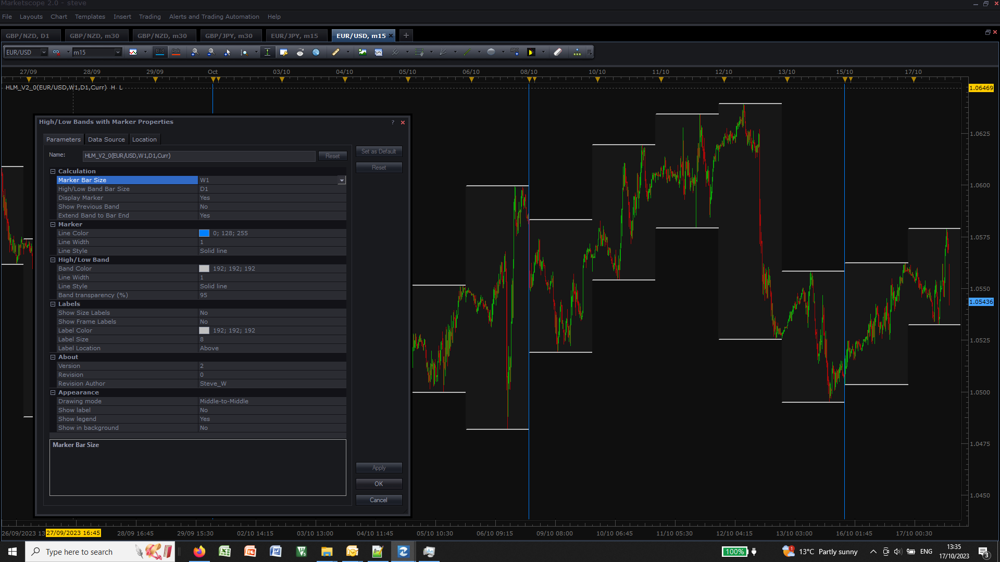

# HighLow Bands with Marker

> Source: https://fxcodebase.com/code/viewtopic.php?f=17&t=74260  
> Forum: 17 · Topic 74260 · 5 post(s)

---

## HighLow Bands with Marker

**Apprentice** · Wed Oct 18, 2023 4:12 am

Based on the request.
[https://fxcodebase.com/code/viewtopic.php?f=17&p=152295](https://fxcodebase.com/code/viewtopic.php?f=17&p=152295)

 [HighLow Bands with Marker.lua](files/152970/HighLow%20Bands%20with%20Marker.lua)

---

## Re: HighLow Bands with Marker

**ahmedalhosenyy** · Wed Oct 18, 2023 7:57 am

many thanks for the indicator ,

May you add shift function to it

thanks in advance

Regards

---

## Re: HighLow Bands with Marker

**Apprentice** · Sat Oct 21, 2023 9:22 am

We have added your request to the development list.
Development reference 950

---

## Re: HighLow Bands with Marker

**Steve_W** · Sun Oct 22, 2023 7:24 am

Check the parameter "Show Previous Band = No", set it to be Yes.
The bands will shift by one period (1 day if bar size is set to D1).

Is that what you wanted?

---

## Re: HighLow Bands with Marker

**AdryanSalmon** · Wed Nov 29, 2023 7:55 pm

Thank you Mario and Steve for your help with creating this.
