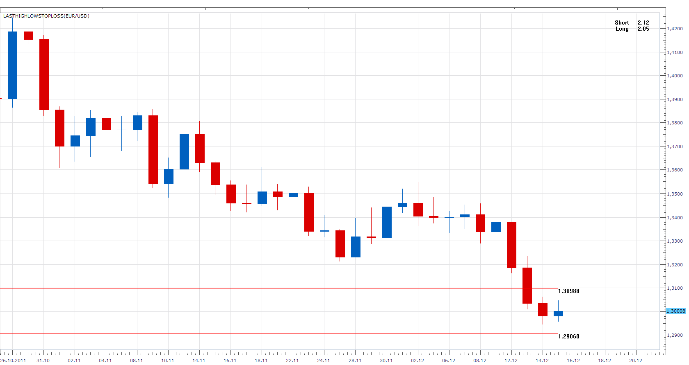

# HighLow StopLoss

> Source: https://fxcodebase.com/code/viewtopic.php?f=17&t=9745  
> Forum: 17 · Topic 9745 · 8 post(s)

---

## HighLow StopLoss

**Apprentice** · Thu Dec 15, 2011 1:54 pm

Using this indicator, you can define, Stop Levels.
They are Period High / Low plus a defined number of pips.

Depending on the defined percentage of equity you are willing to lose per single trade.
Indicator calculated maximum number ot Lots that you may open.

 [HighLowStopLoss.lua](files/20754/HighLowStopLoss.lua)

The indicator was revised and updated

---

## Re: HighLow StopLoss

**trendwatch** · Mon Dec 19, 2011 9:40 am

Hi Apprentice,

I'm using this indicator now and it works like a charm. But I do have a small request:
Could you perhaps add the option to remove the decimals?

Thanks

---

## Re: HighLow StopLoss

**elsigis** · Wed Dec 21, 2011 9:31 am

I appreciate this indicator. Well done.
I also agree that adjusting the decimal places would be great.

---

## Re: HighLow StopLoss

**Apprentice** · Thu Dec 22, 2011 8:35 am

Your request is added to the developmental cue.

---

## Re: HighLow StopLoss

**Apprentice** · Wed Mar 22, 2017 11:18 am

Indicator was revised and updated.

---

## Re: HighLow StopLoss

**oxbx99** · Tue Sep 10, 2019 6:11 am

hi,

currently this indicator draw the horizontal lines from far left to current bar.

is it possible to add option to this indicator to draw the horizontal lines from **x bar ago** to current bar.

thanks

---

## Re: HighLow StopLoss

**Apprentice** · Tue Sep 10, 2019 7:50 am

Your request is added to the development list.
Development reference 54.

---

## Re: HighLow StopLoss

**Apprentice** · Thu Sep 12, 2019 6:49 am

[HighLowStopLoss.lua](files/128598/HighLowStopLoss.lua)

Try this version.
