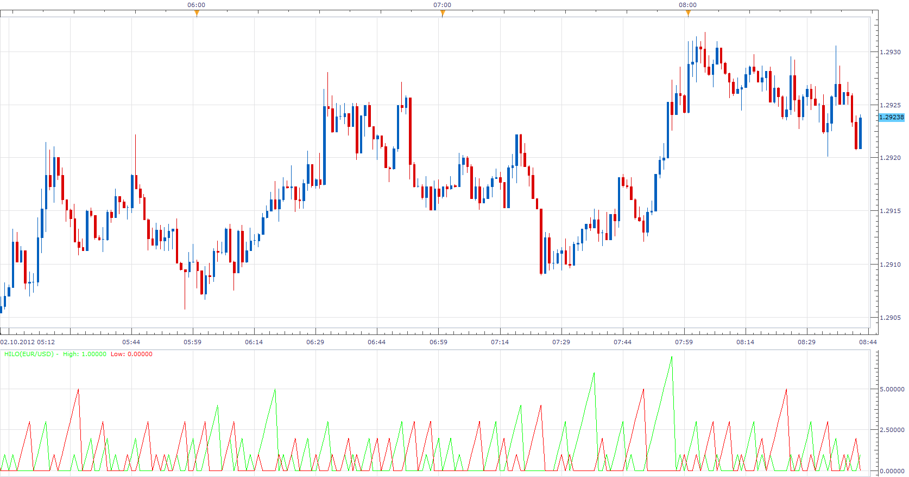

# HiLo

> Source: https://fxcodebase.com/code/viewtopic.php?f=17&t=24006  
> Forum: 17 · Topic 24006 · 3 post(s)

---

## HiLo

**Apprentice** · Tue Oct 02, 2012 7:41 am

Thisi indicator counts the number of consecutive Higher Highs, or , Lower Lows Bars.
if high[period] > high[period-1] then
HigerHighsCount[period] = HigerHighsCount[period-1] +1;
else
HigerHighsCount[period] =0
end

if low[period] < low[period-1] then
LowerLows[period] = LowerLows[period-1] +1;
else
LowerLowsCount[period] =0
end

 [HiLo.lua](files/41264/HiLo.lua)

The indicator was revised and updated

---

## Re: HiLo

**Alexander.Gettinger** · Mon Oct 27, 2014 10:41 am

MQL4 version of HiLo oscillator: [viewtopic.php?f=38&t=61385](https://fxcodebase.com/code/viewtopic.php?f=38&t=61385).

---

## Re: HiLo

**Apprentice** · Tue Jun 27, 2017 3:26 am

The indicator was revised and updated.
